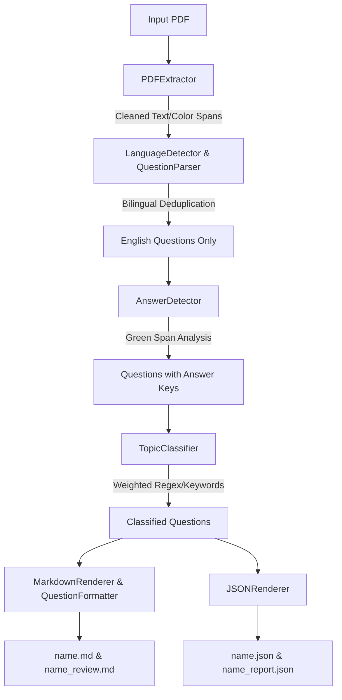

# LLM System & Architecture Context: EXQ Pipeline

This document is optimized for Large Language Models (LLMs), AI coding agents, and automated agents needing deep architectural context, design invariants, data models, and runtime mechanics of the **EXQ** repository.

---

## 1. System Mission & Core Directives

- **Primary Goal**: Parse public service exam question PDFs (specifically APPSC master question papers and final answer keys), clean out print artifacts and language duplicates, classify by syllabus topics, format complex question syntax cleanly, and export synchronized `.md` and `.json` files.
- **Strict Non-LLM Execution**: All core parsing, answer extraction, and topic assignments run **purely deterministically** (PyMuPDF `fitz`, Unicode regex, coordinate geometry, color thresholds). LLMs are NOT used in the extraction loop to avoid cost, latency, non-determinism, and hallucinations.

---

## 2. Directory Structure & Key Modules

```
exq/
├── app.py                      # Main CLI entrypoint & high-level pipeline orchestrator
├── topics.yaml                 # Default topic keywords & regex weights configuration
├── topics_gsma.yaml            # GSMA syllabus configuration
├── requirements.txt            # Python dependencies (PyMuPDF, pyyaml)
├── README.md                   # Human-facing overview and usage guide
├── LLM.md                     # LLM architectural, schema, and operational specification
├── ARCHITECTURE.md             # In-depth module mechanics, dataflow, and design decisions
├── src/
│   ├── models.py               # Dataclass definitions (Question, QuestionBlock, etc.)
│   ├── pdf_extractor.py        # PyMuPDF block & span extraction, browser header/footer cleanup
│   ├── language_detector.py    # Unicode Telugu detection (U+0C00 - U+0C7F)
│   ├── question_parser.py      # Splits text into Question objects, options, and excludes metadata
│   ├── answer_detector.py      # Identifies green spans for correct options; tracks multi/missing answers
│   ├── topic_classifier.py     # Regex and keyword weighted scoring against topics.yaml
│   ├── question_formatter.py   # Smart markdown formatter (tables, assertion/reason, statements)
│   ├── markdown_renderer.py    # Generates human-friendly markdown with topic index
│   └── json_renderer.py        # Generates structured JSON schema
└── tests/
    └── test_converter.py       # Comprehensive unit & regression test suite
```

---

## 3. Data Models (`src/models.py`)

When modifying code or writing integration scripts, adhere to these contracts:

### `Question` Dataclass
```python
@dataclass
class Question:
    question_number: int              # Sequential number (1-indexed)
    question_text: str                # Extracted and cleaned question stem
    options: Dict[str, str]           # Map of option key ("1", "2", etc.) to option string
    answer: List[str]                 # Detected correct option numbers, e.g. ["1"] or ["1", "3"]
    topic: str                        # Classified topic name
    score: float                      # Topic match confidence score
    raw_block_ids: List[int]          # Traceability indices back to raw blocks
    language: str = "en"              # Language code ('en' or 'te')
    needs_review: bool = False        # Flagged True if answer ambiguous or missing
    review_reasons: List[str]         # List of reasons if flagged for review
```

---

## 4. Processing Pipeline Phases



---

## 5. Formatter Heuristics (`src/question_formatter.py`)

When interacting with question bodies:
1. **Column Matching**:
   - Matches: `Column I ... Column II`
   - Classifies left labels via lowercase roman (`(i)`, `(ii)`, `(iii)`) or lowercase letters.
   - Classifies right labels via uppercase letters (`(W)`, `(X)`, `(Y)`, `(Z)`) or digits.
   - Emits GitHub Flavored Markdown table.
2. **Assertion & Reason**:
   - Matches: `Assertion (A):` and `Reason (R):` (anchored with punctuation).
   - Separates them into distinct bold markdown blocks.
3. **Inline Numbered Statements**:
   - Matches: ` 1. ... 2. ...` with negative lookbehind `(?<![0-9@])` to prevent false matches on dates (e.g. `2047.`).

---

## 6. Common Prompts & Extension Tasks

If asked by a user to modify or enhance this codebase:
- **Calibrating & reviewing topic classifications**:
  - Run a lightweight script to produce `<name>_topic_review.md` grouping question numbers and short stems (~120 chars) by topic.
  - Inspect questions with score 0 (which fall back to the first topic in the YAML file) or false matches caused by generic regexes.
  - Calibrate weights: Assign `9-10` for unambiguous multi-word phrases and domain keywords; avoid broad single-word keywords or non-anchored acronyms.
- **Adding new syllabus topics**: Edit `topics.yaml` or `topics_gsma.yaml`. Topic ordering in the output Markdown strictly mirrors the list sequence in the YAML file.
- **Handling new PDF artifacts**: Check `src/pdf_extractor.py` and inspect font sizes or coordinate boundaries in the browser-printed headers/footers.
- **Changing answer color thresholds**: Tune `src/answer_detector.py` green RGB boundary checks.
- **Executing tests**: Run `python -m unittest tests.test_converter -v`.

