# APPSC PCB All Exams Question Bank

## Topic Index

### 1. Ecosystems

#### Definition, Scope & Importance of Ecosystem

- Q1
- Q2
- Q3
- Q4
- Q5

#### Classification, Structure & Function of Ecosystem

- Q6
- Q7
- Q8
- Q9
- Q10
- Q11
- Q12
- Q13
- Q14
- Q15

#### Food Chains, Food Webs & Ecological Pyramids

- Q16
- Q17
- Q18
- Q19
- Q20
- Q21

#### Flow of Energy & Biogeochemical Cycles

- Q22
- Q23
- Q24
- Q25
- Q26
- Q27
- Q28
- Q29

#### Bioaccumulation, Biomagnification & Carrying Capacity

- Q30

#### Ecosystem Value & Ecological Services

- Q31
- Q32
- Q33

### 2. Natural Resources

#### Living and Non-Living Resources Classification

- Q34

#### Water Resources: Surface & Ground Water Utilization, Floods & Droughts

- Q35
- Q36
- Q37
- Q38
- Q39
- Q40
- Q41
- Q42
- Q43
- Q44
- Q45
- Q46
- Q47
- Q48
- Q49
- Q50
- Q51
- Q52
- Q53

#### Dams: Benefits & Environmental Problems

- Q54
- Q55

#### Mineral Resources: Use, Exploitation & Environmental Effects

- Q56
- Q57
- Q58
- Q59

#### Land & Forest Resources

*(No questions)*

#### Energy Resources: Growing Needs, Renewable & Non-Renewable Sources

- Q60
- Q61

#### Alternate Energy Sources

*(No questions)*

### 3. Biodiversity and Biotic Resources

#### Genetic, Species & Ecosystem Diversity

*(No questions)*

#### Value of Biodiversity: Consumptive, Productive, Social, Ethical & Aesthetic

- Q62
- Q63
- Q64
- Q65
- Q66
- Q67

#### India as a Mega Diversity Nation & Biodiversity Hotspots

- Q68
- Q69
- Q70
- Q71

#### Threats to Biodiversity: Habitat Loss, Poaching & Man-Wildlife Conflicts

- Q72
- Q73
- Q74
- Q75

#### In-Situ and Ex-Situ Conservation

- Q76

#### National Biodiversity Act

*(No questions)*

### 4. Engineering Materials

#### Structure and Properties of Engineering Materials

- Q77
- Q78
- Q79
- Q80
- Q81
- Q82
- Q83
- Q84
- Q85
- Q86
- Q87

#### Phase Diagrams

- Q88

#### Heat Treatment

- Q89
- Q90

#### Stress-Strain Diagrams for Engineering Materials

- Q91
- Q92
- Q93
- Q94
- Q95
- Q96

### 5. Fluid Mechanics and Hydraulics

#### Newtonian and Non-Newtonian Fluids & Fluid Properties

- Q97
- Q98
- Q99
- Q100
- Q101
- Q102
- Q103
- Q104
- Q105
- Q106
- Q107
- Q108
- Q109
- Q110
- Q111
- Q112
- Q113
- Q114
- Q115
- Q116
- Q117
- Q118
- Q119
- Q120
- Q121
- Q122
- Q123

#### Measurement of Pressure & Manometers

- Q124
- Q125
- Q126
- Q127
- Q128
- Q129

#### Fluid Kinematics: Classification of Fluids, Stream Function & Velocity Potential

- Q130
- Q131
- Q132
- Q133

#### Fluid Dynamics: Continuity Equation, Bernoulli's Equation & Impulse Momentum Equation

- Q134
- Q135
- Q136
- Q137
- Q138
- Q139
- Q140
- Q141
- Q142
- Q143
- Q144
- Q145
- Q146
- Q147
- Q148
- Q149
- Q150
- Q151
- Q152
- Q153
- Q154
- Q155
- Q156
- Q157
- Q158
- Q159
- Q160
- Q161
- Q162
- Q163
- Q164
- Q165
- Q166
- Q167
- Q168
- Q169
- Q170
- Q171
- Q172
- Q173
- Q174
- Q175
- Q176
- Q177
- Q178
- Q179
- Q180
- Q181
- Q182
- Q183
- Q184
- Q185
- Q186
- Q187

#### Laminar & Turbulent Flow in Pipes & Reynolds Number

- Q188

#### Hagen Poiseuille's Equation, Darcy–Weisbach Equation, Friction Factor & Head Losses

- Q189
- Q190
- Q191
- Q192
- Q193
- Q194
- Q195
- Q196
- Q197
- Q198
- Q199

#### Dimensional Analysis & Similarity Laws

*(No questions)*

#### Elementary Boundary Layer Theory

- Q200
- Q201
- Q202

### 6. Process Calculations and Thermodynamics

#### Laws of Conservation of Mass and Energy

- Q203

#### Tie Components, Recycle, Bypass and Purge Calculations

- Q204
- Q205
- Q206

#### Degrees of Freedom

- Q207
- Q208
- Q209

#### First & Second Laws of Thermodynamics and Applications

- Q210
- Q211
- Q212
- Q213
- Q214
- Q215
- Q216
- Q217
- Q218
- Q219
- Q220
- Q221
- Q222
- Q223
- Q224
- Q225
- Q226

#### Equations of State & Thermodynamic Properties of Real Systems

- Q227
- Q228

### 7. Air, Water, Soil and Noise Pollution and Control Technologies

#### Air Pollution: Primary & Secondary Pollutants, Ambient Air Quality Standards

- Q229
- Q230
- Q231
- Q232
- Q233
- Q234
- Q235
- Q236
- Q237
- Q238
- Q239
- Q240
- Q241
- Q242
- Q243
- Q244
- Q245
- Q246
- Q247
- Q248
- Q249
- Q250
- Q251
- Q252
- Q253

#### Particulate Emission Control & Control of SOx and NOx

*(No questions)*

#### Automobile and Industrial Air Pollution

*(No questions)*

#### Water Pollution: Sources, Types & Drinking Water Quality Standards

- Q254
- Q255
- Q256
- Q257
- Q258
- Q259
- Q260
- Q261
- Q262
- Q263
- Q264
- Q265
- Q266
- Q267
- Q268
- Q269
- Q270
- Q271
- Q272
- Q273
- Q274
- Q275
- Q276
- Q277
- Q278
- Q279
- Q280
- Q281
- Q282
- Q283
- Q284
- Q285
- Q286
- Q287
- Q288
- Q289
- Q290
- Q291
- Q292
- Q293
- Q294
- Q295
- Q296
- Q297
- Q298
- Q299
- Q300
- Q301
- Q302
- Q303
- Q304
- Q305
- Q306
- Q307
- Q308
- Q309
- Q310
- Q311
- Q312
- Q313
- Q314
- Q315

#### Wastewater Treatment: Primary, Secondary & Tertiary Treatment

- Q316
- Q317
- Q318
- Q319
- Q320
- Q321
- Q322
- Q323
- Q324
- Q325
- Q326
- Q327
- Q328
- Q329
- Q330
- Q331
- Q332

#### Treatment Units: Grit Chambers, Sedimentation Tanks, Trickling Filters & Oxidation Ponds

*(No questions)*

#### Activated Sludge Process, Septic Tanks, Sludge Disposal & Wastewater Recycling

*(No questions)*

#### Soil Pollution: Sources, Types, Impacts of Modern Agriculture & Soil Degradation

- Q333
- Q334
- Q335
- Q336
- Q337
- Q338
- Q339
- Q340
- Q341

#### Noise Pollution: Sources, Health Hazards & Standards

- Q342
- Q343
- Q344
- Q345
- Q346
- Q347
- Q348

### 8. Solid and Industrial Waste Management

#### Municipal Solid Waste Management: Collection, Segregation & Transport

- Q349
- Q350
- Q351
- Q352
- Q353
- Q354
- Q355
- Q356

#### Solid Waste Processing & Disposal Technologies

- Q357
- Q358
- Q359
- Q360
- Q361
- Q362
- Q363
- Q364
- Q365
- Q366
- Q367
- Q368
- Q369
- Q370
- Q371
- Q372
- Q373

#### Composition, Characteristics & Management of E-Waste

*(No questions)*

#### Bioremediation Concepts & Applications

- Q374
- Q375
- Q376

### 9. Global Environmental Problems, Policies and Legislations

#### Climate Change & Impacts on Human Environment

- Q377
- Q378
- Q379
- Q380
- Q381
- Q382
- Q383
- Q384
- Q385
- Q386
- Q387
- Q388
- Q389
- Q390
- Q391
- Q392
- Q393
- Q394
- Q395
- Q396
- Q397
- Q398
- Q399
- Q400

#### Ozone Depletion & Ozone Depleting Substances (ODS)

- Q401
- Q402
- Q403
- Q404
- Q405

#### Deforestation & Desertification

*(No questions)*

#### International Conventions: Earth Summit, Kyoto Protocol, Montreal Protocol & Paris Agreement

- Q406
- Q407

#### Indian Environmental Protection Act (EPA 1986)

- Q408
- Q409
- Q410
- Q411

#### Legal Aspects: Air Act, Water Act, Forest Act & Wildlife Protection Act

- Q412
- Q413
- Q414
- Q415
- Q416
- Q417
- Q418
- Q419

#### Waste Management Rules: Municipal Solid Waste, Biomedical Waste & Hazardous Waste Rules

- Q420

### 10. Environmental Impact Assessment towards Sustainable Future

#### EIA Structure & Baseline Data Acquisition Methods

- Q421
- Q422
- Q423
- Q424
- Q425

#### Impacts Assessment: Air, Water, Biological & Socio-Economic Aspects

- Q426
- Q427
- Q428
- Q429
- Q430
- Q431
- Q432

#### Risk Assessment Strategies & Environmental Management Plan (EMP)

- Q433
- Q434
- Q435
- Q436
- Q437

#### Sustainable Development, Population Explosion & Consumerism

- Q438
- Q439
- Q440
- Q441
- Q442
- Q443
- Q444
- Q445
- Q446
- Q447
- Q448

#### Environmental Education, Ethics, Urban Sprawl & Human Health

- Q449
- Q450
- Q451
- Q452
- Q453

#### Green Building Concepts, Ecological Footprint & Low Carbon Lifestyle

- Q454

#### Life Cycle Assessment (LCA)

- Q455
- Q456
- Q457
- Q458

### 11.civil engineering

- Q459
- Q460
- Q461
- Q462
- Q463
- Q464
- Q465
- Q466
- Q467
- Q468
- Q469
- Q470
- Q471
- Q472
- Q473
- Q474
- Q475
- Q476
- Q477
- Q478
- Q479
- Q480
- Q481
- Q482
- Q483
- Q484
- Q485
- Q486
- Q487
- Q488
- Q489
- Q490
- Q491
- Q492
- Q493
- Q494
- Q495
- Q496
- Q497
- Q498
- Q499
- Q500
- Q501
- Q502
- Q503
- Q504
- Q505
- Q506
- Q507
- Q508
- Q509
- Q510
- Q511
- Q512
- Q513
- Q514
- Q515
- Q516
- Q517
- Q518
- Q519
- Q520
- Q521
- Q522
- Q523
- Q524
- Q525
- Q526
- Q527
- Q528
- Q529
- Q530
- Q531
- Q532
- Q533
- Q534
- Q535
- Q536
- Q537
- Q538
- Q539
- Q540
- Q541
- Q542
- Q543
- Q544
- Q545
- Q546
- Q547
- Q548
- Q549
- Q550
- Q551
- Q552
- Q553
- Q554

---

# 1. Ecosystems

## Definition, Scope & Importance of Ecosystem

## Question 1

**Topic:** 1. Ecosystems
**Subtopic:** Definition, Scope & Importance of Ecosystem

### Question

Why are ecosystems important?

### Options

1. They provide a habitat for wildlife only.
2. They regulate climate and provide oxygen.
3. They are solely responsible for soil formation.
4. They serve as source of entertainment for humans.

### Answer

> **Answer: 2**

### Exam

PCB-2025

---

## Question 2

**Topic:** 1. Ecosystems
**Subtopic:** Definition, Scope & Importance of Ecosystem

### Question

Which of the following is an indirect utilisation of the forest ecosystem?

### Options

1. Fruits
2. Wood for farm implements
3. Grass for grazing
4. Paper

### Answer

> **Answer: 4**

### Exam

PCB-2025

---

## Question 3

**Topic:** 1. Ecosystems
**Subtopic:** Definition, Scope & Importance of Ecosystem

### Question

Which of the following best describes an ecosystem?

### Options

1. Only plants and animals in a particular area
2. Soil, water, and air in a specific location
3. Climate and weather patterns of a region
4. Involves interaction between living organisms and the environment

### Answer

> **Answer: 4**

### Exam

PCB-2025

---

## Question 4

**Topic:** 1. Ecosystems
**Subtopic:** Definition, Scope & Importance of Ecosystem

### Question

Read the following statement and conclusions carefully and decide which of the conclusions logically follow(s) from the given statement.

**Statement:** Ecosystems provide invaluable services that support life on Earth and contribute to human well-being.

**Conclusions:**

I. Therefore, preserving ecosystems is essential for maintaining biodiversity and ecological balance.

II. Consequently, investing in ecosystem conservation efforts has no significant impact on socio-economic development.

### Options

1. Only conclusion I follows
2. Only conclusion II follows
3. Neither conclusion I nor II follows
4. Both conclusions I and II follow

### Answer

> **Answer: 1**

### Exam

PCB-2025

---

## Question 5

**Topic:** 1. Ecosystems
**Subtopic:** Definition, Scope & Importance of Ecosystem

### Question

Which of the following best describes the function of forests?

### Options

1. Forests contribute to noise pollution reduction in urban areas.
2. Forests are mainly used for urban development and construction purposes.
3. Forests primarily serve as recreational areas for tourists.
4. Forests prevent flash floods and soil erosion.

### Answer

> **Answer: 4**

### Exam

PCB-2025

---

## Classification, Structure & Function of Ecosystem

## Question 6

**Topic:** 1. Ecosystems
**Subtopic:** Classification, Structure & Function of Ecosystem

### Question

Four ecosystems have been given, out of which three are alike in some manner and one is different. Select the one that is different with respect to the nature of the ecosystem.

### Options

1. River
2. Forest
3. Aquarium
4. Village

### Answer

> **Answer: 3**

### Exam

PCB-Civil-2022

---

## Question 7

**Topic:** 1. Ecosystems
**Subtopic:** Classification, Structure & Function of Ecosystem

### Question

Which of the following is a part of terrestrial ecosystems?

### Options

1. Estuaries
2. Rivers
3. Wetlands
4. Grasslands

### Answer

> **Answer: 4**

### Exam

PCB-2025

---

## Question 8

**Topic:** 1. Ecosystems
**Subtopic:** Classification, Structure & Function of Ecosystem

### Question

Match the biogeographic zones of India with their key features or locations.

| **Biogeographic Zones** | **Key Features or Locations** |
| --- | --- |
| **1.** Trans Himalayan Region | **A.** Rajasthan, arid ecosystem |
| **2.** Thar Desert | **B.** Snow-covered mountains, Ladakh |
| **3.** Western Ghats | **C.** Maharashtra, Karnataka and Kerala |
| **4.** Andaman and Nicobar Islands | **D.** Tropical forests, unique biodiversity |

### Options

1. 1-A, 2-B, 3-C, 4-D
2. 1-B, 2-A, 3-C, 4-D
3. 1-A, 2-B, 3-D, 4-C
4. 1-B, 2-A, 3-D, 4-C

### Answer

> **Answer: 2**

### Exam

PCB-2025

---

## Question 9

**Topic:** 1. Ecosystems
**Subtopic:** Classification, Structure & Function of Ecosystem

### Question

Which soil horizon is characterised by maximum biological activity?

### Options

1. A horizon (topsoil)
2. B horizon (subsoil)
3. C horizon (parent material)
4. E horizon (eluviated layer)

### Answer

> **Answer: 1**

### Exam

Env-analyst-2025

---

## Question 10

**Topic:** 1. Ecosystems
**Subtopic:** Classification, Structure & Function of Ecosystem

### Question

Which of the following best describes the role of soil organic matter in ecosystems?

### Options

1. Reducing soil erosion exclusively in arid regions
2. Serving as a habitat for deep-sea organisms
3. Enhancing soil fertility and water retention
4. Promoting the growth of salt-tolerant plant species

### Answer

> **Answer: 3**

### Exam

Env-analyst-2025

---

## Question 11

**Topic:** 1. Ecosystems
**Subtopic:** Classification, Structure & Function of Ecosystem

### Question

Which soil texture classification has the highest water retention capacity?

### Options

1. Sandy loam
2. Clay
3. Silt
4. Pure sand

### Answer

> **Answer: 2**

### Exam

Env-analyst-2025

---

## Question 12

**Topic:** 1. Ecosystems
**Subtopic:** Classification, Structure & Function of Ecosystem

### Question

Match the following environmental strategies with their corresponding benefits.

| **Strategy** | **Benefit** |
| --- | --- |
| **A)** Organic farming | **1)** Reduces pesticide usage |
| **B)** Water conservation | **2)** Ensures sustainable irrigation |
| **C)** Crop rotation | **3)** Prevents soil degradation |
| **D)** Use of biofertilisers | **4)** Enhances soil microbial activity |

### Options

1. A-1, B-2, C-3, D-4
2. A-4, B-3, C-1, D-2
3. A-2, B-1, C-4, D-3
4. A-3, B-4, C-2, D-1

### Answer

> **Answer: 1**

### Exam

Env-analyst-2025

---

## Question 13

**Topic:** 1. Ecosystems
**Subtopic:** Classification, Structure & Function of Ecosystem

### Question

What is the primary goal of eco-friendly soil management programs?

### Options

1. To maximise short-term agricultural yields
2. To preserve soil fertility for long-term productivity
3. To eliminate the use of all fertilisers
4. To promote rapid urbanisation

### Answer

> **Answer: 2**

### Exam

Env-analyst-2025

---

## Question 14

**Topic:** 1. Ecosystems
**Subtopic:** Classification, Structure & Function of Ecosystem

### Question

How does the depletion of soil nutrients directly affect global food security?

### Options

1. It reduces the carrying capacity of soil for crops.
2. It enhances the growth of invasive species.
3. It increases water availability in agricultural regions.
4. It promotes biodiversity in farmland ecosystems.

### Answer

> **Answer: 1**

### Exam

Env-analyst-2025

---

## Question 15

**Topic:** 1. Ecosystems
**Subtopic:** Classification, Structure & Function of Ecosystem

### Question

Which of the following is a characteristic of a mature ecosystem?

### Options

1. High species diversity
2. Absence of keystone species
3. Simple food web
4. Primary succession

### Answer

> **Answer: 1**

### Exam

Env-analyst-2025

---

## Food Chains, Food Webs & Ecological Pyramids

## Question 16

**Topic:** 1. Ecosystems
**Subtopic:** Food Chains, Food Webs & Ecological Pyramids

### Question

Which of the following heterotrophs is classified as a secondary consumer?

### Options

1. Rodents
2. Cows
3. Goats
4. Sparrows

### Answer

> **Answer: 4**

### Exam

PCB-Civil-2022

---

## Question 17

**Topic:** 1. Ecosystems
**Subtopic:** Food Chains, Food Webs & Ecological Pyramids

### Question

In an ecosystem, some animals feed on other organisms, while others feed on dead organic matter. What is this type of food chain called?

### Options

1. Herbivorous food chain
2. Detritus food chain
3. Carnivorous food chain
4. Omnivorous food chain

### Answer

> **Answer: 2**

### Exam

PCB-2025

---

## Question 18

**Topic:** 1. Ecosystems
**Subtopic:** Food Chains, Food Webs & Ecological Pyramids

### Question

Which of the following best describes a food web?

### Options

1. A linear representation of energy flow from producers to consumers in an ecosystem
2. A single chain showing the flow of energy from one trophic level to another
3. A complex network of interconnected food chains in an ecosystem
4. A graphical representation of the nutrient cycle within an ecosystem

### Answer

> **Answer: 3**

### Exam

PCB-2025

---

## Question 19

**Topic:** 1. Ecosystems
**Subtopic:** Food Chains, Food Webs & Ecological Pyramids

### Question

Which is the most basic and the first trophic level of an ecological pyramid?

### Options

1. Primary consumers
2. Secondary consumers
3. Producers
4. Tertiary consumers

### Answer

> **Answer: 3**

### Exam

PCB-2025

---

## Question 20

**Topic:** 1. Ecosystems
**Subtopic:** Food Chains, Food Webs & Ecological Pyramids

### Question

Match the column A for the components of food web with their characteristics in column B.

| **Column A: Components of Food Web** | **Column B: Characteristics** |
| --- | --- |
| **1.** Apex predator | **a.** Breaks down dead organic matter |
| **2.** Keystone species | **b.** Energy harnessing |
| **3.** Decomposer | **c.** Maintains ecosystem structure and function |
| **4.** Primary producer | **d.** Regulates population sizes of other species |

### Options

1. 1-d; 2-c; 3-a; 4-b
2. 1-c; 2-d; 3-b; 4-a
3. 1-b; 2-d; 3-a; 4-c
4. 1-a; 2-d; 3-b; 4-c

### Answer

> **Answer: 1**

### Exam

Env-analyst-2025

---

## Question 21

**Topic:** 1. Ecosystems
**Subtopic:** Food Chains, Food Webs & Ecological Pyramids

### Question

Which of the following is the most significant example of a keystone species in a food chain?

### Options

1. Apex predator
2. Decomposer
3. Producer
4. Mesopredator

### Answer

> **Answer: 1**

### Exam

Env-analyst-2025

---

## Flow of Energy & Biogeochemical Cycles

## Question 22

**Topic:** 1. Ecosystems
**Subtopic:** Flow of Energy & Biogeochemical Cycles

### Question

In an ecological pyramid, what is the primary direction of energy flow?

### Options

1. From consumers to producers
2. From producers to consumers
3. From decomposers to consumers
4. From predators to producers

### Answer

> **Answer: 2**

### Exam

PCB-2025

---

## Question 23

**Topic:** 1. Ecosystems
**Subtopic:** Flow of Energy & Biogeochemical Cycles

### Question

What does the term ‘biogeochemical’ signify?

### Options

1. Movement of organisms through the ecosystem
2. Flow of energy from sunlight to heat
3. Cycling of elements between living and nonliving components
4. Geological processes affecting only the biosphere

### Answer

> **Answer: 3**

### Exam

PCB-2025

---

## Question 24

**Topic:** 1. Ecosystems
**Subtopic:** Flow of Energy & Biogeochemical Cycles

### Question

Read the following statement and conclusions carefully and decide which of the conclusions logically follow(s) from the given statement.

**Statement:** In an ecological pyramid, the energy transfer between trophic levels follows a hierarchical structure, with each successive level receiving less energy than the previous one.

**Conclusions:**

I. Top predators in an ecosystem, such as apex predators, have the lowest energy availability compared to primary producers.

II. Primary producers contribute the most energy to the ecosystem, forming the foundation of the food web.

### Options

1. Only conclusion I follows
2. Only conclusion II follows
3. Neither conclusion I nor II follows
4. Both conclusions I and II follow

### Answer

> **Answer: 4**

### Exam

PCB-2025

---

## Question 25

**Topic:** 1. Ecosystems
**Subtopic:** Flow of Energy & Biogeochemical Cycles

### Question

What restricts the number of trophic levels in a food chain to four or five?

### Options

1. Limited availability of producers
2. Significant energy loss (80-90%) at each transfer
3. Competition between top predators
4. Decline in biodiversity at higher levels

### Answer

> **Answer: 2**

### Exam

PCB-2025

---

## Question 26

**Topic:** 1. Ecosystems
**Subtopic:** Flow of Energy & Biogeochemical Cycles

### Question

Which of the following ecosystem functions is most closely related to the concept of 'tipping points', where small changes can lead to abrupt and irreversible changes in ecosystem behaviour?

### Options

1. Non-linear dynamics
2. Catastrophic shifts
3. Threshold effects
4. Feedback loops

### Answer

> **Answer: 3**

### Exam

Env-analyst-2025

---

## Question 27

**Topic:** 1. Ecosystems
**Subtopic:** Flow of Energy & Biogeochemical Cycles

### Question

Which of the following ecosystems exhibits highest net primary production?

### Options

1. Temperate grassland
2. Arctic tundra
3. Tropical rainforest
4. Coral reef

### Answer

> **Answer: 3**

### Exam

Env-analyst-2025

---

## Question 28

**Topic:** 1. Ecosystems
**Subtopic:** Flow of Energy & Biogeochemical Cycles

### Question

Select the correct conclusion for the following statement. Statement: Decomposers play a crucial role in nutrient cycling in an ecosystem.

### Options

1. Decomposers are the primary consumers of an ecosystem
2. Nutrient cycling is unnecessary for ecosystem function
3. Decomposers compete with producers for resources
4. Decomposers facilitate nutrient availability for producers

### Answer

> **Answer: 4**

### Exam

Env-analyst-2025

---

## Question 29

**Topic:** 1. Ecosystems
**Subtopic:** Flow of Energy & Biogeochemical Cycles

### Question

In the context of global biogeochemical cycles, which of the following processes represents the most complex and least understood nutrient transformation mechanism?

### Options

1. Nitrogen fixation by symbiotic bacteria
2. Phosphorus weathering and sedimentation
3. Microbial mediated sulphur reduction in anaerobic environments
4. Mercury biomagnification in aquatic ecosystems

### Answer

> **Answer: 1**

### Exam

Env-analyst-2025

---

## Bioaccumulation, Biomagnification & Carrying Capacity

## Question 30

**Topic:** 1. Ecosystems
**Subtopic:** Bioaccumulation, Biomagnification & Carrying Capacity

### Question

Which of the following best describes bio-accumulation?

### Options

1. The gradual accumulation of pollutants or toxins in the tissues of living organisms over time
2. The process by which organisms eliminate toxins from their bodies
3. The process by which organisms accumulate food
4. The movement of nutrients through different trophic levels in an ecosystem

### Answer

> **Answer: 1**

### Exam

PCB-2025

---

## Ecosystem Value & Ecological Services

## Question 31

**Topic:** 1. Ecosystems
**Subtopic:** Ecosystem Value & Ecological Services

### Question

Select the option that is true regarding the following two statements labelled Assertion (A) and Reason (R).

**Assertion (A):** Ecosystem services are essential for sustaining human well-being and economic development.

**Reason (R):** The carrying capacity of an ecosystem determines its ability to provide services such as food production, water purification, and climate regulation. As human populations increase, the demand for these services may exceed the ecosystem’s capacity, leading to degradation and loss of biodiversity.

### Options

1. Both A and R are true, and R is the correct explanation of A
2. Both A and R are true, and R is not the correct explanation of A
3. A is true, but R is false
4. A is false, but R is true

### Answer

> **Answer: 1**

### Exam

PCB-2025

---

## Question 32

**Topic:** 1. Ecosystems
**Subtopic:** Ecosystem Value & Ecological Services

### Question

Match the following based on ecosystem goods and services.

| **Types of Values** | **Examples/Explanations** |
| --- | --- |
| **1.** Consumptive Use Value | **A.** Preserving resources for future benefits |
| **2.** Productive Use Value | **B.** Commercial resources like timber, fish, medicinal plants |
| **3.** Non-consumptive Use Value | **C.** Non-market resources like firewood, fodder, etc. |
| **4.** Option Value | **D.** Activities like bird-watching, ecotourism |

### Options

1. 1-A, 2-B, 3-C, 4-D
2. 1-B, 2-A, 3-D, 4-C
3. 1-C, 2-B, 3-D, 4-A
4. 1-B, 2-C, 3-D, 4-A

### Answer

> **Answer: 3**

### Exam

PCB-2025

---

## Question 33

**Topic:** 1. Ecosystems
**Subtopic:** Ecosystem Value & Ecological Services

### Question

Which ecosystem shows the earliest detectable response to climate change?

### Options

1. Alpine tundra
2. Coral reefs
3. Temperate forests
4. Grasslands

### Answer

> **Answer: 1**

### Exam

Env-analyst-2025

---

# 2. Natural Resources

## Living and Non-Living Resources Classification

## Question 34

**Topic:** 2. Natural Resources
**Subtopic:** Living and Non-Living Resources Classification

### Question

Which of the following represents the living natural resources?

### Options

1. Air
2. Plants
3. Soil
4. Minerals

### Answer

> **Answer: 2**

### Exam

PCB-2025

---

## Water Resources: Surface & Ground Water Utilization, Floods & Droughts

## Question 35

**Topic:** 2. Natural Resources
**Subtopic:** Water Resources: Surface & Ground Water Utilization, Floods & Droughts

### Question

The horizontal tunnels constructed at shallow depths along the banks of a river to intercept ground water tables are called_______.

### Options

1. canals
2. infiltration galleries
3. springs
4. lakes

### Answer

> **Answer: 2**

### Exam

PCB-Civil-2022

---

## Question 36

**Topic:** 2. Natural Resources
**Subtopic:** Water Resources: Surface & Ground Water Utilization, Floods & Droughts

### Question

The line joining points of equal depths of evapotranspiration is __________.

### Options

1. isohyets
2. isopluvial
3. isopleth
4. isothermal

### Answer

> **Answer: 3**

### Exam

PCB-Civil-2022

---

## Question 37

**Topic:** 2. Natural Resources
**Subtopic:** Water Resources: Surface & Ground Water Utilization, Floods & Droughts

### Question

The daily flows of a river have 1050 data points, and the number of days the flow being equal to or greater than its class value is 205. Find the percentage probability of the flow magnitude being equalled or exceeded.

### Options

1. 0.15
2. 0.195
3. 0.255
4. 0.295

### Answer

> **Answer: 2**

### Exam

PCB-Civil-2022

---

## Question 38

**Topic:** 2. Natural Resources
**Subtopic:** Water Resources: Surface & Ground Water Utilization, Floods & Droughts

### Question

Which of the following is the Aridity Index (AI)?
PET = Potential evapotranspiration
AET = Actual evapotranspiration

### Options

1. (PET - AET) / AET × 100
2. AET / PET × 100
3. (PET - AET) / PET × 100
4. (PET - AET) / PET × 100

### Answer

> **Answer: K Subramanya Engineering hydrology McGraw**

### Exam

PCB-Civil-2022

---

## Question 39

**Topic:** 2. Natural Resources
**Subtopic:** Water Resources: Surface & Ground Water Utilization, Floods & Droughts

### Question

interval
Discharge
15  25  32  18  12
m3/s

### Options

1. 30.33%
2. 22.33%
3. 29.49%
4. 33.33%

### Answer

> **Answer: K Subramanya Engineering hydrology**

### Exam

PCB-Civil-2022

---

## Question 40

**Topic:** 2. Natural Resources
**Subtopic:** Water Resources: Surface & Ground Water Utilization, Floods & Droughts

### Question

The precipitation falling directly over the streams is called:

### Options

1. channel precipitation
2. throughfall
3. interception
4. runoff

### Answer

> **Answer: 1**

### Exam

PCB-Civil-2022

---

## Question 41

**Topic:** 2. Natural Resources
**Subtopic:** Water Resources: Surface & Ground Water Utilization, Floods & Droughts

### Question

In the chart of weighing bucket rain gauge, the pen had reversed its path of travel at 4 hours of the next day after recording 100 mm of rainfall and the rainfall recorded in the next day at next two hours is 50 mm, then the cumulative rainfall recorded by gauge at say 6 hours of the next day is:

### Options

1. 150 mm
2. 50 mm
3. 200 mm
4. 100 mm

### Answer

> **Answer: 1**

### Exam

PCB-Civil-2022

---

## Question 42

**Topic:** 2. Natural Resources
**Subtopic:** Water Resources: Surface & Ground Water Utilization, Floods & Droughts

### Question

Rate of transpiration depends upon the:

### Options

1. base period of the plant
2. harvesting period of the plant
3. Atmospheric humidity and wind
4. sowing period of the plant

### Answer

> **Answer: 3**

### Exam

PCB-Civil-2022

---

## Question 43

**Topic:** 2. Natural Resources
**Subtopic:** Water Resources: Surface & Ground Water Utilization, Floods & Droughts

### Question

Match the characteristics of catchment.

| **Characteristics of Catchment** | **Description** |
| --- | --- |
| **1.** Stream density | **A.** Elevation difference between the catchment outlet and the highest point on the basin perimeter |
| **2.** Drainage density | **B.** Ratio of number of streams of all orders to the area of basin |
| **3.** Relief | **C.** Ratio of total length of streams of all orders within the basin to the area of basin |
| | **D.** Reflecting the pattern of branches that unite to form the trunk stream |

### Options

1. 1 - A, 2 - B, 3 - C
2. 1 - A, 2 - D, 3 - C
3. 1 - B, 2 - D, 3 - A
4. 1 - B, 2 - C, 3 - A

### Answer

> **Answer: 4**

### Exam

PCB-Civil-2022

---

## Question 44

**Topic:** 2. Natural Resources
**Subtopic:** Water Resources: Surface & Ground Water Utilization, Floods & Droughts

### Question

Two channels of order 2 and order 3 joined together produces an order of which of the following streams?

### Options

1. 3rd order
2. 2nd order
3. 1st order
4. 5th order

### Answer

> **Answer: 1**

### Exam

PCB-Civil-2022

---

## Question 45

**Topic:** 2. Natural Resources
**Subtopic:** Water Resources: Surface & Ground Water Utilization, Floods & Droughts

### Question

What is the average value of duty for crop rice in India?

### Options

1. 775 hectares/cumec
2. 1000 hectares/cumec
3. 1500 hectares/cumec
4. 1275 hectares/cumec

### Answer

> **Answer: 1**

### Exam

PCB-Civil-2022

---

## Question 46

**Topic:** 2. Natural Resources
**Subtopic:** Water Resources: Surface & Ground Water Utilization, Floods & Droughts

### Question

A canal commands an irrigated area of 500 hectares. The intensity of irrigation of paddy in this area is 50%. The transplantation of paddy requires 30 days and total depth of water required by the paddy is 50cm on the field during transplantation. The available water during transplantation on the field is 15 cm. Calculate the duty of water , on the field for the given details.

### Options

1. 730.5 hectares/cumec
2. 750 hectares/cumec
3. 740.5 hectares/cumec
4. 745.5 hectares/cumec

### Answer

> **Answer: 3**

### Exam

PCB-Civil-2022

---

## Question 47

**Topic:** 2. Natural Resources
**Subtopic:** Water Resources: Surface & Ground Water Utilization, Floods & Droughts

### Question

In India, the south western monsoon called ‘kharif’ spans mostly from ______.

### Options

1. July to October
2. April to June
3. October to March
4. January to March

### Answer

> **Answer: 1**

### Exam

PCB-Civil-2022

---

## Question 48

**Topic:** 2. Natural Resources
**Subtopic:** Water Resources: Surface & Ground Water Utilization, Floods & Droughts

### Question

Which of the following crops is classified as Rabi crop in India?

### Options

1. Linseed
2. Sorghum
3. Rice
4. Maize

### Answer

> **Answer: 1**

### Exam

PCB-Civil-2022

---

## Question 49

**Topic:** 2. Natural Resources
**Subtopic:** Water Resources: Surface & Ground Water Utilization, Floods & Droughts

### Question

Calculate the delta for a crop if its duty is 1000 hectares/cumec on the field. Consider the base period of crop as 100 days.

### Options

1. 74.8 cm
2. 86.4 cm
3. 100 cm
4. 106.56 cm

### Answer

> **Answer: 2**

### Exam

PCB-Civil-2022

---

## Question 50

**Topic:** 2. Natural Resources
**Subtopic:** Water Resources: Surface & Ground Water Utilization, Floods & Droughts

### Question

Identify whether the given statements related to diversion head works constructed at the head of the canal are correct or incorrect.

**Statements:**

A) If the major part or entire ponding of water is achieved by a raised crest and a smaller part or nil part of it is achieved by the shutters, then this barrier is called a barrage.

B) If the major part or entire ponding of water is achieved by a raised crest and a smaller part or nil part of it is achieved by the shutters, then this barrier is called a weir.

### Options

1. Statement A is correct but B is incorrect
2. Statement B is correct but A is incorrect
3. Both statements are correct
4. Both statements are incorrect

### Answer

> **Answer: 2**

### Exam

PCB-Civil-2022

---

## Question 51

**Topic:** 2. Natural Resources
**Subtopic:** Water Resources: Surface & Ground Water Utilization, Floods & Droughts

### Question

Identify whether the given statements related to diversion head works are correct or incorrect.

**Statements:**

A) Fish ladder arrangement is provided in the weir or dam for interrupting/preventing the movement of fishes either to the upstream or downstream.

B) Silt ejector is used for removal of silt which has entered the canal.

### Options

1. Statement A is correct but B is incorrect
2. Statement B is correct but A is incorrect
3. Both statements are correct
4. Both statements are incorrect

### Answer

> **Answer: 2**

### Exam

PCB-Civil-2022

---

## Question 52

**Topic:** 2. Natural Resources
**Subtopic:** Water Resources: Surface & Ground Water Utilization, Floods & Droughts

### Question

How can droughts be mitigated?

### Options

1. By increasing water consumption during dry seasons
2. By implementing water conservation measures, such as rain water harvesting
3. By promoting deforestation to increase soil moisture retention
4. By encouraging excessive irrigation practices

### Answer

> **Answer: 2**

### Exam

PCB-2025

---

## Question 53

**Topic:** 2. Natural Resources
**Subtopic:** Water Resources: Surface & Ground Water Utilization, Floods & Droughts

### Question

Which of the following is a consequence of overutilisation of surface and groundwater?

### Options

1. Enhanced water quality
2. Increased aquifer recharge rates
3. Drought
4. Expansion of wetland habitats

### Answer

> **Answer: 3**

### Exam

PCB-2025

---

## Dams: Benefits & Environmental Problems

## Question 54

**Topic:** 2. Natural Resources
**Subtopic:** Dams: Benefits & Environmental Problems

### Question

Which of the following is a potential problem caused by dams?

### Options

1. Increased agricultural productivity
2. Reduced risk of flooding downstream
3. Disruption of natural river flow
4. Preservation of aquatic ecosystems

### Answer

> **Answer: 3**

### Exam

PCB-2025

---

## Question 55

**Topic:** 2. Natural Resources
**Subtopic:** Dams: Benefits & Environmental Problems

### Question

What is the primary purpose of a stilling basin in a dam?

### Options

1. To reduce the pressure on the dam
2. To increase the water level upstream
3. To dissipate the kinetic energy of the water
4. To improve the water quality downstream

### Answer

> **Answer: 3**

### Exam

Env-analyst-2025

---

## Mineral Resources: Use, Exploitation & Environmental Effects

## Question 56

**Topic:** 2. Natural Resources
**Subtopic:** Mineral Resources: Use, Exploitation & Environmental Effects

### Question

Which modern method is used to locate and exploit mineral deposits?

### Options

1. Panning
2. Satellite imagery and remote sensing technique
3. Traditional mining techniques
4. Surface sampling

### Answer

> **Answer: 2**

### Exam

PCB-2025

---

## Question 57

**Topic:** 2. Natural Resources
**Subtopic:** Mineral Resources: Use, Exploitation & Environmental Effects

### Question

Which of the following is a potential consequence of the use and exploitation of mineral resources?

### Options

1. Decreases environmental pollution
2. Enhances biodiversity in affected areas
3. Ecological balance
4. Soil erosion and habitat destruction

### Answer

> **Answer: 4**

### Exam

PCB-2025

---

## Question 58

**Topic:** 2. Natural Resources
**Subtopic:** Mineral Resources: Use, Exploitation & Environmental Effects

### Question

Which of the following activities distinguishes the exploitation stage from other stages of mining operations?

### Options

1. Identification of mineral deposits through geophysical surveys
2. Evaluation of the economic feasibility of extracting a deposit
3. Construction of access routes and infrastructure for extraction
4. Direct removal of minerals from the deposit for commercial use

### Answer

> **Answer: 4**

### Exam

PCB-2025

---

## Question 59

**Topic:** 2. Natural Resources
**Subtopic:** Mineral Resources: Use, Exploitation & Environmental Effects

### Question

Select the option that is true regarding the following two statements labelled Assertion (A) and Reason (R).

**Assertion (A):** Mining operations are a significant cause of environmental degradation.

**Reason (R):** The extraction of minerals from the lithosphere leads to various adverse effects such as depletion of land, pollution of land, water, and air by industrial wastes, and conversion of land to industrial use.

### Options

1. Both A and R are true, and R is the correct explanation of A
2. Both A and R are true, and R is not the correct explanation of A
3. A is true, but R is false
4. A is false, but R is true

### Answer

> **Answer: 1**

### Exam

PCB-2025

---

## Energy Resources: Growing Needs, Renewable & Non-Renewable Sources

## Question 60

**Topic:** 2. Natural Resources
**Subtopic:** Energy Resources: Growing Needs, Renewable & Non-Renewable Sources

### Question

Which of the following is an example of non-renewable energy sources?

### Options

1. Hydropower
2. Geothermal
3. Solar energy
4. Natural gas

### Answer

> **Answer: 4**

### Exam

PCB-2025

---

## Question 61

**Topic:** 2. Natural Resources
**Subtopic:** Energy Resources: Growing Needs, Renewable & Non-Renewable Sources

### Question

Match the following based on non-renewable and renewable energy sources.

| **Energy Source Type** | **Characteristics or Impacts** |
| --- | --- |
| **1.** Non-renewable energy | **A.** Uses resources like solar, wind and hydropower |
| **2.** Fossil fuel combustion | **B.** Includes coal, oil and natural gas |
| **3.** Renewable energy | **C.** Causes air pollution and global warming |
| **4.** Biofuel production | **D.** Derived from plants, garbage and organic matter |

### Options

1. 1-A, 2-C, 3-B, 4-D
2. 1-B, 2-D, 3-A, 4-C
3. 1-A, 2-B, 3-C, 4-D
4. 1-B, 2-C, 3-A, 4-D

### Answer

> **Answer: 4**

### Exam

PCB-2025

---

# 3. Biodiversity and Biotic Resources

## Value of Biodiversity: Consumptive, Productive, Social, Ethical & Aesthetic

## Question 62

**Topic:** 3. Biodiversity and Biotic Resources
**Subtopic:** Value of Biodiversity: Consumptive, Productive, Social, Ethical & Aesthetic

### Question

Which of the following diversity values can be classified as representing ‘the beauty of a waterfall in the Western Ghats’?

### Options

1. Aesthetic values
2. Ethical values
3. Social values
4. Option values

### Answer

> **Answer: 1**

### Exam

PCB-2025

---

## Question 63

**Topic:** 3. Biodiversity and Biotic Resources
**Subtopic:** Value of Biodiversity: Consumptive, Productive, Social, Ethical & Aesthetic

### Question

Which is the direct utilisation of timber, food, fuelwood, and fodder by local communities?

### Options

1. Social value
2. Productive use value
3. Consumptive use value
4. Option value

### Answer

> **Answer: 3**

### Exam

PCB-2025

---

## Question 64

**Topic:** 3. Biodiversity and Biotic Resources
**Subtopic:** Value of Biodiversity: Consumptive, Productive, Social, Ethical & Aesthetic

### Question

Which value is placed on natural products that are consumed after moving through a market?

### Options

1. Aesthetic value
2. Social value
3. Ethical value
4. Productive use

### Answer

> **Answer: 4**

### Exam

PCB-2025

---

## Question 65

**Topic:** 3. Biodiversity and Biotic Resources
**Subtopic:** Value of Biodiversity: Consumptive, Productive, Social, Ethical & Aesthetic

### Question

Which of the following is NOT a value of biodiversity?

### Options

1. Consumptive use value
2. Productive use value
3. Endemic value
4. Social value

### Answer

> **Answer: 3**

### Exam

PCB-2025

---

## Question 66

**Topic:** 3. Biodiversity and Biotic Resources
**Subtopic:** Value of Biodiversity: Consumptive, Productive, Social, Ethical & Aesthetic

### Question

Which value is related to biodiversity conservation based on the importance of protecting all forms of life?

### Options

1. Option value
2. Ethical value
3. Aesthetic value
4. Consumptive value

### Answer

> **Answer: 2**

### Exam

PCB-2025

---

## Question 67

**Topic:** 3. Biodiversity and Biotic Resources
**Subtopic:** Value of Biodiversity: Consumptive, Productive, Social, Ethical & Aesthetic

### Question

Select the option that is true regarding the following two statements labelled Assertion (A) and Reason (R).

**Assertion (A):** The ethical approach to biodiversity conservation asserts that every organism holds intrinsic value, and preserving biodiversity is our duty.

**Reason (R):** We are morally obligated to maintain and pass on our biological heritage to future generations in good condition.

### Options

1. Both A and R are true, and R is the correct explanation of A
2. Both A and R are true, and R is not the correct explanation of A
3. A is true, but R is false
4. A is false, but R is true

### Answer

> **Answer: 1**

### Exam

PCB-2025

---

## India as a Mega Diversity Nation & Biodiversity Hotspots

## Question 68

**Topic:** 3. Biodiversity and Biotic Resources
**Subtopic:** India as a Mega Diversity Nation & Biodiversity Hotspots

### Question

Which biogeographical region, known for its high biodiversity, is under threat due to human habitation?

### Options

1. Biodiversity hotspot
2. Ecosystem
3. Genetic diversity
4. All geographic regions

### Answer

> **Answer: 1**

### Exam

PCB-2025

---

## Question 69

**Topic:** 3. Biodiversity and Biotic Resources
**Subtopic:** India as a Mega Diversity Nation & Biodiversity Hotspots

### Question

In which state is the Kailadevi Wildlife Sanctuary situated?

### Options

1. Haryana
2. Rajasthan
3. Madhya Pradesh
4. Punjab

### Answer

> **Answer: 2**

### Exam

PCB-2025

---

## Question 70

**Topic:** 3. Biodiversity and Biotic Resources
**Subtopic:** India as a Mega Diversity Nation & Biodiversity Hotspots

### Question

In which state is Kokkarebellur village situated, where pelicans are an endangered species?

### Options

1. Rajasthan
2. Karnataka
3. Tamil Nadu
4. Kerala

### Answer

> **Answer: 2**

### Exam

PCB-2025

---

## Question 71

**Topic:** 3. Biodiversity and Biotic Resources
**Subtopic:** India as a Mega Diversity Nation & Biodiversity Hotspots

### Question

Match List I with List II with reference to biodiversity hotspots in India.

| **List I** | **List II** |
| --- | --- |
| **A)** Indo-Burma | **I)** Himalayan region |
| **B)** Himalaya | **II)** Entire north-eastern India |
| **C)** The Western Ghats and Sri Lanka | **III)** Nicobar group of Islands |
| **D)** Sundalands | **IV)** Western Ghats |

### Options

1. A-II, B-I, C-IV, D-III
2. A-III, B-I, C-IV, D-II
3. A-I, B-II, C-IV, D-III
4. A-II, B-I, C-III, D-IV

### Answer

> **Answer: 1**

### Exam

PCB-2025

---

## Threats to Biodiversity: Habitat Loss, Poaching & Man-Wildlife Conflicts

## Question 72

**Topic:** 3. Biodiversity and Biotic Resources
**Subtopic:** Threats to Biodiversity: Habitat Loss, Poaching & Man-Wildlife Conflicts

### Question

What happens when non-native species, like Lantana, are introduced into ecosystems?

### Options

1. Stabilises local species
2. Disrupts balance, causing extinctions
3. Enhances biodiversity
4. Promotes agriculture

### Answer

> **Answer: 2**

### Exam

PCB-2025

---

## Question 73

**Topic:** 3. Biodiversity and Biotic Resources
**Subtopic:** Threats to Biodiversity: Habitat Loss, Poaching & Man-Wildlife Conflicts

### Question

Match List I with List II with reference to the threats to biodiversity.

| **List I** | **List II** |
| --- | --- |
| **A)** Habitat loss | **I)** Fish species |
| **B)** Poaching | **II)** Humans |
| **C)** Over-exploitation | **III)** Animals and plants |
| **D)** Co-extinction or overharvesting | **IV)** Specific animals |

### Options

1. A-II, B-I, C-IV, D-III
2. A-III, B-I, C-IV, D-II
3. A-I, B-II, C-IV, D-III
4. A-III, B-IV, C-II, D-I

### Answer

> **Answer: 4**

### Exam

PCB-2025

---

## Question 74

**Topic:** 3. Biodiversity and Biotic Resources
**Subtopic:** Threats to Biodiversity: Habitat Loss, Poaching & Man-Wildlife Conflicts

### Question

Read the given statement and conclusions carefully. Without making any assumptions, decide which of the given conclusions logically follow(s) from the statements.

**Statement:** Studies have shown that poor ventilation in homes, combined with indoor activities such as cooking with solid fuels or smoking, leads to the accumulation of respirable particulates in indoor air. This has been linked to a significant increase in respiratory health issues, especially in children.

**Conclusions:**

I. Improving ventilation in homes can help reduce the concentration of harmful particulates.

II. Children living in poorly ventilated homes are at higher risk of developing respiratory problems due to indoor air pollution.

### Options

1. Only conclusion I follows.
2. Only conclusion II follows.
3. Neither conclusion I nor II follows.
4. Both conclusion I and II follows.

### Answer

> **Answer: 4**

### Exam

Env-analyst-2025

---

## Question 75

**Topic:** 3. Biodiversity and Biotic Resources
**Subtopic:** Threats to Biodiversity: Habitat Loss, Poaching & Man-Wildlife Conflicts

### Question

Which statistical method best accounts for detection probability in animal population estimates?

### Options

1. Simple random sampling
2. Mark-recapture
3. Distance sampling
4. Stratified sampling

### Answer

> **Answer: 3**

### Exam

Env-analyst-2025

---

## In-Situ and Ex-Situ Conservation

## Question 76

**Topic:** 3. Biodiversity and Biotic Resources
**Subtopic:** In-Situ and Ex-Situ Conservation

### Question

What is the term for the process of certifying sustainably harvested forest products?

### Options

1. Forest certification
2. Chain of custody
3. Eco-labeling
4. Sustainable forest management

### Answer

> **Answer: 1**

### Exam

Env-analyst-2025

---

# 4. Engineering Materials

## Structure and Properties of Engineering Materials

## Question 77

**Topic:** 4. Engineering Materials
**Subtopic:** Structure and Properties of Engineering Materials

### Question

The relationship between Young's modulus of rigidity (E), bulk modulus of elasticity (K) and modulus of rigidity (G) is:
E-		9GK
(3K+G)
E-		(3K+G)
2. *		9GK
3GK
3. *		(3K+2G)
(3K+2G)
4. x		3GK

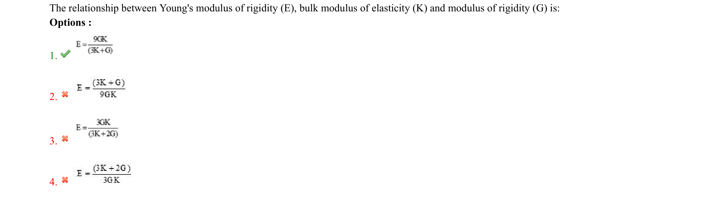

### Options

*(No options)*

### Answer

> **Answer: None**

### Exam

PCB-2022

---

## Question 78

**Topic:** 4. Engineering Materials
**Subtopic:** Structure and Properties of Engineering Materials

### Question

The relationship between Poisson's ratio (), bulk modulus of elasticity (K) and modulus of rigidity (G) is:

### Options

1. 2(G-3K)
2. (3K + 2G)
3. (3K -2G)
4. (3K+2G) 2(G-3K)

### Answer

> **Answer: None**

### Exam

PCB-2022

---

## Question 79

**Topic:** 4. Engineering Materials
**Subtopic:** Structure and Properties of Engineering Materials

### Question

What is the average number of atoms per unit cell in simple cubic structures if there are 8 atoms corresponding to 8 corners and there are no atoms on the faces or in the interior of the unit cell?

### Options

1. 1
2. 2
3. 4
4. 6

### Answer

> **Answer: 1**

### Exam

PCB-2025

---

## Question 80

**Topic:** 4. Engineering Materials
**Subtopic:** Structure and Properties of Engineering Materials

### Question

Which of the following is NOT a property of ceramics?

### Options

1. High thermal and chemical resistance
2. Poor electrical conductivity (except for certain ceramics)
3. Usage in electronic and aerospace applications
4. High ductility and malleability

### Answer

> **Answer: 4**

### Exam

PCB-2025

---

## Question 81

**Topic:** 4. Engineering Materials
**Subtopic:** Structure and Properties of Engineering Materials

### Question

Match the alloys with their metallic materials.

| **Alloy** | **Metallic Material** |
| --- | --- |
| **1.** Brass | **a.** Lead and tin |
| **2.** Bronze | **b.** Aluminium, nickel, cobalt and iron |
| **3.** Alnico | **c.** Copper and zinc |
| **4.** Terne | **d.** Copper and tin |

### Options

1. 1-c, 2-d, 3-b, 4-a
2. 1-c, 2-d, 3-a, 4-b
3. 1-d, 2-c, 3-a, 4-b
4. 1-d, 2-c, 3-b, 4-a

### Answer

> **Answer: 1**

### Exam

PCB-2025

---

## Question 82

**Topic:** 4. Engineering Materials
**Subtopic:** Structure and Properties of Engineering Materials

### Question

_______ method is particularly used for measuring the grain size when grains are not equiaxed.

### Options

1. The comparison
2. The Jeffries planimetric
3. Heyn’s intercept
4. The equilibrium

### Answer

> **Answer: 3**

### Exam

PCB-2025

---

## Question 83

**Topic:** 4. Engineering Materials
**Subtopic:** Structure and Properties of Engineering Materials

### Question

Read the given statement and conclusions carefully. Assuming that the information given in the statement is true, even if it appears to be at variance with commonly known facts, decide which of the given conclusions logically follow(s) from the statement.

**Statement:** Alloys with low aluminium content (4% to 7%) are single-phase alloys and can be fabricated by cold working processes, due to their good ductility and malleability.

**Conclusions:**

I. Alloys with low aluminium content are fabricated by cold rolling, drawing and pressing.

II. These alloys are used in pump castings, valve fittings and gears.

### Options

1. Only conclusion I follows.
2. Only conclusion II follows.
3. Both conclusions I and II follow.
4. Neither conclusion I nor II follows.

### Answer

> **Answer: 1**

### Exam

PCB-2025

---

## Question 84

**Topic:** 4. Engineering Materials
**Subtopic:** Structure and Properties of Engineering Materials

### Question

Read the given statement and conclusions carefully. Assuming that the information given in the statement is true, even if it appears to be at variance with commonly known facts, decide which of the given conclusions logically follow(s) from the statement.

**Statement:** Increasing the tempering temperature during heat treatment of steel leads to improved ductility and toughness.

**Conclusions:**

I. Increasing the tempering temperature improves brittleness, but there is no effect on the toughness of steel.

II. Increasing the tempering temperature increases hardness.

### Options

1. Only conclusion I follows.
2. Only conclusion II follows.
3. Both conclusions I and II follow.
4. Neither conclusion I nor II follows.

### Answer

> **Answer: 4**

### Exam

PCB-2025

---

## Question 85

**Topic:** 4. Engineering Materials
**Subtopic:** Structure and Properties of Engineering Materials

### Question

Which of the following is a non-ferrous metal?

### Options

1. Grey cast iron
2. Mild steel
3. Copper
4. High carbon steel

### Answer

> **Answer: 3**

### Exam

PCB-2025

---

## Question 86

**Topic:** 4. Engineering Materials
**Subtopic:** Structure and Properties of Engineering Materials

### Question

What is the key difference between crystalline and amorphous solids?

### Options

1. Crystalline solids have an ordered arrangement of atoms, while amorphous solids lack long-range order.
2. Crystalline solids are always metals, and amorphous solids are always non-metals.
3. Crystalline solids can only exist at high temperatures, while amorphous solids exist at room temperature.
4. Crystalline solids are only man-made, while amorphous solids are natural.

### Answer

> **Answer: 1**

### Exam

PCB-2025

---

## Question 87

**Topic:** 4. Engineering Materials
**Subtopic:** Structure and Properties of Engineering Materials

### Question

Convert 10 GPa pressure into MPa.

### Options

1. 1000 MPa
2. 100 MPa
3. 10,000 MPa
4. 1,00,000 MPa

### Answer

> **Answer: 3**

### Exam

PCB-2025

---

## Phase Diagrams

## Question 88

**Topic:** 4. Engineering Materials
**Subtopic:** Phase Diagrams

### Question

What does a phase diagram represent?

### Options

1. The mechanical properties of materials at different pressures
2. The phases in equilibrium at various compositions, temperatures and pressures
3. The chemical reactions occurring in a system
4. The electrical conductivity of materials

### Answer

> **Answer: 2**

### Exam

PCB-2025

---

## Heat Treatment

## Question 89

**Topic:** 4. Engineering Materials
**Subtopic:** Heat Treatment

### Question

In _______ transformation, a liquid reacts with a solid and forms a new solid at constant temperature during cooling.

### Options

1. peritectoid
2. peritectic
3. eutectoid
4. monotectic

### Answer

> **Answer: 2**

### Exam

PCB-2025

---

## Question 90

**Topic:** 4. Engineering Materials
**Subtopic:** Heat Treatment

### Question

Which of the following is NOT a primary objective of heat treatment?

### Options

1. Improve machinability
2. Enhance material formability
3. Change the product shape
4. Restore ductility after cold working

### Answer

> **Answer: 3**

### Exam

PCB-2025

---

## Stress-Strain Diagrams for Engineering Materials

## Question 91

**Topic:** 4. Engineering Materials
**Subtopic:** Stress-Strain Diagrams for Engineering Materials

### Question

The Stress (o) - Strain (e) diagram for a Linear-Elastic material is:

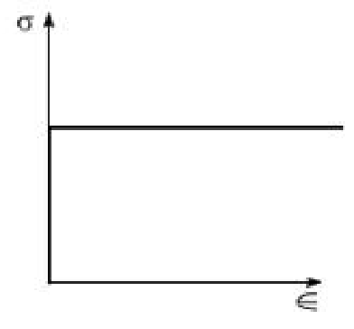

### Options

2. 
3. 
4. 

### Answer

> **Answer: None**

### Exam

PCB-2022

---

## Question 92

**Topic:** 4. Engineering Materials
**Subtopic:** Stress-Strain Diagrams for Engineering Materials

### Question

The relationship between the Engineering Strain (e) and the True Strain (ε), for materials with no changes in volume during deformation, is (where ln represents natural log):

### Options

1. ε = ln(e + 1)
2. ε = ln(e ̶1)
3. e = ln(ε + 1)
4. e = ln(ε ̶ 1)

### Answer

> **Answer: 1**

### Exam

PCB-2022

---

## Question 93

**Topic:** 4. Engineering Materials
**Subtopic:** Stress-Strain Diagrams for Engineering Materials

### Question

The relationship between the Engineering Stress (s) and the True Stress (σ), for materials with no changes in volume during deformation, is (where e is the Engineering Strain and ε is the True Strain):

### Options

1. σ = s(e + 1)
2. σ = s(e – 1)
3. s= σ(ε + 1)
4. s= σ(ε – 1)

### Answer

> **Answer: 1**

### Exam

PCB-2022

---

## Question 94

**Topic:** 4. Engineering Materials
**Subtopic:** Stress-Strain Diagrams for Engineering Materials

### Question

A rod is 2 m long at a temperature of 10 °C. The temperature of it is raised to 80 °C. If the expansion due to temperature rise is prevented, the stress developed in the rod is (take Young's modulus of rigidity, E, = 1.0 × 105 MN/m2 and coefficient of thermal expansion, α, = 0.000012 per °C):

### Options

1. 64 N/mm2
2. 64 kN/mm2
3. 84 N/mm2
4. 84 kN/mm2

### Answer

> **Answer: 3**

### Exam

PCB-2022

---

## Question 95

**Topic:** 4. Engineering Materials
**Subtopic:** Stress-Strain Diagrams for Engineering Materials

### Question

What distinguishes true stress from nominal (or conventional) stress in a uniaxial tension test?

### Options

1. True stress considers the original area of the specimen.
2. Nominal stress is based on the actual area at a given instant.
3. True stress considers the actual area at a given instant.
4. Both true stress and nominal stress use the original area of the specimen.

### Answer

> **Answer: 3**

### Exam

PCB-2025

---

## Question 96

**Topic:** 4. Engineering Materials
**Subtopic:** Stress-Strain Diagrams for Engineering Materials

### Question

Select the option that is true regarding the following two statements labelled Assertion (A) and Reason (R).

**Assertion (A):** The area under the stress-strain curve represents the energy absorbed by the material during deformation.

**Reason (R):** The integral of stress with respect to strain provides a measure of the work done on the material, which is related to the energy absorbed during deformation.

### Options

1. Both A and R are true and R is the correct explanation of A
2. Both A and R are true, but R is not the correct explanation of A
3. A is true, but R is false
4. A is false, but R is true

### Answer

> **Answer: 1**

### Exam

PCB-2025

---

# 5. Fluid Mechanics and Hydraulics

## Newtonian and Non-Newtonian Fluids & Fluid Properties

## Question 97

**Topic:** 5. Fluid Mechanics and Hydraulics
**Subtopic:** Newtonian and Non-Newtonian Fluids & Fluid Properties

### Question

On application of shear stress, the fluid will:

### Options

1. start to flow
2. not flow
3. flow or not depending on the value of the shear stress
4. flow or not depending on other factors apart from the shear stress

### Answer

> **Answer: 1**

### Exam

PCB-2022

---

## Question 98

**Topic:** 5. Fluid Mechanics and Hydraulics
**Subtopic:** Newtonian and Non-Newtonian Fluids & Fluid Properties

### Question

______ is the ratio of dynamic viscosity to kinematic viscosity.

### Options

1. Density
2. Virtual viscosity
3. Specific weight
4. Specific volume

### Answer

> **Answer: 1**

### Exam

PCB-2022

---

## Question 99

**Topic:** 5. Fluid Mechanics and Hydraulics
**Subtopic:** Newtonian and Non-Newtonian Fluids & Fluid Properties

### Question

The dimensions of specific weight are same as that of:

### Options

1. pressure
2. force/volume
3. work/volume
4. density

### Answer

> **Answer: 2**

### Exam

PCB-2022

---

## Question 100

**Topic:** 5. Fluid Mechanics and Hydraulics
**Subtopic:** Newtonian and Non-Newtonian Fluids & Fluid Properties

### Question

Which of the following statements is correct about the density of water?

### Options

1. Density of water increases with temperature.
2. Density of water decreases with temperature.
3. Density of water is maximum at 4 °C.
4. Density of water is maximum at 0 °C.

### Answer

> **Answer: 3**

### Exam

PCB-2022

---

## Question 101

**Topic:** 5. Fluid Mechanics and Hydraulics
**Subtopic:** Newtonian and Non-Newtonian Fluids & Fluid Properties

### Question

In the graph of shearing stress vs. rate of shearing strain, which of the following lines represent shear
thinning fluid?
Shearingstress,t
Rateof shearing strain,

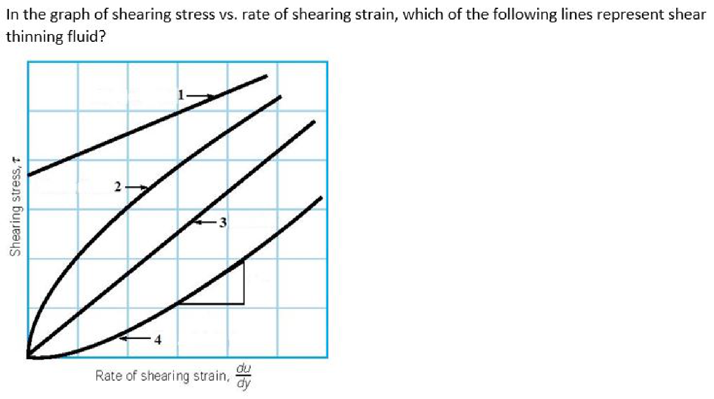

### Options

1. 1
2. 2
3. 3
4. 4

### Answer

> **Answer: 2**

### Exam

PCB-2022

---

## Question 102

**Topic:** 5. Fluid Mechanics and Hydraulics
**Subtopic:** Newtonian and Non-Newtonian Fluids & Fluid Properties

### Question

If the specific gravity of a fluid is 1.26, its specific weight will be (take density of water = 1000 kg/m3 and acceleration due to gravity = 10 m/s2):

### Options

1. 12.6 N/m3
2. 12.6 kN/m3
3. 1.26 N/m3
4. 1.26 kN/m3

### Answer

> **Answer: 2**

### Exam

PCB-2022

---

## Question 103

**Topic:** 5. Fluid Mechanics and Hydraulics
**Subtopic:** Newtonian and Non-Newtonian Fluids & Fluid Properties

### Question

For liquids or gases at rest, the pressure gradient in the vertical direction at any point in a fluid depends only on the ______ of the fluid at that point.

### Options

1. viscosity
2. specific weight
3. temperature
4. thermal conductivity

### Answer

> **Answer: 2**

### Exam

PCB-2022

---

## Question 104

**Topic:** 5. Fluid Mechanics and Hydraulics
**Subtopic:** Newtonian and Non-Newtonian Fluids & Fluid Properties

### Question

is the acceleration due to gravity and R is gas constant):

### Options

1. Bz RB
2. 
3. 
4. P=P: Bz

### Answer

> **Answer: None**

### Exam

PCB-2022

---

## Question 105

**Topic:** 5. Fluid Mechanics and Hydraulics
**Subtopic:** Newtonian and Non-Newtonian Fluids & Fluid Properties

### Question

Any two points at ______ elevation in a continuous mass of the same static fluid will be at ______ pressure(s).

### Options

1. the same; the same
2. the same; different
3. different; the same
4. the same; absolute

### Answer

> **Answer: 1**

### Exam

PCB-2022

---

## Question 106

**Topic:** 5. Fluid Mechanics and Hydraulics
**Subtopic:** Newtonian and Non-Newtonian Fluids & Fluid Properties

### Question

For the tank shown in the following figure, the resultant force due to the pressure on side wall AB will be:
Freesurface
p=Patm
Specific weight=

### Options

1. located at the mid-point of the wall
2. located at the upper half of the wall
3. located at the lower half of the wall
4. located at the base of the wall (at point B)

### Answer

> **Answer: 3**

### Exam

PCB-2022

---

## Question 107

**Topic:** 5. Fluid Mechanics and Hydraulics
**Subtopic:** Newtonian and Non-Newtonian Fluids & Fluid Properties

### Question

Based on the two statements given below, choose the correct answer. Statement A: The magnitude of the resultant fluid force is equal to the pressure acting at the centroid of the area multiplied by the total area. Statement B: The resultant fluid force, acting on a fully submerged inclined plane surface, does not pass through the centroid of the area.

### Options

1. Both statements A and B are correct.
2. Both statements A and B are incorrect.
3. Statement A is correct but statement B is incorrect.
4. Statement A is incorrect but statement B is correct.

### Answer

> **Answer: 1**

### Exam

PCB-2022

---

## Question 108

**Topic:** 5. Fluid Mechanics and Hydraulics
**Subtopic:** Newtonian and Non-Newtonian Fluids & Fluid Properties

### Question

(where Ixx is the area moment of inertia of the plate area about its centroidal x axis, Ixy is the product of inertia of the plane surface,  is the
angle of inclination of the plane surface, hcG is the depth straight down from the surface to the plate centroid, A is the area of plane surface):

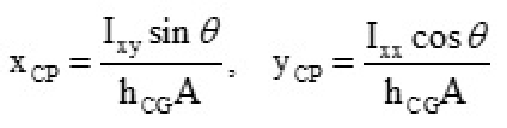

### Options

1. Ixy sin 8 I x sin g
2. hcGA Ycp hcGA
3. 
4. Ixxcos Ixsin hcGA hcGA

### Answer

> **Answer: None**

### Exam

PCB-2022

---

## Question 109

**Topic:** 5. Fluid Mechanics and Hydraulics
**Subtopic:** Newtonian and Non-Newtonian Fluids & Fluid Properties

### Question

Panel ABC in the slanted side of a water tank (shown in the following figure) is an isosceles triangle with vertex at A
and base BC = 2 m. The water force on the panel is (take specific weight of water as 9790 N/m3):
Water
14m
B,C		3m

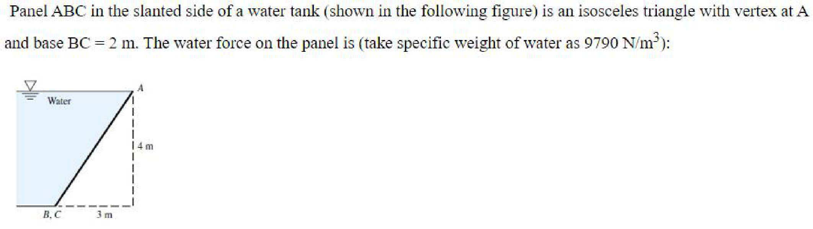

### Options

1. 131.0 N
2. 131.0 kN
3. 32.6 kN
4. 32.6 N

### Answer

> **Answer: 2**

### Exam

PCB-2022

---

## Question 110

**Topic:** 5. Fluid Mechanics and Hydraulics
**Subtopic:** Newtonian and Non-Newtonian Fluids & Fluid Properties

### Question

*(No text)*

### Options

1. 104 kN.m
2. 114 kN.m
3. 124 kN.m
4. 134 kN.m

### Answer

> **Answer: 3**

### Exam

PCB-2022

---

## Question 111

**Topic:** 5. Fluid Mechanics and Hydraulics
**Subtopic:** Newtonian and Non-Newtonian Fluids & Fluid Properties

### Question

Which of the following is NOT a constriction meter?

### Options

1. Thin-plate orifice
2. Flow nozzle
3. Venturi tube
4. Rotameter

### Answer

> **Answer: 4**

### Exam

PCB-2022

---

## Question 112

**Topic:** 5. Fluid Mechanics and Hydraulics
**Subtopic:** Newtonian and Non-Newtonian Fluids & Fluid Properties

### Question

Which of the following statements is NOT true about nozzle meter discharge coefficient, Cd (Re is Reynolds number, and β is ratio of nozzle diameter to pipe diameter)?

### Options

1. Cd generally increases with increase in Re at constant β.
2. Cd generally increases with increase in β at constant Re.
3. Cd for nozzle meter is more than that for an orifice meter at the same β and Re.
4. Formation of Vena contracta does not take place.

### Answer

> **Answer: 1**

### Exam

PCB-2022

---

## Question 113

**Topic:** 5. Fluid Mechanics and Hydraulics
**Subtopic:** Newtonian and Non-Newtonian Fluids & Fluid Properties

### Question

If the actual velocity in the contracted section of a jet of liquid flowing from a 50-mm-diameter orifice is 8.91 m/s under a head of 5 m, the value of the coefficient of velocity will be (take acceleration due to gravity as 10 m/s2):

### Options

1. 0.891
2. 0.861
3. 0.901
4. 0.821

### Answer

> **Answer: 1**

### Exam

PCB-2022

---

## Question 114

**Topic:** 5. Fluid Mechanics and Hydraulics
**Subtopic:** Newtonian and Non-Newtonian Fluids & Fluid Properties

### Question

The flow velocity (V) from an orifice, attached to a tank of sufficiently large cross-sectional area, is (where ac is the area of vena contracta, a is
the tank area, h is the height of the fluid in the tank and g is the acceleration due to gravity):
2gh ac
2gh
2gh
3. *

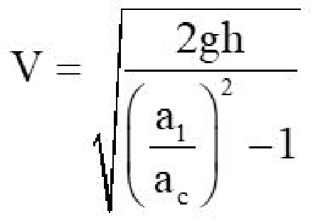

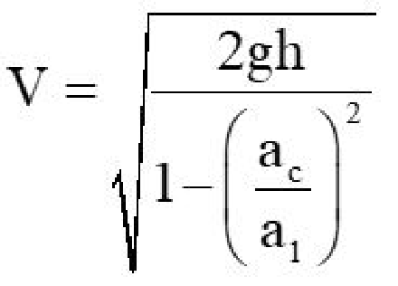

### Options

*(No options)*

### Answer

> **Answer: None**

### Exam

PCB-2022

---

## Question 115

**Topic:** 5. Fluid Mechanics and Hydraulics
**Subtopic:** Newtonian and Non-Newtonian Fluids & Fluid Properties

### Question

When the _______ between liquid molecules and a tube is greater than the _______ between liquid molecules, the liquid wets the surface of the tube and there is a capillary rise.

### Options

1. adhesion, cohesion
2. cohesion, adhesion
3. adhesion, adhesion
4. cohesion, cohesion

### Answer

> **Answer: 1**

### Exam

PCB-2025

---

## Question 116

**Topic:** 5. Fluid Mechanics and Hydraulics
**Subtopic:** Newtonian and Non-Newtonian Fluids & Fluid Properties

### Question

Which of the following is NOT an example of a thixotropic fluid?

### Options

1. Lipstick
2. Printer ink
3. Enamel
4. Water

### Answer

> **Answer: 4**

### Exam

PCB-2025

---

## Question 117

**Topic:** 5. Fluid Mechanics and Hydraulics
**Subtopic:** Newtonian and Non-Newtonian Fluids & Fluid Properties

### Question

Match the properties of fluids with the SI units representing them.

| Property of Fluids | SI Unit |
| --- | --- |
| 1. Specific volume | a. kg/m³ |
| 2. Weight density | b. m³/kg |
| 3. Kinematic viscosity | c. N/m³ |
| 4. Mass density | d. m²/s |

### Options

1. 1-b, 2-c, 3-d, 4-a
2. 1-b, 2-d, 3-c, 4-a
3. 1-b, 2-c, 3-a, 4-d
4. 1-c, 2-b, 3-d, 4-a

### Answer

> **Answer: 1**

### Exam

PCB-2025

---

## Question 118

**Topic:** 5. Fluid Mechanics and Hydraulics
**Subtopic:** Newtonian and Non-Newtonian Fluids & Fluid Properties

### Question

Read the given statement and conclusions carefully. Assuming that the information given in the statement is true, even if it appears to be at variance with commonly known facts, decide which of the given conclusions logically follow(s) from the statement.

**Statement:** Due to surface tension forces acting on a surface, the pressure intensity inside the droplet, bubble and jet of the liquid is more as compared to that outside.

**Conclusions:**

I. When the diameter of a droplet decreases, the intensity of pressure inside the droplet increases.

II. All the molecules on the free surface experience an upward pull force.

### Options

1. Only conclusion I follows.
2. Only conclusion II follows.
3. Both conclusions I and II follow.
4. Neither conclusion I nor II follows.

### Answer

> **Answer: 1**

### Exam

PCB-2025

---

## Question 119

**Topic:** 5. Fluid Mechanics and Hydraulics
**Subtopic:** Newtonian and Non-Newtonian Fluids & Fluid Properties

### Question

Match the following physical quantities with their measurement units in the SI system.

| **Physical Quantity** | **SI Unit** |
| --- | --- |
| **1.** Angular acceleration | **a.** N/m² |
| **2.** Discharge | **b.** rad/s² |
| **3.** Kinematic viscosity | **c.** m³/s |
| **4.** Shear stress | **d.** m²/s |

### Options

1. 1-b, 2-c, 3-d, 4-a
2. 1-b, 2-d, 3-c, 4-a
3. 1-b, 2-c, 3-a, 4-d
4. 1-c, 2-b, 3-d, 4-a

### Answer

> **Answer: 1**

### Exam

PCB-2025

---

## Question 120

**Topic:** 5. Fluid Mechanics and Hydraulics
**Subtopic:** Newtonian and Non-Newtonian Fluids & Fluid Properties

### Question

For Newtonian fluids, the relation between shear stress and velocity gradient is a _______.

### Options

1. parabolic curve
2. zigzag line
3. straight line
4. sinusoidal curve

### Answer

> **Answer: 3**

### Exam

PCB-2025

---

## Question 121

**Topic:** 5. Fluid Mechanics and Hydraulics
**Subtopic:** Newtonian and Non-Newtonian Fluids & Fluid Properties

### Question

Which of the following statements about surface tension is correct?

### Options

1. Surface tension acts perpendicular to the surface of a liquid.
2. Surface tension is independent of temperature.
3. Surface tension is the force per unit length acting parallel to the liquid surface at the interface.
4. Surface tension increases as the liquid temperature increases.

### Answer

> **Answer: 3**

### Exam

PCB-2025

---

## Question 122

**Topic:** 5. Fluid Mechanics and Hydraulics
**Subtopic:** Newtonian and Non-Newtonian Fluids & Fluid Properties

### Question

What is the value of density of water (in gm/cm3 )?

### Options

1. 1000
2. 1
3. 10
4. 100

### Answer

> **Answer: 2**

### Exam

PCB-2025

---

## Question 123

**Topic:** 5. Fluid Mechanics and Hydraulics
**Subtopic:** Newtonian and Non-Newtonian Fluids & Fluid Properties

### Question

Which of the following types of turbines is most suitable for a low-head dam?

### Options

1. Impulse turbine
2. Reaction turbine
3. Kaplan turbine
4. Francis turbine

### Answer

> **Answer: 2**

### Exam

Env-analyst-2025

---

## Measurement of Pressure & Manometers

## Question 124

**Topic:** 5. Fluid Mechanics and Hydraulics
**Subtopic:** Measurement of Pressure & Manometers

### Question

Which of the following statements is NOT correct about gauge pressure?

### Options

1. It can be more than absolute pressure.
2. For a pressure value more than atmospheric pressure, gauge pressure will be positive.
3. It can have negative values.
4. For a pressure value less than atmospheric pressure, gauge pressure will be negative.

### Answer

> **Answer: 1**

### Exam

PCB-2022

---

## Question 125

**Topic:** 5. Fluid Mechanics and Hydraulics
**Subtopic:** Measurement of Pressure & Manometers

### Question

SG=0.8
PA		4m
60kPa
3m
Water
2m
Water

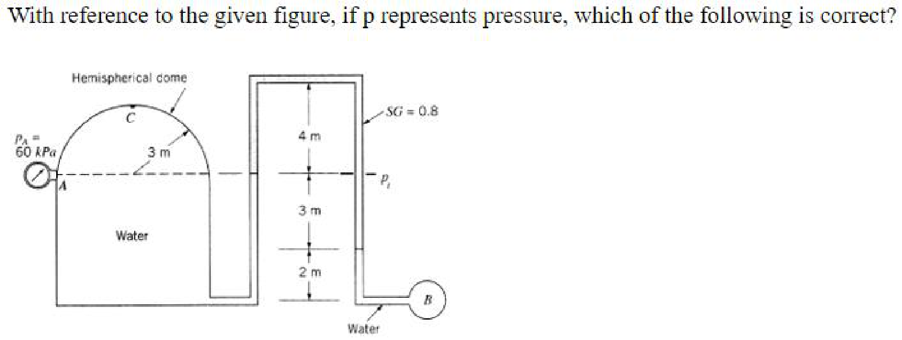

### Options

1. pA = p1
2. pA = p1 - pB
3. pA < p1
4. pA > p1

### Answer

> **Answer: 1**

### Exam

PCB-2022

---

## Question 126

**Topic:** 5. Fluid Mechanics and Hydraulics
**Subtopic:** Measurement of Pressure & Manometers

### Question

Water flows upward in a pipe slanted at 3o, as shown in the given figure. If the mercury manometer reads h = 12 cm,
the pressure difference between points (1) and (2) in the pipe is (take specific weights of water as 9790 N/m3 and of
mercuryas 133100N/m3)
30°
(1)
2m

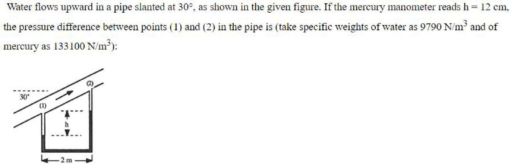

### Options

1. 2.4 kPa
2. 16.0 kPa
3. 26.1 kPa
4. 34.4 kPa

### Answer

> **Answer: 3**

### Exam

PCB-2022

---

## Question 127

**Topic:** 5. Fluid Mechanics and Hydraulics
**Subtopic:** Measurement of Pressure & Manometers

### Question

SG=1.2		2m
Density =1500kg/m3

### Options

1. 7.1 kN/m3
2. 7.1 N/m3
3. 16.5 kN/m3
4. 16.5N/m3

### Answer

> **Answer: 1**

### Exam

PCB-2022

---

## Question 128

**Topic:** 5. Fluid Mechanics and Hydraulics
**Subtopic:** Measurement of Pressure & Manometers

### Question

The head given by a pitot stagnation-velocity tube corresponds to the ______.

### Options

1. hydraulic grade line
2. energy grade line
3. gravity head only
4. velocity head only

### Answer

> **Answer: 2**

### Exam

PCB-2022

---

## Question 129

**Topic:** 5. Fluid Mechanics and Hydraulics
**Subtopic:** Measurement of Pressure & Manometers

### Question

Find the pressure (in N/m?) due to a column of o.4 m for the oil of density 8oo kg/m and acceleration due to gravity
10m/s2

### Options

1. 3200
2. 3924
3. 3000
4. 3150

### Answer

> **Answer: 1**

### Exam

PCB-2025

---

## Fluid Kinematics: Classification of Fluids, Stream Function & Velocity Potential

## Question 130

**Topic:** 5. Fluid Mechanics and Hydraulics
**Subtopic:** Fluid Kinematics: Classification of Fluids, Stream Function & Velocity Potential

### Question

Flow at varying rates through a long straight pipe of uniform cross-section is a ______.

### Options

1. steady and uniform flow
2. steady and non-uniform flow
3. unsteady and uniform flow
4. unsteady and non-uniform flow

### Answer

> **Answer: 3**

### Exam

PCB-2022

---

## Question 131

**Topic:** 5. Fluid Mechanics and Hydraulics
**Subtopic:** Fluid Kinematics: Classification of Fluids, Stream Function & Velocity Potential

### Question

A ______ is a set of fluid particles that form a line at a given instant.

### Options

1. streamline
2. pathline
3. streakline
4. timeline

### Answer

> **Answer: 4**

### Exam

PCB-2022

---

## Question 132

**Topic:** 5. Fluid Mechanics and Hydraulics
**Subtopic:** Fluid Kinematics: Classification of Fluids, Stream Function & Velocity Potential

### Question

Which of the following statements is NOT correct about flow streamlines?

### Options

1. Fluid particles accelerate normal to streamlines.
2. Fluid particles accelerate along streamlines.
3. The component of weight along a streamline does not depend on the streamline angle.
4. The lines that are tangent to the velocity vectors throughout the flow field are called streamlines.

### Answer

> **Answer: 3**

### Exam

PCB-2022

---

## Question 133

**Topic:** 5. Fluid Mechanics and Hydraulics
**Subtopic:** Fluid Kinematics: Classification of Fluids, Stream Function & Velocity Potential

### Question

The actual path traced by a fluid particle over a period of time is called _______.

### Options

1. pathline
2. streamline
3. streakline
4. steady line

### Answer

> **Answer: 1**

### Exam

PCB-2025

---

## Fluid Dynamics: Continuity Equation, Bernoulli's Equation & Impulse Momentum Equation

## Question 134

**Topic:** 5. Fluid Mechanics and Hydraulics
**Subtopic:** Fluid Dynamics: Continuity Equation, Bernoulli's Equation & Impulse Momentum Equation

### Question

A schematic diagram of a hydraulic braking system is shown in the following figure. If the driver applies a force of
1oo N, the force F available at the brakes is (take specific gravity of the fluid to be 0.8 and units of length as mm):
100N
150
200
100
40

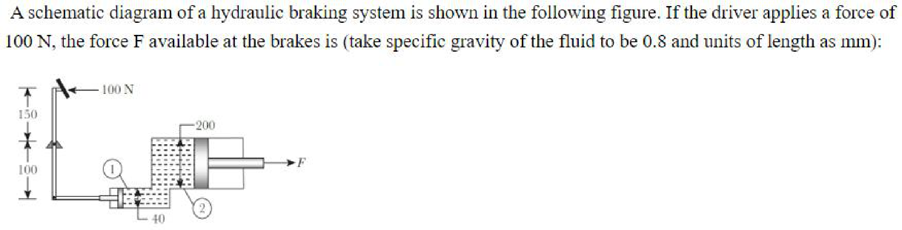

### Options

1. 1.67 kN
2. 2.5 kN
3. 2.75 kN
4. 3.75 kN

### Answer

> **Answer: 4**

### Exam

PCB-2022

---

## Question 135

**Topic:** 5. Fluid Mechanics and Hydraulics
**Subtopic:** Fluid Dynamics: Continuity Equation, Bernoulli's Equation & Impulse Momentum Equation

### Question

A hydraulic lift is used to lift a weight, as shown in the following figure. The diameter of the piston (D) on which the
weight is to beplaced is:
Weight
2500kg
25kg
10cm
0.1m
1mm
1 cm

### Options

1. 0.1 m
2. 1 m
3. 1 mm
4. 1 cm

### Answer

> **Answer: 2**

### Exam

PCB-2022

---

## Question 136

**Topic:** 5. Fluid Mechanics and Hydraulics
**Subtopic:** Fluid Dynamics: Continuity Equation, Bernoulli's Equation & Impulse Momentum Equation

### Question

The Bernoulli equation can be obtained by integrating F = ma along a ______.

### Options

1. streamline
2. pathline
3. streakline
4. timeline

### Answer

> **Answer: 1**

### Exam

PCB-2022

---

## Question 137

**Topic:** 5. Fluid Mechanics and Hydraulics
**Subtopic:** Fluid Dynamics: Continuity Equation, Bernoulli's Equation & Impulse Momentum Equation

### Question

*(No text)*

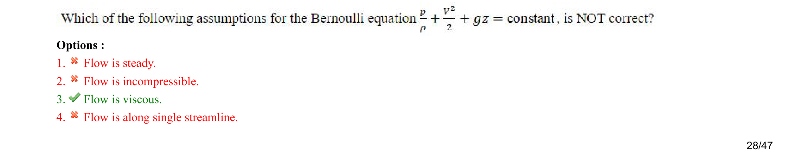

### Options

1. Flow is steady.
2. Flow is incompressible.
3. Flow is viscous.
4. Flow is along single streamline.

### Answer

> **Answer: 3**

### Exam

PCB-2022

---

## Question 138

**Topic:** 5. Fluid Mechanics and Hydraulics
**Subtopic:** Fluid Dynamics: Continuity Equation, Bernoulli's Equation & Impulse Momentum Equation

### Question

The pitot formula, used for velocity measurement using pitot tube, is (where V is the flow velocity, Po is the stagnation pressure, Ps is the static
pressure and p is the density):

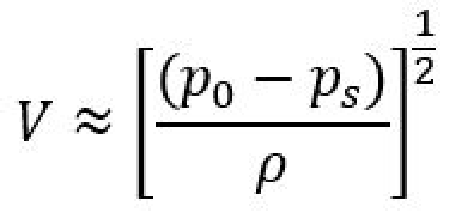

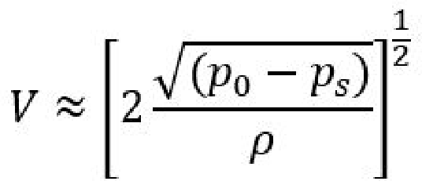

### Options

1. Po
3. 

### Answer

> **Answer: None**

### Exam

PCB-2022

---

## Question 139

**Topic:** 5. Fluid Mechanics and Hydraulics
**Subtopic:** Fluid Dynamics: Continuity Equation, Bernoulli's Equation & Impulse Momentum Equation

### Question

The actual discharge (Q) through an orifice, attached to a tank, is given by (where V is the flow velocity from the orifice, ac is the area of
contraction, a is the orifice area, h is the height of the fluid in the tank, Cc is the coefficient of contraction, Cv is the coefficient of velocity and g
is the acceleration due to gravity):
Q=(axV)

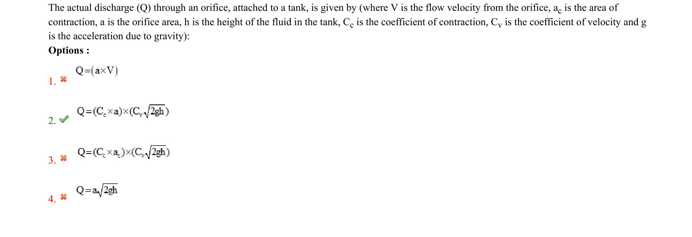

### Options

1. 
2. 
3. Q=(C,×a,.)x(C,/2gh)
4. Q=a/2gh

### Answer

> **Answer: None**

### Exam

PCB-2022

---

## Question 140

**Topic:** 5. Fluid Mechanics and Hydraulics
**Subtopic:** Fluid Dynamics: Continuity Equation, Bernoulli's Equation & Impulse Momentum Equation

### Question

JIIUILL		II.LL IVI
In reference to the following figure, the coefficient of velocity is given by:

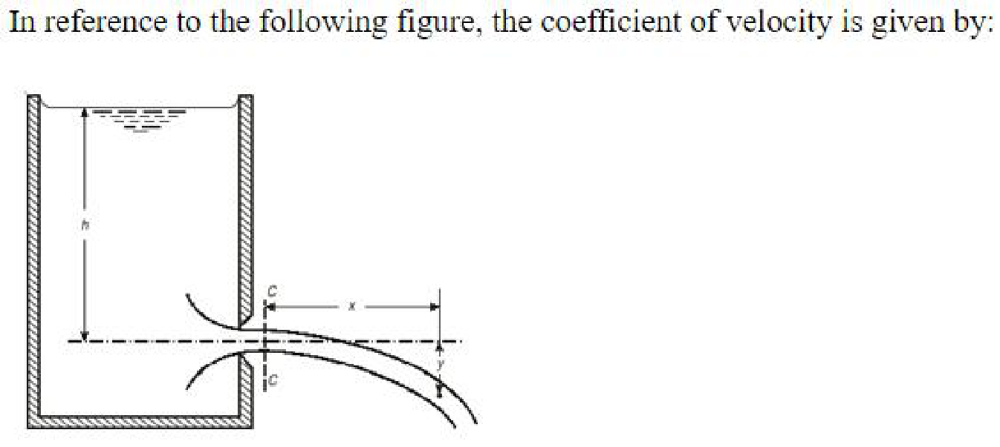

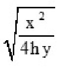

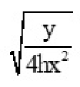

### Options

1. 4hy
2. 4hx?
3. 4hy2
4. × 4hx

### Answer

> **Answer: None**

### Exam

PCB-2022

---

## Question 141

**Topic:** 5. Fluid Mechanics and Hydraulics
**Subtopic:** Fluid Dynamics: Continuity Equation, Bernoulli's Equation & Impulse Momentum Equation

### Question

*(No text)*

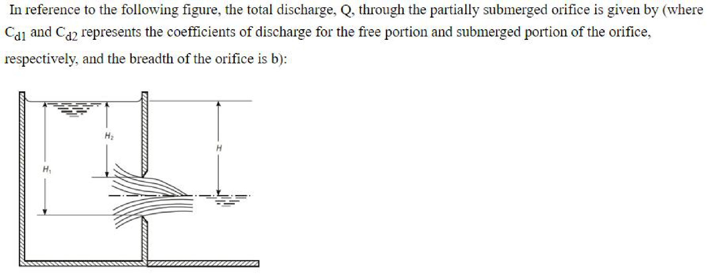

### Options

1. 
2. 
3. 
4. 

### Answer

> **Answer: 1**

### Exam

PCB-2022

---

## Question 142

**Topic:** 5. Fluid Mechanics and Hydraulics
**Subtopic:** Fluid Dynamics: Continuity Equation, Bernoulli's Equation & Impulse Momentum Equation

### Question

Water discharges at the rate of 98 litres per second through a vertical sharp-edged orifice of area 0.01 m2 placed under a constant head of 10 m. A point on the jet measured from the vena contracta of the jet has coordinates 3.85 m horizontal and 0.4 m vertical. The value of coefficient of contraction is (take acceleration due to gravity as 10 m/s2):

### Options

1. 0.63
2. 0.73
3. 0.78
4. 0.96

### Answer

> **Answer: 2**

### Exam

PCB-2022

---

## Question 143

**Topic:** 5. Fluid Mechanics and Hydraulics
**Subtopic:** Fluid Dynamics: Continuity Equation, Bernoulli's Equation & Impulse Momentum Equation

### Question

In reference to the following figure, the time to completely empty the vertical cylindrical tank is (where A is the cross-
sectional area of the tank, a is the area of orifice and Cd is the coefficient of discharge):
dh
H2
rifice

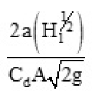

### Options

1. Cgav/2g
2. CA./2g
3. Cgay2g
4. CA/2gh

### Answer

> **Answer: None**

### Exam

PCB-2022

---

## Question 144

**Topic:** 5. Fluid Mechanics and Hydraulics
**Subtopic:** Fluid Dynamics: Continuity Equation, Bernoulli's Equation & Impulse Momentum Equation

### Question

dh
H2
Orifice
Ho

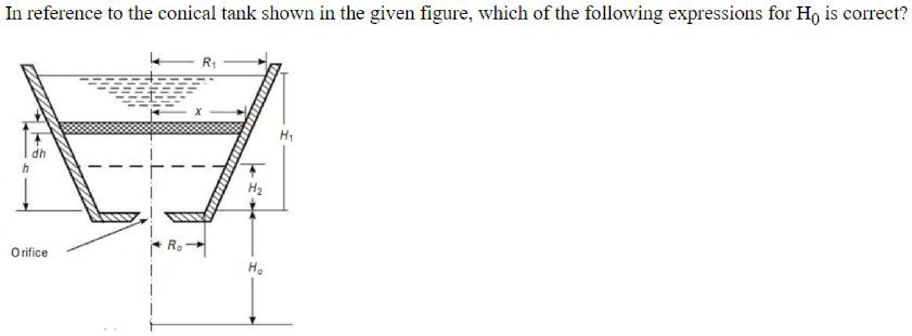

### Options

1. Ho= R,H
2. (R,-Ro)
3. R,H
4. R,H2

### Answer

> **Answer: None**

### Exam

PCB-2022

---

## Question 145

**Topic:** 5. Fluid Mechanics and Hydraulics
**Subtopic:** Fluid Dynamics: Continuity Equation, Bernoulli's Equation & Impulse Momentum Equation

### Question

*(No text)*

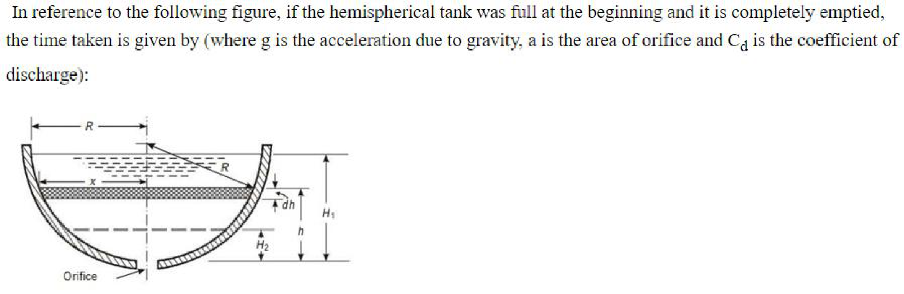

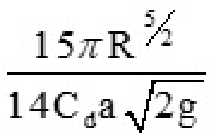

### Options

1. 
2. 
3. 
4. 

### Answer

> **Answer: 1**

### Exam

PCB-2022

---

## Question 146

**Topic:** 5. Fluid Mechanics and Hydraulics
**Subtopic:** Fluid Dynamics: Continuity Equation, Bernoulli's Equation & Impulse Momentum Equation

### Question

In a Borda's mouthpiece as shown in the following figure, 4o mm diameter discharges under a constant head of 1.5 m.
If the coefficient of velocity for the entrance section of the mouthpiece is 0.95, the coefficient of contraction, when the
mouthpiece is running firee, is:
Area

### Options

1. 0.554
2. 0.59
3. 0.63
4. 0.68

### Answer

> **Answer: 1**

### Exam

PCB-2022

---

## Question 147

**Topic:** 5. Fluid Mechanics and Hydraulics
**Subtopic:** Fluid Dynamics: Continuity Equation, Bernoulli's Equation & Impulse Momentum Equation

### Question

sill

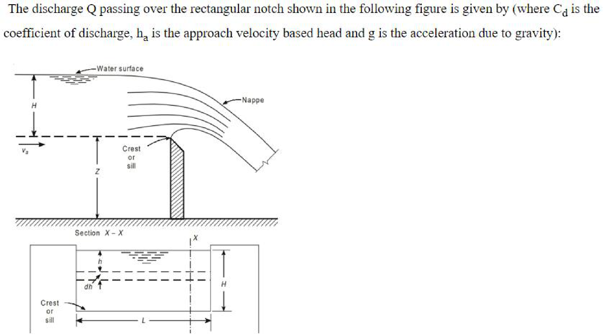

### Options

1. Q=C/2gl[(H+h, -h
2. 
3. 
4. 

### Answer

> **Answer: None**

### Exam

PCB-2022

---

## Question 148

**Topic:** 5. Fluid Mechanics and Hydraulics
**Subtopic:** Fluid Dynamics: Continuity Equation, Bernoulli's Equation & Impulse Momentum Equation

### Question

Francis formula for the discharge over a rectangular weir neglecting the approach velocity is (where H and L are the height and width of the
weir, respectively, and n is the number of end contractions for the weir):

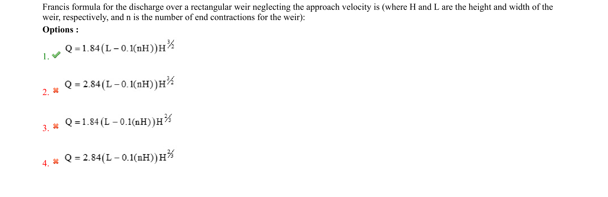

### Options

1. Q = 1. 84(L - 0. 1(nH)H
2. Q = 2.84(L - 0.1(nH))H
3. Q = 1. 84(L - 0.1(nH)H %
4. Q = 2.84(L - 0.1(nH)H

### Answer

> **Answer: None**

### Exam

PCB-2022

---

## Question 149

**Topic:** 5. Fluid Mechanics and Hydraulics
**Subtopic:** Fluid Dynamics: Continuity Equation, Bernoulli's Equation & Impulse Momentum Equation

### Question

For flow over the triangular notch shown in the following figure, constant for the notch is given by (where Ca is the
coefficient of discharge, and g is the acceleration due to gravity):
Watersurface

### Options

1. 
2. 15 sin
3. 
4. 15 tan

### Answer

> **Answer: None**

### Exam

PCB-2022

---

## Question 150

**Topic:** 5. Fluid Mechanics and Hydraulics
**Subtopic:** Fluid Dynamics: Continuity Equation, Bernoulli's Equation & Impulse Momentum Equation

### Question

Which of the following statements is NOT true about a triangular weir?

### Options

1. The nappe emerging from a triangular weir or notch has the same shape for nearly all different heads.
2. For measuring low discharges, a triangular weir or notch is more useful as compared to a rectangular weir.
3. In most of the cases of flow over a triangular weir or notch, the velocity of approach may be neglected without introducing an appreciable error.
4. Ventilation of a triangular weir is must.

### Answer

> **Answer: 4**

### Exam

PCB-2022

---

## Question 151

**Topic:** 5. Fluid Mechanics and Hydraulics
**Subtopic:** Fluid Dynamics: Continuity Equation, Bernoulli's Equation & Impulse Momentum Equation

### Question

*(No text)*

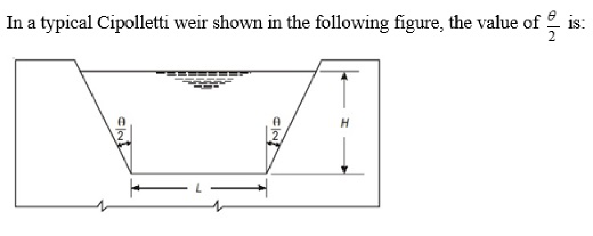

### Options

1. 14°
2. 22°
3. 30°
4. 38°

### Answer

> **Answer: 1**

### Exam

PCB-2022

---

## Question 152

**Topic:** 5. Fluid Mechanics and Hydraulics
**Subtopic:** Fluid Dynamics: Continuity Equation, Bernoulli's Equation & Impulse Momentum Equation

### Question

In frictionless flow, with no work or heat transfer, the energy grade line:

### Options

1. linearly increases
2. linearly decreases
3. has constant height
4. first increases then decreases

### Answer

> **Answer: 3**

### Exam

PCB-2022

---

## Question 153

**Topic:** 5. Fluid Mechanics and Hydraulics
**Subtopic:** Fluid Dynamics: Continuity Equation, Bernoulli's Equation & Impulse Momentum Equation

### Question

The height to which a liquid would rise in a piezometer tube attached to the flow is the same as the ______.

### Options

1. height of the hydraulic grade line
2. height of the energy grade line
3. gravity head only
4. velocity head only

### Answer

> **Answer: 1**

### Exam

PCB-2022

---

## Question 154

**Topic:** 5. Fluid Mechanics and Hydraulics
**Subtopic:** Fluid Dynamics: Continuity Equation, Bernoulli's Equation & Impulse Momentum Equation

### Question

In an open-channel flow, the hydraulic grade line is:

### Options

1. below the free surface of the water
2. identical to the free surface of the water
3. above the free surface of the water
4. can be above or below the free surface of the water

### Answer

> **Answer: 2**

### Exam

PCB-2022

---

## Question 155

**Topic:** 5. Fluid Mechanics and Hydraulics
**Subtopic:** Fluid Dynamics: Continuity Equation, Bernoulli's Equation & Impulse Momentum Equation

### Question

The relationship between hydraulic grade line (HGL) and the energy grade line (EGL) is:

### Options

1. HGL = EGL – velocity head
2. HGL = EGL – potential head
3. HGL = EGL – pressure head
4. HGL = EGL – (pressure head + potential head)

### Answer

> **Answer: 1**

### Exam

PCB-2022

---

## Question 156

**Topic:** 5. Fluid Mechanics and Hydraulics
**Subtopic:** Fluid Dynamics: Continuity Equation, Bernoulli's Equation & Impulse Momentum Equation

### Question

*(No text)*

### Options

1. of gradually increasing height and straight
2. of gradually decreasing height and straight
3. of gradually increasing height and gradually increasing height
4. straight and straight

### Answer

> **Answer: 1**

### Exam

PCB-2022

---

## Question 157

**Topic:** 5. Fluid Mechanics and Hydraulics
**Subtopic:** Fluid Dynamics: Continuity Equation, Bernoulli's Equation & Impulse Momentum Equation

### Question

The power available at the outlet of a pipe is (where Q is the discharge through the pipe, V is the velocity of flow, L and D are the length and the
diameter of the pipe, respectively, w is the specific weight, f is the friction factor and g is the acceleration due to gravity):
πD2		fL V2
2gD
πD2		fL V?
2gD
2.
fL V?
4L		2gD
πD3		fL V?
2L		2gD

### Options

*(No options)*

### Answer

> **Answer: None**

### Exam

PCB-2022

---

## Question 158

**Topic:** 5. Fluid Mechanics and Hydraulics
**Subtopic:** Fluid Dynamics: Continuity Equation, Bernoulli's Equation & Impulse Momentum Equation

### Question

The water from a reservoir at a high altitude is conveyed by a pipeline. The efficiency of power transmission in this case is given by (where Q is
the volume flow rate, R is the hydraulic resistance of the pipeline and H is the potential head of water in the reservoir):

### Options

1. RQ?
2. 
3. Tp H?
4. H? RQ

### Answer

> **Answer: None**

### Exam

PCB-2022

---

## Question 159

**Topic:** 5. Fluid Mechanics and Hydraulics
**Subtopic:** Fluid Dynamics: Continuity Equation, Bernoulli's Equation & Impulse Momentum Equation

### Question

The efficiency of power transmission through a pipe, at the condition of maximum power delivered, is (where H is the total head supplied at the
entrance to the pipe and hf is the loss of head due to friction):

### Options

1. 1/2
2. 1/4
3. 1/3
4. 2/3

### Answer

> **Answer: None**

### Exam

PCB-2022

---

## Question 160

**Topic:** 5. Fluid Mechanics and Hydraulics
**Subtopic:** Fluid Dynamics: Continuity Equation, Bernoulli's Equation & Impulse Momentum Equation

### Question

Corresponding to the maximum power transmitted through a pipeline, the efficiency of power transmission is:

### Options

1. 50.0%
2. 56.7%
3. 66.7%
4. 76.7%

### Answer

> **Answer: 3**

### Exam

PCB-2022

---

## Question 161

**Topic:** 5. Fluid Mechanics and Hydraulics
**Subtopic:** Fluid Dynamics: Continuity Equation, Bernoulli's Equation & Impulse Momentum Equation

### Question

The relation between force F and jet velocity V, for a high-velocity jet impinging on a stationary flat vertical plate (neglecting friction), is:

### Options

1. × Foc V1/2
2. Foc V3/2
3. V FoV?
4. F oc V3

### Answer

> **Answer: None**

### Exam

PCB-2022

---

## Question 162

**Topic:** 5. Fluid Mechanics and Hydraulics
**Subtopic:** Fluid Dynamics: Continuity Equation, Bernoulli's Equation & Impulse Momentum Equation

### Question

Which of the following statements is true about force F due to a high-velocity jet impingement on a stationary curved
plate (neglecting fiiction)as shown in the given figure?

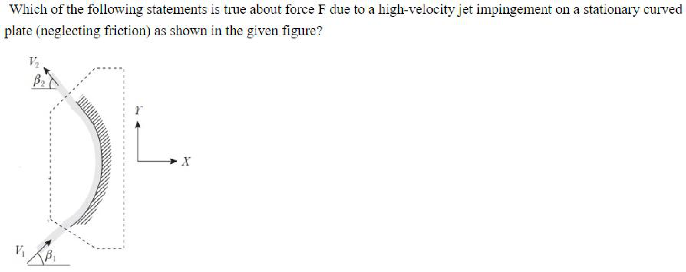

### Options

1. Force in X-direction is dependent on V1cosβ1
2. Force in X-direction is dependent on V2sinβ2
3. Force in Y-direction is dependent on V1cosβ1
4. Force in Y-direction is dependent on V2cosβ2

### Answer

> **Answer: 1**

### Exam

PCB-2022

---

## Question 163

**Topic:** 5. Fluid Mechanics and Hydraulics
**Subtopic:** Fluid Dynamics: Continuity Equation, Bernoulli's Equation & Impulse Momentum Equation

### Question

The force, F, generated when a jet strikes at the middle of one of the flat plates mounted on a wheel is (where V is the jet velocity and u is the tangential velocity of the wheel at the middle of the plate, D is the diameter of the wheel at the middle of the plate and A is the area of the plate):

### Options

1. F = ρ A V (V-u)
2. F = ρ A V2
3. F = ρ A V u
4. F = ρ A u2

### Answer

> **Answer: 1**

### Exam

PCB-2022

---

## Question 164

**Topic:** 5. Fluid Mechanics and Hydraulics
**Subtopic:** Fluid Dynamics: Continuity Equation, Bernoulli's Equation & Impulse Momentum Equation

### Question

A number of flat plates are mounted on a wheel and the jet strikes at the middle of the plate. The efficiency of this wheel is (where V is the jet
velocity and u is the tangential velocity of the wheel at the middle of the plate):

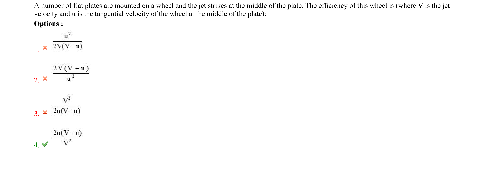

### Options

1. 2V(V-u)
2. 2V(V-)
3. 2u(V-u)
4. 2u(V-u) V?

### Answer

> **Answer: None**

### Exam

PCB-2022

---

## Question 165

**Topic:** 5. Fluid Mechanics and Hydraulics
**Subtopic:** Fluid Dynamics: Continuity Equation, Bernoulli's Equation & Impulse Momentum Equation

### Question

A number of flat plates are mounted on a wheel and the jet strikes at the middle of the plate. The efficiency of this wheel is maximum when
(where V is the jet velocity and u is the tangential velocity of the wheel at the middle of the plate):

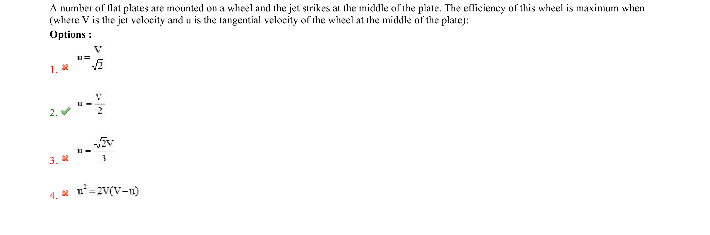

### Options

1. u=
2. 
3. 
4. u’=2V(V-u)

### Answer

> **Answer: None**

### Exam

PCB-2022

---

## Question 166

**Topic:** 5. Fluid Mechanics and Hydraulics
**Subtopic:** Fluid Dynamics: Continuity Equation, Bernoulli's Equation & Impulse Momentum Equation

### Question

*(No text)*

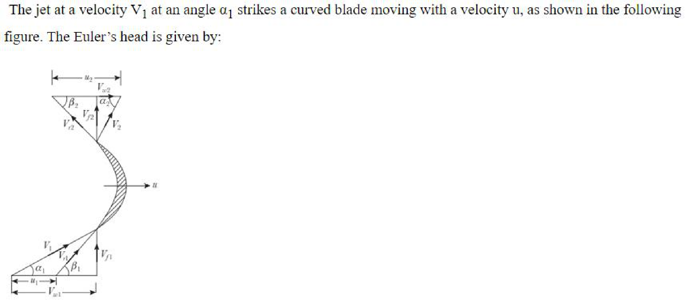

### Options

1. V
2. 
3. 
4. 

### Answer

> **Answer: None**

### Exam

PCB-2022

---

## Question 167

**Topic:** 5. Fluid Mechanics and Hydraulics
**Subtopic:** Fluid Dynamics: Continuity Equation, Bernoulli's Equation & Impulse Momentum Equation

### Question

Based on the two statements given below, choose the correct answer. Statement A: Reaction turbines are low-head, high-flow devices. Statement B: In a reaction turbine, flow enters at the larger-diameter section and discharges through the eye.

### Options

1. Both statements A and B are correct.
2. Statement A is correct, but statement B is incorrect.
3. Statement A is incorrect, but statement B is correct.
4. Both statements A and B are incorrect.

### Answer

> **Answer: 1**

### Exam

PCB-2022

---

## Question 168

**Topic:** 5. Fluid Mechanics and Hydraulics
**Subtopic:** Fluid Dynamics: Continuity Equation, Bernoulli's Equation & Impulse Momentum Equation

### Question

Head coefficient CH of a turbine is (where H = head, D = impeller diameter, g = acceleration due to gravity, n = shaft speed):

### Options

1. 
2. 
3. 
4. 

### Answer

> **Answer: 1**

### Exam

PCB-2022

---

## Question 169

**Topic:** 5. Fluid Mechanics and Hydraulics
**Subtopic:** Fluid Dynamics: Continuity Equation, Bernoulli's Equation & Impulse Momentum Equation

### Question

Power coefficient Cp of a turbine is (where bhp = available power, D = impeller diameter, p = fluid density, n = shaft speed):
Pn'D3
bhp

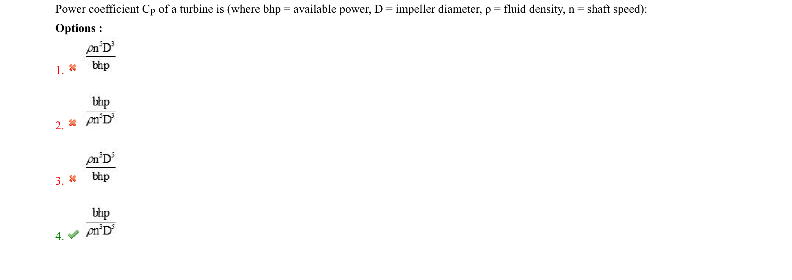

### Options

1. 
2. pmD
3. bhp
4. bhp

### Answer

> **Answer: None**

### Exam

PCB-2022

---

## Question 170

**Topic:** 5. Fluid Mechanics and Hydraulics
**Subtopic:** Fluid Dynamics: Continuity Equation, Bernoulli's Equation & Impulse Momentum Equation

### Question

The power specific speed Nsp for a turbine is (where bhp = available power, H = head, p = fluid density, g = acceleration due to gravity, n =
shaft speed):

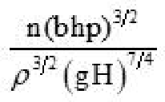

### Options

1. n(bhp)/2
2. n(bhp)/2
3. p"(gH)
4. n(bhp)3/2

### Answer

> **Answer: None**

### Exam

PCB-2022

---

## Question 171

**Topic:** 5. Fluid Mechanics and Hydraulics
**Subtopic:** Fluid Dynamics: Continuity Equation, Bernoulli's Equation & Impulse Momentum Equation

### Question

velocity,H=head,g=acceleration due to gravity).

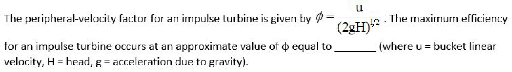

### Options

1. 0.27
2. 0.37
3. 0.47
4. 0.57

### Answer

> **Answer: 3**

### Exam

PCB-2022

---

## Question 172

**Topic:** 5. Fluid Mechanics and Hydraulics
**Subtopic:** Fluid Dynamics: Continuity Equation, Bernoulli's Equation & Impulse Momentum Equation

### Question

For a centrifugal pump, the ratio of the power available at the impeller to the power available at the shaft of the pump is known as:

### Options

1. overall efficiency
2. volumetric efficiency
3. hydraulic efficiency
4. mechanical efficiency

### Answer

> **Answer: 4**

### Exam

PCB-2022

---

## Question 173

**Topic:** 5. Fluid Mechanics and Hydraulics
**Subtopic:** Fluid Dynamics: Continuity Equation, Bernoulli's Equation & Impulse Momentum Equation

### Question

For a centrifugal pump, the ratio of the actual flow rate to the theoretical flow rate is known as:

### Options

1. overall efficiency
2. volumetric efficiency
3. hydraulic efficiency
4. mechanical efficiency

### Answer

> **Answer: 2**

### Exam

PCB-2022

---

## Question 174

**Topic:** 5. Fluid Mechanics and Hydraulics
**Subtopic:** Fluid Dynamics: Continuity Equation, Bernoulli's Equation & Impulse Momentum Equation

### Question

For a centrifugal pump, for the blade exit angle less than 90°, the pump head ______.

### Options

1. decreases with increasing discharge
2. remains constant with increasing discharge
3. increases with increasing discharge
4. first increases and then decreases with increasing discharge

### Answer

> **Answer: 1**

### Exam

PCB-2022

---

## Question 175

**Topic:** 5. Fluid Mechanics and Hydraulics
**Subtopic:** Fluid Dynamics: Continuity Equation, Bernoulli's Equation & Impulse Momentum Equation

### Question

The efficiency of a typical centrifugal pump is maximum at:

### Options

1. zero discharge
2. 40% of maximum discharge
3. 60% of maximum discharge
4. maximum discharge

### Answer

> **Answer: 3**

### Exam

PCB-2022

---

## Question 176

**Topic:** 5. Fluid Mechanics and Hydraulics
**Subtopic:** Fluid Dynamics: Continuity Equation, Bernoulli's Equation & Impulse Momentum Equation

### Question

Capacity coefficient CQ of a pump is (where Q = discharge, D = impeller diameter, n = shaft speed):

### Options

1. 
2. 
3. V nD
4. ×

### Answer

> **Answer: None**

### Exam

PCB-2022

---

## Question 177

**Topic:** 5. Fluid Mechanics and Hydraulics
**Subtopic:** Fluid Dynamics: Continuity Equation, Bernoulli's Equation & Impulse Momentum Equation

### Question

The head required at the centrifugal pump inlet to keep the liquid from cavitating or boiling is known as:

### Options

1. minimum head
2. threshold head
3. ultimate head
4. net positive-suction head

### Answer

> **Answer: 4**

### Exam

PCB-2022

---

## Question 178

**Topic:** 5. Fluid Mechanics and Hydraulics
**Subtopic:** Fluid Dynamics: Continuity Equation, Bernoulli's Equation & Impulse Momentum Equation

### Question

For a fluid flowing through a centrifugal pump having density p, discharge Q, circumferential speed ui, tip speed u2, and absolute
circumferential velocity components of the flow Vt1 and Vt2, the power delivered to the fluid is given by:

### Options

1. PQ(u, Vi-u, Va)
2. PQ(uzVe-u,Vl)
3. PQ(u Va-u Vi)
4. PQ(u, Vi-u Ve)

### Answer

> **Answer: None**

### Exam

PCB-2022

---

## Question 179

**Topic:** 5. Fluid Mechanics and Hydraulics
**Subtopic:** Fluid Dynamics: Continuity Equation, Bernoulli's Equation & Impulse Momentum Equation

### Question

Which of the following formulas is used to find Chezy’s constant?

### Options

1. Ryve's equation
2. Hazen’s equation
3. Bazin’s equation
4. Continuity equation

### Answer

> **Answer: 3**

### Exam

PCB-Civil-2022

---

## Question 180

**Topic:** 5. Fluid Mechanics and Hydraulics
**Subtopic:** Fluid Dynamics: Continuity Equation, Bernoulli's Equation & Impulse Momentum Equation

### Question

Which of the following is the correct expression, in case of open channel flow, to measure energy at a particular point in the channel?

### Options

1. \(E = y + \frac{v^2}{2g}\), where, \(E\) = specific energy, \(y\) = pressure head, \(\frac{v^2}{2g}\) = velocity head.
2. \(E = 2y + \frac{v^2}{g}\), where, \(E\) = specific energy, \(y\) = pressure head, \(\frac{v^2}{2g}\) = velocity head.
3. \(E = y + \frac{v^2}{2g}\), where, \(E\) = specific energy, \(y\) = pressure head, \(\frac{v^2}{2g}\) = velocity head.
4. \(E = y + \frac{v^2}{g}\), where, \(E\) = specific energy, \(y\) = pressure head, \(\frac{v^2}{2g}\) = velocity head.

### Answer

> **Answer: 1**

### Exam

PCB-Civil-2022

---

## Question 181

**Topic:** 5. Fluid Mechanics and Hydraulics
**Subtopic:** Fluid Dynamics: Continuity Equation, Bernoulli's Equation & Impulse Momentum Equation

### Question

Calculate the specific energy at a point in a rectangular open channel whose width is 2 m, depth 1 m and discharge 2 m3/sec. Take acceleration due to gravity as 10 m/sec2.

### Options

1. 1.05 m
2. 1.20 m
3. 1.50 m
4. 1.95 m

### Answer

> **Answer: 1**

### Exam

PCB-Civil-2022

---

## Question 182

**Topic:** 5. Fluid Mechanics and Hydraulics
**Subtopic:** Fluid Dynamics: Continuity Equation, Bernoulli's Equation & Impulse Momentum Equation

### Question

A lined channel of trapezoidal section carries a discharge of 6 m3/sec, at a depth of 1 m, with bottom width 2 m and side slope of 1.5 horizontal to 1 vertical. Consider uniform flow and calculate the velocity of flow.

### Options

1. 1.312 m/sec
2. 1.714 m/sec
3. 2.135 m/sec
4. 2.426 m/sec

### Answer

> **Answer: 2**

### Exam

PCB-Civil-2022

---

## Question 183

**Topic:** 5. Fluid Mechanics and Hydraulics
**Subtopic:** Fluid Dynamics: Continuity Equation, Bernoulli's Equation & Impulse Momentum Equation

### Question

Identify whether the given statements related to basic assumptions in gradually varied flow analysis are correct or incorrect.

**Statements:**

A) The head loss in a reach may be computed using an equation applicable to uniform flow, having the same velocity and hydraulic mean radius of the section.

B) Channel bottom slope is large.

### Options

1. Statement A is correct but B is incorrect
2. Statement B is correct but A is incorrect
3. Both statements are correct
4. Both statements are incorrect

### Answer

> **Answer: 1**

### Exam

PCB-Civil-2022

---

## Question 184

**Topic:** 5. Fluid Mechanics and Hydraulics
**Subtopic:** Fluid Dynamics: Continuity Equation, Bernoulli's Equation & Impulse Momentum Equation

### Question

Which of the following is an example of steady rapidly varied flow with broken flow profile?

### Options

1. The backwaters produced by a dam
2. Hydraulic jump
3. The flow of water in a pipe of constant diameter at constant velocity
4. The flow of water through pipe of constant diameter connected to a pump pumping at a constant rate which is then switched off

### Answer

> **Answer: 2**

### Exam

PCB-Civil-2022

---

## Question 185

**Topic:** 5. Fluid Mechanics and Hydraulics
**Subtopic:** Fluid Dynamics: Continuity Equation, Bernoulli's Equation & Impulse Momentum Equation

### Question

Identify whether the given statements related to the applications of a hydraulic jump are correct or incorrect.

**Statements:**

A) It is used to lower the water level on the d/s side of a metering flume and thus maintain low water level in the channel for irrigation, etc.

B) It is used to dissipate energy in the water flowing over the spillway and other hydraulic structures and thus prevent scouring downstream.

### Options

1. Statement A is correct but B is incorrect
2. Statement B is correct but A is incorrect
3. Both statements are correct
4. Both statements are incorrect

### Answer

> **Answer: 2**

### Exam

PCB-Civil-2022

---

## Question 186

**Topic:** 5. Fluid Mechanics and Hydraulics
**Subtopic:** Fluid Dynamics: Continuity Equation, Bernoulli's Equation & Impulse Momentum Equation

### Question

According to Bernoulli’s equation, the total energy of any fluid particle is the sum of _______.

### Options

1. pressure energy and kinetic energy only
2. kinetic energy and potential energy only
3. pressure energy and potential energy only
4. pressure energy, kinetic energy and potential energy

### Answer

> **Answer: 4**

### Exam

PCB-2025

---

## Question 187

**Topic:** 5. Fluid Mechanics and Hydraulics
**Subtopic:** Fluid Dynamics: Continuity Equation, Bernoulli's Equation & Impulse Momentum Equation

### Question

Which of the following correctly represents the principle of the continuity equation for an incompressible fluid flowing through a pipe?

### Options

1. ρ1⋅V1=ρ2⋅V2
2. A1⋅ρ1=A2⋅ρ2
3. A1⋅V1=A2⋅V2
4. ρ1⋅A1=ρ2⋅A2

### Answer

> **Answer: 3**

### Exam

PCB-2025

---

## Laminar & Turbulent Flow in Pipes & Reynolds Number

## Question 188

**Topic:** 5. Fluid Mechanics and Hydraulics
**Subtopic:** Laminar & Turbulent Flow in Pipes & Reynolds Number

### Question

The Darcy friction factor (f) for laminar flow in circular pipes is given by (Red is pipe diameter-based Reynolds number):

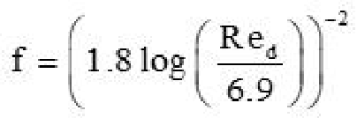

### Options

1. 8log
2. 6.9
3. Re.

### Answer

> **Answer: None**

### Exam

PCB-2022

---

## Hagen Poiseuille's Equation, Darcy–Weisbach Equation, Friction Factor & Head Losses

## Question 189

**Topic:** 5. Fluid Mechanics and Hydraulics
**Subtopic:** Hagen Poiseuille's Equation, Darcy–Weisbach Equation, Friction Factor & Head Losses

### Question

Darcy-Weisbach equation used for computing the loss of head due to friction (h) in pipes is given by (where V is the velocity of flow, L and D
are the length and diameter of the pipe, respectively, f is the friction factor and g is the acceleration due to gravity):

### Options

1. LV2
2. 2gD
3. 2gD
4. h. /2gD 2gD fLV

### Answer

> **Answer: None**

### Exam

PCB-2022

---

## Question 190

**Topic:** 5. Fluid Mechanics and Hydraulics
**Subtopic:** Hagen Poiseuille's Equation, Darcy–Weisbach Equation, Friction Factor & Head Losses

### Question

Which of the following losses occurring in pipe flow does NOT belong to the category of minor loss?

### Options

1. Loss in sudden expansion
2. Loss in bends
3. Loss in flow through valves, open or partially closed
4. Frictional loss in pipes

### Answer

> **Answer: 4**

### Exam

PCB-2022

---

## Question 191

**Topic:** 5. Fluid Mechanics and Hydraulics
**Subtopic:** Hagen Poiseuille's Equation, Darcy–Weisbach Equation, Friction Factor & Head Losses

### Question

and d is the pipe diameter):

### Options

1. Kd
2. K)2
3. eq
4. 

### Answer

> **Answer: None**

### Exam

PCB-2022

---

## Question 192

**Topic:** 5. Fluid Mechanics and Hydraulics
**Subtopic:** Hagen Poiseuille's Equation, Darcy–Weisbach Equation, Friction Factor & Head Losses

### Question

What is the correct relationship of loss coefficients (K) for 90° bends with pipe bend radius (R) to pipe diameter (d) ratio?

### Options

1. K increases with increase in R/d
2. K decreases with increase in R/d
3. K first decreases till a certain value and then increases with increase in R/d
4. K first increases till a certain value and then decreases with increase in R/d

### Answer

> **Answer: 3**

### Exam

PCB-2022

---

## Question 193

**Topic:** 5. Fluid Mechanics and Hydraulics
**Subtopic:** Hagen Poiseuille's Equation, Darcy–Weisbach Equation, Friction Factor & Head Losses

### Question

The loss coefficient, KsE, of flow entering from a pipe of smaller diameter (d) to a pipe of larger diameter (D), known as sudden expansion, is:
12
d2
2.
3.*

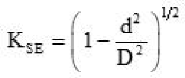

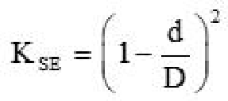

### Options

*(No options)*

### Answer

> **Answer: None**

### Exam

PCB-2022

---

## Question 194

**Topic:** 5. Fluid Mechanics and Hydraulics
**Subtopic:** Hagen Poiseuille's Equation, Darcy–Weisbach Equation, Friction Factor & Head Losses

### Question

K = 0.42
4. *

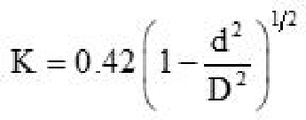

### Options

*(No options)*

### Answer

> **Answer: None**

### Exam

PCB-2022

---

## Question 195

**Topic:** 5. Fluid Mechanics and Hydraulics
**Subtopic:** Hagen Poiseuille's Equation, Darcy–Weisbach Equation, Friction Factor & Head Losses

### Question

For gradual conical expansion from a pipe of diameter di to a pipe of diameter d2, the loss coefficient K is (where Cp is the pressure-recovery
coefficient):
K=1
2. *
d?
3.

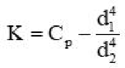

### Options

*(No options)*

### Answer

> **Answer: None**

### Exam

PCB-2022

---

## Question 196

**Topic:** 5. Fluid Mechanics and Hydraulics
**Subtopic:** Hagen Poiseuille's Equation, Darcy–Weisbach Equation, Friction Factor & Head Losses

### Question

The pipe-head loss is equal to the change in the ______.

### Options

1. height of the hydraulic grade line
2. pressure head only
3. gravity head only
4. velocity head only

### Answer

> **Answer: 1**

### Exam

PCB-2022

---

## Question 197

**Topic:** 5. Fluid Mechanics and Hydraulics
**Subtopic:** Hagen Poiseuille's Equation, Darcy–Weisbach Equation, Friction Factor & Head Losses

### Question

What does the Darcy–Weisbach equation describe?

### Options

1. Pressure distribution in a fluid flow
2. Velocity distribution in a laminar flow
3. Frictional losses in a pipe flow
4. Viscous losses in a turbulent flow

### Answer

> **Answer: 3**

### Exam

PCB-2025

---

## Question 198

**Topic:** 5. Fluid Mechanics and Hydraulics
**Subtopic:** Hagen Poiseuille's Equation, Darcy–Weisbach Equation, Friction Factor & Head Losses

### Question

Select the option that is true regarding the following two statements labelled Assertion (A) and Reason (R).

**Assertion (A):** The Hagen–Poiseuille equation describes the laminar flow of an incompressible, Newtonian fluid through a cylindrical pipe.

**Reason (R):** For a flow through a circular pipe, according to the Hagen–Poiseuille law, the flow rate is directly proportional to the pressure drop.

### Options

1. Both A and R are true and R is the correct explanation of A
2. Both A and R are true, but R is not the correct explanation of A
3. A is true, but R is false
4. A is false, but R is true Note: For this question, ambiguity is found in question/answer. Candidate will get full marks for this question if any of the correct options are chosen.

### Answer

> **Answer: 1, 2**

### Exam

PCB-2025

---

## Question 199

**Topic:** 5. Fluid Mechanics and Hydraulics
**Subtopic:** Hagen Poiseuille's Equation, Darcy–Weisbach Equation, Friction Factor & Head Losses

### Question

Which of the following is NOT a minor head loss through a pipe?

### Options

1. Loss due to sudden enlargement
2. Loss at the entrance of the pipe
3. Loss due to bends or pipe fittings
4. Loss due to friction

### Answer

> **Answer: 4**

### Exam

PCB-2025

---

## Elementary Boundary Layer Theory

## Question 200

**Topic:** 5. Fluid Mechanics and Hydraulics
**Subtopic:** Elementary Boundary Layer Theory

### Question

Who among the following introduced the concept of boundary layer and derived the equations for the boundary layer flow by correct reduction of Navier-Stokes equations?

### Options

1. Ludwig Prandtl
2. Dickens
3. Ryve
4. Von Mises

### Answer

> **Answer: 1**

### Exam

PCB-Civil-2022

---

## Question 201

**Topic:** 5. Fluid Mechanics and Hydraulics
**Subtopic:** Elementary Boundary Layer Theory

### Question

Identify whether the given statements related to application of the boundary layer theory are correct or incorrect.

**Statements:**

A) The boundary-layer theory is valid beyond the point of separation.

B) Mathematically, the application of the boundary-layer theory converts the character of governing Navier-Stokes equations from elliptic to parabolic.

### Options

1. Statement A is correct but B is incorrect
2. Statement B is correct but A is incorrect
3. Both statements are correct
4. Both statements are incorrect

### Answer

> **Answer: 2**

### Exam

PCB-Civil-2022

---

## Question 202

**Topic:** 5. Fluid Mechanics and Hydraulics
**Subtopic:** Elementary Boundary Layer Theory

### Question

Identify whether the given statements related to point of separation and the boundary layer theory in fluids are correct or incorrect.

**Statements:**

A) The boundary layer theory does not speak about the location of the point of separation.

B) At the point of separation, the boundary layer thickness becomes quite large for the thin layer approximation to be valid.

### Options

1. Statement A is correct but B is incorrect
2. Statement B is correct but A is incorrect
3. Both statements are correct
4. Both statements are incorrect

### Answer

> **Answer: 2**

### Exam

PCB-Civil-2022

---

# 6. Process Calculations and Thermodynamics

## Laws of Conservation of Mass and Energy

## Question 203

**Topic:** 6. Process Calculations and Thermodynamics
**Subtopic:** Laws of Conservation of Mass and Energy

### Question

Which of the following statements accurately describes the principle of conservation of mass?

### Options

1. The principle of conservation of mass states that mass can be created or destroyed in an isolated system.
2. The principle of conservation of mass asserts that the total mass of a closed system remains constant over time, regardless of internal changes.
3. The principle of conservation of mass applies only to mechanical systems and does not hold true for chemical reactions.
4. The principle of conservation of mass is only relevant in the scenarios involving fluid dynamics and does not apply to chemical reactions.

### Answer

> **Answer: 2**

### Exam

PCB-2025

---

## Tie Components, Recycle, Bypass and Purge Calculations

## Question 204

**Topic:** 6. Process Calculations and Thermodynamics
**Subtopic:** Tie Components, Recycle, Bypass and Purge Calculations

### Question

‘_______’ is a term denoting a process stream that returns the material from downstream of a process unit back to the process unit.

### Options

1. Recycle stream
2. Bypass stream
3. Purge stream
4. Fresh feed stream

### Answer

> **Answer: 1**

### Exam

PCB-2025

---

## Question 205

**Topic:** 6. Process Calculations and Thermodynamics
**Subtopic:** Tie Components, Recycle, Bypass and Purge Calculations

### Question

Nitrogen in the combustion air passes through unreacted and is used as a tie component. This principle can also be used to measure:

### Options

1. the fraction of the reagent that reacts, to optimise the reactor design and to minimise the by-product formation
2. the performance of a reactor or a plant
3. the flow of a process stream, by introducing a measured flow of some easily analysed (compatible) materials
4. the overall performance of a plant that includes all the chemical and physical losses

### Answer

> **Answer: 3**

### Exam

PCB-2025

---

## Question 206

**Topic:** 6. Process Calculations and Thermodynamics
**Subtopic:** Tie Components, Recycle, Bypass and Purge Calculations

### Question

Which of the following types of stream is used to remove the accumulation of an inert or unwanted material that might otherwise build up in the recycle stream?

### Options

1. Recycle stream
2. Bypass stream
3. Purge stream
4. Fresh feed stream

### Answer

> **Answer: 3**

### Exam

PCB-2025

---

## Degrees of Freedom

## Question 207

**Topic:** 6. Process Calculations and Thermodynamics
**Subtopic:** Degrees of Freedom

### Question

With reference to mechanical systems, which of the following options best describes translational degrees of freedom?

### Options

1. Movement around an axis
2. Movement along straight lines
3. Movement due to rotation
4. Movement resulting from deformation

### Answer

> **Answer: 2**

### Exam

PCB-2025

---

## Question 208

**Topic:** 6. Process Calculations and Thermodynamics
**Subtopic:** Degrees of Freedom

### Question

What does the term 'Degrees of Freedom' represent in process engineering?

### Options

1. The total equations used in solving for unknowns
2. The energy stored within a system undergoing a change of state
3. The number of inlet and outlet streams in a process
4. The number of variables that can be manipulated after design specifications are set

### Answer

> **Answer: 4**

### Exam

PCB-2025

---

## Question 209

**Topic:** 6. Process Calculations and Thermodynamics
**Subtopic:** Degrees of Freedom

### Question

Match the following terms related to conservation of energy with their descriptions.

| Term | Description |
| --- | --- |
| 1. Law of conservation of energy | a. Total energy of a system remains constant over time. |
| 2. Mechanical energy | b. Energy associated with the position or configuration of an object |
| 3. Potential energy | c. Energy associated with the motion of an object |
| 4. Kinetic energy | d. Sum of potential energy and kinetic energy in a system |

### Options

1. 1-c, 2-d, 3-b, 4-a
2. 1-c, 2-d, 3-a, 4-b
3. 1-a, 2-d, 3-b, 4-c
4. 1-d, 2-c, 3-b, 4-a

### Answer

> **Answer: 3**

### Exam

PCB-2025

---

## First & Second Laws of Thermodynamics and Applications

## Question 210

**Topic:** 6. Process Calculations and Thermodynamics
**Subtopic:** First & Second Laws of Thermodynamics and Applications

### Question

The throttling process involves the passage of a higher-pressure fluid through a narrow constriction. The effect is _______.

### Options

1. increase in pressure and reduction in volume
2. reduction in pressure as well as volume
3. increase in pressure as well as volume
4. reduction in pressure and increase in volume

### Answer

> **Answer: 4**

### Exam

PCB-2025

---

## Question 211

**Topic:** 6. Process Calculations and Thermodynamics
**Subtopic:** First & Second Laws of Thermodynamics and Applications

### Question

According to Joule’s law, the specific internal energy of a gas depends on _______.

### Options

1. pressure
2. volume
3. temperature
4. mass

### Answer

> **Answer: 3**

### Exam

PCB-2025

---

## Question 212

**Topic:** 6. Process Calculations and Thermodynamics
**Subtopic:** First & Second Laws of Thermodynamics and Applications

### Question

Which of the following correctly represents the First Law of Thermodynamics for a closed system undergoing a change of state?

### Options

1.
2. Q − W = ΔE
3. Q + W = ΔE
4. Q = ΔE × W

### Answer

> **Answer: 2**

### Exam

PCB-2025

---

## Question 213

**Topic:** 6. Process Calculations and Thermodynamics
**Subtopic:** First & Second Laws of Thermodynamics and Applications

### Question

Read the given statement and conclusions carefully. Assuming that the information given in the statement is true, even if it appears to be at variance with commonly known facts, decide which of the given conclusions logically follow(s) from the statement.

**Statement:** The degree of freedom in a system represents the number of independent variables or parameters required to describe the state of the system completely.

**Conclusions:**

I. Higher degrees of freedom generally mean smaller sample sizes.

II. The degree of freedom of a system depends solely on the number of components present.

### Options

1. Only conclusion I follows.
2. Only conclusion II follows.
3. Both conclusions I and II follow.
4. Neither conclusion I nor II follows.

### Answer

> **Answer: 4**

### Exam

PCB-2025

---

## Question 214

**Topic:** 6. Process Calculations and Thermodynamics
**Subtopic:** First & Second Laws of Thermodynamics and Applications

### Question

Which of the following statements is FALSE about the second law of thermodynamics?

### Options

1. It is impossible for a heat engine to produce a network in a complete cycle if it exchanges heat only with bodies at a single fixed temperature.
2. The magnitude of entropy of the entire universe, as an isolated system, will always increase over time.
3. Heat itself flows from a colder body to a hotter body.
4. Every isolated system becomes more disordered over time.

### Answer

> **Answer: 3**

### Exam

PCB-2025

---

## Question 215

**Topic:** 6. Process Calculations and Thermodynamics
**Subtopic:** First & Second Laws of Thermodynamics and Applications

### Question

The optical efficiency of a solar thermal collector is defined as:

### Options

1. fraction of the rays reflected from the mirror to solar radiation absorbed in the absorber
2. ratio of solar radiation absorbed in the absorber to intercepted by the collector aperture
3. ratio of solar radiation transmitted from the absorber to intercepted by the collector aperture
4. transmittance of glass envelope of absorber to solar radiation absorbed in the absorber

### Answer

> **Answer: 2**

### Exam

Env-analyst-2025

---

## Question 216

**Topic:** 6. Process Calculations and Thermodynamics
**Subtopic:** First & Second Laws of Thermodynamics and Applications

### Question

Two statements are given, labelled as Assertion (A) and Reason (R). Select the correct option with reference to the statements.

**Assertion (A):** Photovoltaic detectors normally use silicon solar cells measuring the short circuit current.

**Reason (R):** Photovoltaic detectors generate a voltage proportional to the temperature difference between the hot and cold junctions.

### Options

1. Both A and R are true and R is the correct explanation of A
2. Both A and R are true but R is not the correct explanation of A
3. A is true but R is false
4. A is false but R is true

### Answer

> **Answer: 1**

### Exam

Env-analyst-2025

---

## Question 217

**Topic:** 6. Process Calculations and Thermodynamics
**Subtopic:** First & Second Laws of Thermodynamics and Applications

### Question

The part of solar radiation that reaches the earth's surface with no change in direction is called:

### Options

1. beam radiation
2. diffuse radiation
3. arbitrary radiation
4. thermal radiation

### Answer

> **Answer: 1**

### Exam

Env-analyst-2025

---

## Question 218

**Topic:** 6. Process Calculations and Thermodynamics
**Subtopic:** First & Second Laws of Thermodynamics and Applications

### Question

In a solar air heating system, the flow rate through an air collector and storage loop is a compromise between ________ and ________.

### Options

1. pressure drop; energy transfer to the air stream
2. temperature drop; energy transfer to the air stream
3. volume drop; energy transfer to the air stream
4. temperature drop; energy transfer to the water stream

### Answer

> **Answer: 1**

### Exam

Env-analyst-2025

---

## Question 219

**Topic:** 6. Process Calculations and Thermodynamics
**Subtopic:** First & Second Laws of Thermodynamics and Applications

### Question

____________ is a solar collector using the absorption of solar radiation at the bottom of a 2 m to 3 m deep body of water to generate low-temperature heat.

### Options

1. Non convecting solar pond
2. Solar photovoltaic
3. Solar desailation
4. Solar distillation

### Answer

> **Answer: 1**

### Exam

Env-analyst-2025

---

## Question 220

**Topic:** 6. Process Calculations and Thermodynamics
**Subtopic:** First & Second Laws of Thermodynamics and Applications

### Question

Two statements are given, labelled as Assertion (A) and Reason (R). Select the correct option with reference to the given statements.

**Assertion (A):** Heliostats consist of several mirror panels supported on a steel structure.

**Reason (R):** The heliostat focal length is approximately equal to the distance of the heliostat from the receiver.

### Options

1. Both A and R are true and R is the correct explanation of A
2. Both A and R are true but R is not the correct explanation of A
3. A is true but R is false
4. A is false but R is true

### Answer

> **Answer: 1**

### Exam

Env-analyst-2025

---

## Question 221

**Topic:** 6. Process Calculations and Thermodynamics
**Subtopic:** First & Second Laws of Thermodynamics and Applications

### Question

Two statements are given, labelled as Assertion (A) and Reason (R). Select the correct option with reference to the given statements.

**Assertion (A):** PV devices are solid state.

**Reason (R):** Therefore, PV devices are rugged and simple in design and require very little maintenance.

### Options

1. Both A and R are true and R is the correct explanation of A
2. Both A and R are true but R is not the correct explanation of A
3. A is true but R is false
4. A is false but R is true

### Answer

> **Answer: 1**

### Exam

Env-analyst-2025

---

## Question 222

**Topic:** 6. Process Calculations and Thermodynamics
**Subtopic:** First & Second Laws of Thermodynamics and Applications

### Question

What is the role of an insulator in Liquid flat plate collector (LFPC)?

### Options

1. To minimise heat loss from the back and the sides
2. To facilitate the flow of heat-transfer fluid
3. To maximise heat loss from the back and the sides
4. To facilitate the incident solar radiation

### Answer

> **Answer: 1**

### Exam

Env-analyst-2025

---

## Question 223

**Topic:** 6. Process Calculations and Thermodynamics
**Subtopic:** First & Second Laws of Thermodynamics and Applications

### Question

Photovoltaic (PV) conversion is the direct conversion of:

### Options

1. sunlight into electricity
2. sunlight into heat energy
3. sunlight into latent heat storage energy
4. kinetic energy into mechanical energy

### Answer

> **Answer: 1**

### Exam

Env-analyst-2025

---

## Question 224

**Topic:** 6. Process Calculations and Thermodynamics
**Subtopic:** First & Second Laws of Thermodynamics and Applications

### Question

Match the following columns.

| **Column A** | **Column B** |
| --- | --- |
| **A.** Direct Solar Radiation | **P.** Instrument used to measure solar radiation |
| **B.** Diffuse Solar Radiation | **Q.** Combination of beam radiation and diffuse radiation |
| **C.** Solar Insolation | **R.** Radiation undergoes solar attenuation |
| **D.** Pyranometer | **S.** Radiation does not undergo solar attenuation |

### Options

1. A-S, B-R, C-Q, D-P
2. A-P, B-R, C-Q, D-S
3. A-S, B-P, C-Q, D-R
4. A-Q, B-R, C-S, D-P

### Answer

> **Answer: 1**

### Exam

Env-analyst-2025

---

## Question 225

**Topic:** 6. Process Calculations and Thermodynamics
**Subtopic:** First & Second Laws of Thermodynamics and Applications

### Question

Two statements are given, labelled as Assertion (A) and Reason (R). Select the correct option with reference to the given statements.

**Assertion (A):** A pyranometer (solar radiation measurement instrument) has a hemispherical view of the surroundings.

**Reason (R):** Therefore, pyranometer is used to measure the total, direct, and diffuse solar radiation on a surface.

### Options

1. Both A and R are true and R is the correct explanation of A
2. Both A and R are true but R is not the correct explanation of A
3. A is true but R is false
4. A is false but R is true

### Answer

> **Answer: 1**

### Exam

Env-analyst-2025

---

## Question 226

**Topic:** 6. Process Calculations and Thermodynamics
**Subtopic:** First & Second Laws of Thermodynamics and Applications

### Question

Which of the following options is an appropriate conclusion for the given statement with reference to ecosystem energetics?

**Statement:** The second law of thermodynamics deals with changes in total entropy.

### Options

1. Energy is effectively created in ecosystems through photosynthesis
2. Energy is dissipated as heat in ecosystems, but entropy decreases
3. Energy is conserved in ecosystems, but entropy increases
4. Energy is transferred efficiently between trophic levels without loss

### Answer

> **Answer: 3**

### Exam

Env-analyst-2025

---

## Equations of State & Thermodynamic Properties of Real Systems

## Question 227

**Topic:** 6. Process Calculations and Thermodynamics
**Subtopic:** Equations of State & Thermodynamic Properties of Real Systems

### Question

Match the following based on the Properties of Thermodynamics of real systems.

| Category | Description |
| --- | --- |
| 1. Measured properties | A. It can be derived by combining measured and fundamental properties. |
| 2. Fundamental properties | B. It can be directly observed in a laboratory. |
| 3. Derived properties | C. It can be derived from basic thermodynamic laws. |

### Options

1. 1-B, 2-A, 3-C
2. 1-C, 2-B, 3-A
3. 1-A, 2-C, 3-B
4. 1-B, 2-C, 3-A

### Answer

> **Answer: 4**

### Exam

PCB-2025

---

## Question 228

**Topic:** 6. Process Calculations and Thermodynamics
**Subtopic:** Equations of State & Thermodynamic Properties of Real Systems

### Question

Which of the following is a key correction applied in the Van der Waals equation of state for real gases?

### Options

1. The volume term accounts for molecular interactions, and the pressure term accounts for molecular size.
2. Both pressure and volume terms account for molecular size.
3. The pressure term accounts for intermolecular forces, and the volume term accounts for molecular size.
4. Both pressure and volume terms account for intermolecular forces.

### Answer

> **Answer: 3**

### Exam

PCB-2025

---

# 7. Air, Water, Soil and Noise Pollution and Control Technologies

## Air Pollution: Primary & Secondary Pollutants, Ambient Air Quality Standards

## Question 229

**Topic:** 7. Air, Water, Soil and Noise Pollution and Control Technologies
**Subtopic:** Air Pollution: Primary & Secondary Pollutants, Ambient Air Quality Standards

### Question

Collection efficiency of an electrostatic precipitator ranges between ______for particles size between 0.1μm to 0.2μm.

### Options

1. 99.8% to 100%
2. 96% to 97%
3. 86% to 88%
4. 83% to 85%

### Answer

> **Answer: 2**

### Exam

PCB-Civil-2022

---

## Question 230

**Topic:** 7. Air, Water, Soil and Noise Pollution and Control Technologies
**Subtopic:** Air Pollution: Primary & Secondary Pollutants, Ambient Air Quality Standards

### Question

The collection efficiency of an electrostatic precipitator under ideal conditions is generally estimated by using______

### Options

1. Vander Waals equation
2. Dobson equation
3. Deutsch-Anderson equation
4. Schmutzdecke equation

### Answer

> **Answer: 3**

### Exam

PCB-Civil-2022

---

## Question 231

**Topic:** 7. Air, Water, Soil and Noise Pollution and Control Technologies
**Subtopic:** Air Pollution: Primary & Secondary Pollutants, Ambient Air Quality Standards

### Question

A venture scrubber used to control air pollution is an example of______.

### Options

1. dry scrubbers
2. wet scrubbers
3. gravity scrubbers
4. pressure scrubbers

### Answer

> **Answer: 2**

### Exam

PCB-Civil-2022

---

## Question 232

**Topic:** 7. Air, Water, Soil and Noise Pollution and Control Technologies
**Subtopic:** Air Pollution: Primary & Secondary Pollutants, Ambient Air Quality Standards

### Question

Which of the following technologies is NOT typically used for controlling particulate emissions from industrial sources?

### Options

1. Electrostatic Precipitator (ESP)
2. Fabric filter (baghouse)
3. Wet scrubber
4. Catalytic converter

### Answer

> **Answer: 4**

### Exam

PCB-2025

---

## Question 233

**Topic:** 7. Air, Water, Soil and Noise Pollution and Control Technologies
**Subtopic:** Air Pollution: Primary & Secondary Pollutants, Ambient Air Quality Standards

### Question

Which of the following pollutants can be controlled using both Selective Catalytic Reduction (SCR) and Selective Non-Catalytic Reduction (SNCR) technologies?

### Options

1. Sulphur dioxide (SO2)
2. Carbon monoxide (CO)
3. Nitrogen oxides (NOx)
4. Particulate Matter (PM)

### Answer

> **Answer: 3**

### Exam

PCB-2025

---

## Question 234

**Topic:** 7. Air, Water, Soil and Noise Pollution and Control Technologies
**Subtopic:** Air Pollution: Primary & Secondary Pollutants, Ambient Air Quality Standards

### Question

Select the option that is true regarding the following two statements labelled Assertion (A) and Reason (R).

**Assertion (A):** Secondary pollutants such as ozone (O₃) have a more direct impact on human health compared to primary pollutants.

**Reason (R):** Primary pollutants like nitrogen oxides (NOₓ) and sulphur dioxide (SO₂) undergo atmospheric transformations to form more harmful secondary pollutants.

**Note:** For this question, discrepancy is found in question/answer. So, this question is ignored for all candidates.

### Options

1. Both (A) and (R) are true
2. Both (A) and (R) are false
3. (A) is true and (R) is false
4. (A) is false and (R) is true

### Answer

> **Answer: None**

### Exam

PCB-2025

---

## Question 235

**Topic:** 7. Air, Water, Soil and Noise Pollution and Control Technologies
**Subtopic:** Air Pollution: Primary & Secondary Pollutants, Ambient Air Quality Standards

### Question

What causes the corrosive impact of sulphur dioxide on respiratory tissues?

### Options

1. Formation of sulphur-containing acids
2. Direct inhalation of pure sulphur dioxide
3. Interaction with nitrogen oxides
4. Breakdown into harmless particles

### Answer

> **Answer: 1**

### Exam

PCB-2025

---

## Question 236

**Topic:** 7. Air, Water, Soil and Noise Pollution and Control Technologies
**Subtopic:** Air Pollution: Primary & Secondary Pollutants, Ambient Air Quality Standards

### Question

How does acid rain primarily affect plant ecosystems?

### Options

1. It increases chlorophyll production.
2. It lowers soil pH, affecting nutrient availability.
3. It enhances root growth and water absorption.
4. It promotes rapid decomposition of organic matter.

### Answer

> **Answer: 2**

### Exam

Env-analyst-2025

---

## Question 237

**Topic:** 7. Air, Water, Soil and Noise Pollution and Control Technologies
**Subtopic:** Air Pollution: Primary & Secondary Pollutants, Ambient Air Quality Standards

### Question

Which method is used for analysing fluoride concentration in air samples?

### Options

1. X-ray diffraction
2. Ion-selective electrode
3. UV-visible spectroscopy
4. Gas chromatography

### Answer

> **Answer: 2**

### Exam

Env-analyst-2025

---

## Question 238

**Topic:** 7. Air, Water, Soil and Noise Pollution and Control Technologies
**Subtopic:** Air Pollution: Primary & Secondary Pollutants, Ambient Air Quality Standards

### Question

Which of the following pollutants is primarily formed due to incomplete combustion in vehicle engines?

### Options

1. Nitrogen oxides (NOx)
2. Carbon monoxide (CO)
3. Hydrocarbons (HCs)
4. Particulate matter (PM)

### Answer

> **Answer: 2**

### Exam

Env-analyst-2025

---

## Question 239

**Topic:** 7. Air, Water, Soil and Noise Pollution and Control Technologies
**Subtopic:** Air Pollution: Primary & Secondary Pollutants, Ambient Air Quality Standards

### Question

What does the Ringelmann Smoke Chart help to determine in relation to emissions?

### Options

1. The speed of smoke rising
2. The colour of smoke
3. The density of smoke
4. The temperature of smoke

### Answer

> **Answer: 3**

### Exam

Env-analyst-2025

---

## Question 240

**Topic:** 7. Air, Water, Soil and Noise Pollution and Control Technologies
**Subtopic:** Air Pollution: Primary & Secondary Pollutants, Ambient Air Quality Standards

### Question

Match the following.

| **Type of Pollutant** | **Source of Pollutant** |
| --- | --- |
| **A.** Biological Pollutants | **1.** Cigarette Smoke |
| **B.** Chemical Pollutants | **2.** Air Fresheners |
| **C.** Particulate Pollutants | **3.** Wood Stoves |
| **D.** Combustion Products | **4.** Mold and Dust |
| **E.** Volatile Organic Compounds (VOCs) | **5.** Cleaning Products |

### Options

1. A - 4; B - 5; C - 1; D - 3; E - 2
2. A - 4; B - 1; C - 3; D - 2; E - 5
3. A - 3; B - 2; C - 4; D - 1; E - 5
4. A - 2; B - 4; C - 1; D - 3; E - 5

### Answer

> **Answer: 1**

### Exam

Env-analyst-2025

---

## Question 241

**Topic:** 7. Air, Water, Soil and Noise Pollution and Control Technologies
**Subtopic:** Air Pollution: Primary & Secondary Pollutants, Ambient Air Quality Standards

### Question

Read the given statement and conclusions carefully. Without making any assumptions, decide which of the given conclusions logically follow(s) from the statements.

**Statement:** In a venturi scrubber, the reduced-pressure region helps cool the exhaust gas and facilitates the condensation of vapour from the liquid initially evaporated in the hot waste gas.

**Conclusions:**

I. The cooling effect in a venturi scrubber contributes to better scrubbing efficiency.

II. Condensation in a venturi scrubber reduces the scrubbing efficiency.

### Options

1. Only conclusion I follows.
2. Only conclusion II follows.
3. Neither conclusion I nor II follows.
4. Both conclusions I and II follow.

### Answer

> **Answer: 1**

### Exam

Env-analyst-2025

---

## Question 242

**Topic:** 7. Air, Water, Soil and Noise Pollution and Control Technologies
**Subtopic:** Air Pollution: Primary & Secondary Pollutants, Ambient Air Quality Standards

### Question

Which absorption technique is the most commonly used for the quantitative analysis of SO₂ in air?

### Options

1. Gas chromatography
2. UV-Vis spectroscopy
3. Infrared spectroscopy
4. Thermal conductivity detector

### Answer

> **Answer: 2**

### Exam

Env-analyst-2025

---

## Question 243

**Topic:** 7. Air, Water, Soil and Noise Pollution and Control Technologies
**Subtopic:** Air Pollution: Primary & Secondary Pollutants, Ambient Air Quality Standards

### Question

Which of the following is a significant challenge in reducing particulate matter emissions from diesel vehicles despite the use of particulate filters?

### Options

1. Increased use of gasoline as fuel
2. High sulphur content in diesel fuel
3. Lack of efficient combustion technology
4. Increased engine wear due to cleaner fuels

### Answer

> **Answer: 2**

### Exam

Env-analyst-2025

---

## Question 244

**Topic:** 7. Air, Water, Soil and Noise Pollution and Control Technologies
**Subtopic:** Air Pollution: Primary & Secondary Pollutants, Ambient Air Quality Standards

### Question

Select the option that is true regarding the following two statements labelled Assertion (A) and Reason (R).

**Assertion (A):** High volume sampling is an effective technique for collecting particulate matter in the atmosphere.

**Reason (R):** High volume samplers can filter large amounts of air, trapping particulate matter in the process, which is ideal for environmental studies.

### Options

1. Both A and R are true, and R is the correct explanation of A.
2. Both A and R are true, and R is not the correct explanation of A.
3. A is true, but R is false.
4. A is false, but R is true.

### Answer

> **Answer: 1**

### Exam

Env-analyst-2025

---

## Question 245

**Topic:** 7. Air, Water, Soil and Noise Pollution and Control Technologies
**Subtopic:** Air Pollution: Primary & Secondary Pollutants, Ambient Air Quality Standards

### Question

Select the option that is true regarding the following two statements labelled Assertion (A) and Reason (R).

**Assertion (A):** Proper design of building materials can help mitigate indoor air pollution.

**Reason (R):** Materials like low-VOC paints, non-toxic insulation and natural flooring can reduce the release of harmful substances indoors.

### Options

1. Both A and R are true, and R is the correct explanation of A.
2. Both A and R are true, and R is not the correct explanation of A.
3. A is true, but R is false.
4. A is false, but R is true.

### Answer

> **Answer: 1**

### Exam

Env-analyst-2025

---

## Question 246

**Topic:** 7. Air, Water, Soil and Noise Pollution and Control Technologies
**Subtopic:** Air Pollution: Primary & Secondary Pollutants, Ambient Air Quality Standards

### Question

What is one of the major issues when using impingers for particle analysis?

### Options

1. They do not allow size segregation.
2. They may cause the break-up of particles into smaller pieces.
3. They do not collect enough large particles.
4. They have a low retention efficiency.

### Answer

> **Answer: 2**

### Exam

Env-analyst-2025

---

## Question 247

**Topic:** 7. Air, Water, Soil and Noise Pollution and Control Technologies
**Subtopic:** Air Pollution: Primary & Secondary Pollutants, Ambient Air Quality Standards

### Question

Read the given statement and conclusions carefully. Without making any assumptions, decide which of the given conclusions logically follow(s) from the statements.

**Statement:** Emission monitoring systems rely on real-time sensor data to detect pollutant levels. However, false positives or inaccuracies may arise due to sensor malfunctions or interference from external factors.

**Conclusions:**

I. Sensor accuracy is critical for the reliability of emission monitoring systems.

II. Emission monitoring systems cannot detect pollutants if external factors interfere with sensor readings.

### Options

1. Only conclusion I follows.
2. Only conclusion II follows.
3. Neither conclusion I nor II follows.
4. Both conclusions I and II follow.

### Answer

> **Answer: 1**

### Exam

Env-analyst-2025

---

## Question 248

**Topic:** 7. Air, Water, Soil and Noise Pollution and Control Technologies
**Subtopic:** Air Pollution: Primary & Secondary Pollutants, Ambient Air Quality Standards

### Question

Read the given statement and conclusions carefully. Without making any assumptions, decide which of the given conclusions logically follow(s) from the statements.

**Statement:** The analysis of particulate matter in automobile emissions involves collecting samples using various devices like filter samplers and gravimetric techniques. These methods help quantify the mass and composition of the particulate matter, providing insights into the environmental impact of different types of vehicles.

**Conclusions:**

I. Filter samplers and gravimetric techniques are essential for quantifying particulate matter from automobile emissions.

II. The analysis of particulate matter has no significance in understanding the environmental impact of automobile emissions.

### Options

1. Only conclusion I follows.
2. Only conclusion II follows.
3. Neither conclusion I nor II follows.
4. Both conclusions I and II follow.

### Answer

> **Answer: 1**

### Exam

Env-analyst-2025

---

## Question 249

**Topic:** 7. Air, Water, Soil and Noise Pollution and Control Technologies
**Subtopic:** Air Pollution: Primary & Secondary Pollutants, Ambient Air Quality Standards

### Question

What is the primary reason for high indoor air pollution levels when unprocessed solid fuels are used, even in well-ventilated spaces?

### Options

1. Poor combustion efficiency and high emission factors
2. Lack of awareness regarding the dangers of indoor pollution
3. Limited availability of alternative fuel sources
4. Inefficient cooking and heating systems

### Answer

> **Answer: 1**

### Exam

Env-analyst-2025

---

## Question 250

**Topic:** 7. Air, Water, Soil and Noise Pollution and Control Technologies
**Subtopic:** Air Pollution: Primary & Secondary Pollutants, Ambient Air Quality Standards

### Question

Which of the following industrial processes is responsible for the largest share of particulate matter emissions?

### Options

1. Steel production
2. Pulp and paper production
3. Mining and smelting
4. Cement production Note: For this question, ambiguity is found in question/answer. Candidate will get full marks for this question if any of the correct options are chosen.

### Answer

> **Answer: 3, 4**

### Exam

Env-analyst-2025

---

## Question 251

**Topic:** 7. Air, Water, Soil and Noise Pollution and Control Technologies
**Subtopic:** Air Pollution: Primary & Secondary Pollutants, Ambient Air Quality Standards

### Question

Which gas is the primary cause of acid rain?

### Options

1. Carbon monoxide
2. Sulphur dioxide
3. Methane
4. Ozone

### Answer

> **Answer: 2**

### Exam

Env-analyst-2025

---

## Question 252

**Topic:** 7. Air, Water, Soil and Noise Pollution and Control Technologies
**Subtopic:** Air Pollution: Primary & Secondary Pollutants, Ambient Air Quality Standards

### Question

This question consists of an Assertion (A) and a Reason (R). Carefully analyse the two statements and select the correct option.

**Assertion (A):** Acid rain damages aquatic ecosystems and buildings.

**Reason (R):** Acid rain is primarily caused by the deposition of sulphur dioxide (SO₂) and nitrogen oxides (NOₓ).

### Options

1. Both A and R are true, and R is the correct explanation of A.
2. Both A and R are true, but R is not the correct explanation of A.
3. A is true, but R is false.
4. A is false, and R is true.

### Answer

> **Answer: 1**

### Exam

Env-analyst-2025

---

## Question 253

**Topic:** 7. Air, Water, Soil and Noise Pollution and Control Technologies
**Subtopic:** Air Pollution: Primary & Secondary Pollutants, Ambient Air Quality Standards

### Question

Which of the following chemicals is known to cause both immediate and long-term respiratory toxicity in humans?

### Options

1. Particulate matter (PM)
2. Arsenic
3. DDT
4. Pyrethrin

### Answer

> **Answer: 1**

### Exam

Env-analyst-2025

---

## Water Pollution: Sources, Types & Drinking Water Quality Standards

## Question 254

**Topic:** 7. Air, Water, Soil and Noise Pollution and Control Technologies
**Subtopic:** Water Pollution: Sources, Types & Drinking Water Quality Standards

### Question

Which of the following property of water is determined by EDTA (ethylene-diaminetetraacetate) titration?

### Options

1. hardness in water
2. turbidity in water
3. dissolved oxygen in water
4. residual chlorine in water

### Answer

> **Answer: 1**

### Exam

PCB-Civil-2022

---

## Question 255

**Topic:** 7. Air, Water, Soil and Noise Pollution and Control Technologies
**Subtopic:** Water Pollution: Sources, Types & Drinking Water Quality Standards

### Question

Copper sulfate is most commonly used(added) to control_______in lakes.

### Options

1. chlorine demand of water
2. growth of algae
3. dispersion of silt
4. suspended particles

### Answer

> **Answer: 2**

### Exam

PCB-Civil-2022

---

## Question 256

**Topic:** 7. Air, Water, Soil and Noise Pollution and Control Technologies
**Subtopic:** Water Pollution: Sources, Types & Drinking Water Quality Standards

### Question

As per IS 10500:2012, the mximum permissible limit for fluoride content present in drinking water shall not exceed _______in the absence of alternate source.

### Options

1. 0.015 ppm
2. 1.5 ppm
3. 15 ppm
4. 150 ppm

### Answer

> **Answer: 2**

### Exam

PCB-Civil-2022

---

## Question 257

**Topic:** 7. Air, Water, Soil and Noise Pollution and Control Technologies
**Subtopic:** Water Pollution: Sources, Types & Drinking Water Quality Standards

### Question

B-coli or E-coli are harmless organisms, but their presence in water indicates the:

### Options

1. presence of pathogenic bacteria
2. absence of pathogenic bacteria
3. presence of non-pathogenic bacteria
4. absence of non-pathogenic bacteria

### Answer

> **Answer: 1**

### Exam

PCB-Civil-2022

---

## Question 258

**Topic:** 7. Air, Water, Soil and Noise Pollution and Control Technologies
**Subtopic:** Water Pollution: Sources, Types & Drinking Water Quality Standards

### Question

When carbon monoxide reacts with hemoglobin, it forms_______.

### Options

1. carboxy-haemoglobin
2. carbomino-haemoglobin
3. amino acid
4. carbon di oxide and hydrogen

### Answer

> **Answer: 1**

### Exam

PCB-Civil-2022

---

## Question 259

**Topic:** 7. Air, Water, Soil and Noise Pollution and Control Technologies
**Subtopic:** Water Pollution: Sources, Types & Drinking Water Quality Standards

### Question

Select the INCORRECT statement with respect to permanent hardness of water.

### Options

1. It can be eliminated by boiling.
2. It forms insoluble scum with soap.
3. It affects the cleaning action of soap.
4. It contains dissolved salts of calcium and magnesium.

### Answer

> **Answer: 1**

### Exam

PCB-Civil-2022

---

## Question 260

**Topic:** 7. Air, Water, Soil and Noise Pollution and Control Technologies
**Subtopic:** Water Pollution: Sources, Types & Drinking Water Quality Standards

### Question

What is a significant source of thermal pollution in aquatic ecosystems?

### Options

1. Agricultural runoff containing pesticides
2. Urban stormwater runoff carrying oil and grease
3. Discharge of heated water from industrial facilities
4. Atmospheric deposition of mercury

### Answer

> **Answer: 3**

### Exam

PCB-2025

---

## Question 261

**Topic:** 7. Air, Water, Soil and Noise Pollution and Control Technologies
**Subtopic:** Water Pollution: Sources, Types & Drinking Water Quality Standards

### Question

What is a key benefit of recycling wastewater for industrial applications?

### Options

1. Increase in water consumption
2. Reduced water quality
3. Increased energy efficiency
4. Minimised environmental impact

### Answer

> **Answer: 4**

### Exam

PCB-2025

---

## Question 262

**Topic:** 7. Air, Water, Soil and Noise Pollution and Control Technologies
**Subtopic:** Water Pollution: Sources, Types & Drinking Water Quality Standards

### Question

Read the following statement and conclusions carefully and decide which of the given conclusions is/are true based on the statement.

**Statement:** Drinking water quality standards vary globally due to differences in environmental conditions, population demographics, and health considerations.

**Conclusions:**

I. Developing countries often have more lenient drinking water quality standards compared to developed nations.

II. Adherence to stringent drinking water quality standards can be financially challenging for some regions.

### Options

1. Only conclusion I is true
2. Only conclusion II is true
3. Both conclusions I and II are true
4. Neither conclusion I nor II is true

### Answer

> **Answer: 3**

### Exam

PCB-2025

---

## Question 263

**Topic:** 7. Air, Water, Soil and Noise Pollution and Control Technologies
**Subtopic:** Water Pollution: Sources, Types & Drinking Water Quality Standards

### Question

Match the following types of water pollution in List I with their respective descriptions in List II.

| List I (Types of water pollution) | List II (Descriptions) |
| --- | --- |
| A. Point source pollution | 1. Pollution that originates from diffuse sources and is challenging to trace back to specific origins |
| B. Non-point source pollution | 2. Pollution resulting from the discharge of untreated or partially treated sewage or wastewater into water bodies |
| C. Thermal pollution | 3. Pollution caused by the runoff of chemicals, fertilisers, and pesticides from agricultural fields into water bodies |
| D. Organic pollution | 4. Pollution caused by the release of heated water from industrial processes or power plants into water bodies |
| E. Nutrient pollution | 5. Pollution resulting from the release of pollutants from identifiable and discrete sources, such as industrial facilities or wastewater treatment plants |

### Options

1. A-5, B-1, C-4, D-2, E-3
2. A-1. B-2, C-4, D-5, E-3
3. A-2, B-3, C-4, D-5, E-1
4. A-3, B-2, C-1, D-4, E-5

### Answer

> **Answer: 1**

### Exam

PCB-2025

---

## Question 264

**Topic:** 7. Air, Water, Soil and Noise Pollution and Control Technologies
**Subtopic:** Water Pollution: Sources, Types & Drinking Water Quality Standards

### Question

Match the following pollutants with their primary effects on the environment.

| **Pollutants** | **Effects** |
| --- | --- |
| **A.** Particulate matter | **1.** Respiratory issues in humans |
| **B.** Heavy metals | **2.** Bioaccumulation and toxicity |
| **C.** Eutrophication agents | **3.** Algal blooms and oxygen depletion |
| **D.** Persistent Organic Pollutants (POPs) | **4.** Long-term contamination of ecosystems |

### Options

1. A-4, B-3, C-2, D-1
2. A-2, B-1, C-4, D-3
3. A-1, B-2, C-3, D-4
4. A-3, B-4, C-1, D-2

### Answer

> **Answer: 3**

### Exam

Env-analyst-2025

---

## Question 265

**Topic:** 7. Air, Water, Soil and Noise Pollution and Control Technologies
**Subtopic:** Water Pollution: Sources, Types & Drinking Water Quality Standards

### Question

How do plastic pollutants affect marine ecosystems?

### Options

1. They enhance coral reef growth.
2. They increase oxygen levels in water.
3. They disrupt food chains and harm aquatic organisms.
4. They promote the growth of beneficial algae.

### Answer

> **Answer: 3**

### Exam

Env-analyst-2025

---

## Question 266

**Topic:** 7. Air, Water, Soil and Noise Pollution and Control Technologies
**Subtopic:** Water Pollution: Sources, Types & Drinking Water Quality Standards

### Question

Which emerging contaminant poses the greatest threat to aquatic ecosystems due to its endocrine-disrupting properties?

### Options

1. Microplastics
2. Pharmaceutical residues
3. Perfluoroalkyl Substances (PFAS)
4. Nanomaterials

### Answer

> **Answer: 3**

### Exam

Env-analyst-2025

---

## Question 267

**Topic:** 7. Air, Water, Soil and Noise Pollution and Control Technologies
**Subtopic:** Water Pollution: Sources, Types & Drinking Water Quality Standards

### Question

Read the given statement and conclusions carefully. Assuming that the information given in the statement is true, decide which of the given conclusion(s) logically follow(s) from the statement.

**Statement:** Carbon monoxide (CO) is a dangerous air pollutant.

**Conclusions:**

I. CO binds with haemoglobin in the blood, reducing oxygen transport.

II. CO emissions are primarily from natural sources like volcanoes.

### Options

1. Only Conclusion I follows.
2. Only Conclusion II follows.
3. Both Conclusions I and II follow.
4. Neither Conclusion I nor II follows.

### Answer

> **Answer: 1**

### Exam

Env-analyst-2025

---

## Question 268

**Topic:** 7. Air, Water, Soil and Noise Pollution and Control Technologies
**Subtopic:** Water Pollution: Sources, Types & Drinking Water Quality Standards

### Question

Match the water pollutants (Column-I) with their primary sources (Column-II).

| **Column-I: Water Pollutants** | **Column-II: Primary Sources** |
| --- | --- |
| **1.** Nitrates | **A.** Industrial discharge |
| **2.** Mercury | **B.** Agricultural runoff |
| **3.** Oil and grease | **C.** Marine shipping |
| **4.** Plastic debris | **D.** Improper waste disposal |

### Options

1. 1-A, 2-D, 3-C, 4-B
2. 1-B, 2-C, 3-A, 4-D
3. 1-B, 2-A, 3-C, 4-D
4. 1-C, 2-A, 3-B, 4-D

### Answer

> **Answer: 3**

### Exam

Env-analyst-2025

---

## Question 269

**Topic:** 7. Air, Water, Soil and Noise Pollution and Control Technologies
**Subtopic:** Water Pollution: Sources, Types & Drinking Water Quality Standards

### Question

Which radioactive isotope presents the greatest concern in nuclear power plant emissions?

### Options

1. Cesium-137
2. Iodine-131
3. Strontium-90
4. Tritium

### Answer

> **Answer: 3**

### Exam

Env-analyst-2025

---

## Question 270

**Topic:** 7. Air, Water, Soil and Noise Pollution and Control Technologies
**Subtopic:** Water Pollution: Sources, Types & Drinking Water Quality Standards

### Question

Read the given statement and conclusions carefully. Assuming that the information given in the statement is true, decide which of the given conclusion(s) logically follow(s) from the statement.

**Statement:** Nuclear accidents are the leading cause of radiation pollution.

**Conclusions:**

I. All radiation pollution stems from human activities.

II. Radiation from natural sources like radon gas also contributes to pollution.

### Options

1. Only Conclusion I follows.
2. Only Conclusion II follows.
3. Both Conclusions I and II follow.
4. Neither Conclusions I nor II follows.

### Answer

> **Answer: 2**

### Exam

Env-analyst-2025

---

## Question 271

**Topic:** 7. Air, Water, Soil and Noise Pollution and Control Technologies
**Subtopic:** Water Pollution: Sources, Types & Drinking Water Quality Standards

### Question

What is the term for the process by which excess nutrients enter water bodies?

### Options

1. Eutrophication
2. Sedimentation
3. Acidification
4. Nutrient cycling

### Answer

> **Answer: 1**

### Exam

Env-analyst-2025

---

## Question 272

**Topic:** 7. Air, Water, Soil and Noise Pollution and Control Technologies
**Subtopic:** Water Pollution: Sources, Types & Drinking Water Quality Standards

### Question

What is the primary mechanism of arsenic mobilisation from Fe-oxide in groundwater, leading to its increased concentration?

### Options

1. Oxidative dissolution
2. Reductive dissolution
3. Complexation
4. Chelation

### Answer

> **Answer: 2**

### Exam

Env-analyst-2025

---

## Question 273

**Topic:** 7. Air, Water, Soil and Noise Pollution and Control Technologies
**Subtopic:** Water Pollution: Sources, Types & Drinking Water Quality Standards

### Question

Which compound is used as the catalyst in COD determination?

### Options

1. Silver sulphate
2. Mercuric sulphate
3. Copper sulphate
4. Zinc sulphate

### Answer

> **Answer: 1**

### Exam

Env-analyst-2025

---

## Question 274

**Topic:** 7. Air, Water, Soil and Noise Pollution and Control Technologies
**Subtopic:** Water Pollution: Sources, Types & Drinking Water Quality Standards

### Question

What does Dissolved Oxygen (DO) in water indicate?

### Options

1. Level of microbial contamination
2. Availability of oxygen for aquatic organisms
3. Presence of heavy metals in water
4. Alkalinity of water

### Answer

> **Answer: 2**

### Exam

Env-analyst-2025

---

## Question 275

**Topic:** 7. Air, Water, Soil and Noise Pollution and Control Technologies
**Subtopic:** Water Pollution: Sources, Types & Drinking Water Quality Standards

### Question

Which of the following is a significant source of water pollution due to the release of heavy metals?

### Options

1. Agricultural activity
2. Smelting and refining in mining
3. Dam functioning
4. Urban effluent system

### Answer

> **Answer: 2**

### Exam

Env-analyst-2025

---

## Question 276

**Topic:** 7. Air, Water, Soil and Noise Pollution and Control Technologies
**Subtopic:** Water Pollution: Sources, Types & Drinking Water Quality Standards

### Question

Which of the following options is the appropriate conclusion to the below mentioned statement? The toxicity of heavy metals can be reduced through chemical treatment.

### Options

1. Chemical treatment derivatises and reduces heavy metal toxicity.
2. Chemical treatment can immobilise heavy metals in soil and water
3. Heavy metals cannot be removed from the environment
4. Chemical treatment volatalises heavy metals Note: For this question, ambiguity is found in question/answer. Candidate will get full marks for this question if any of the correct options are chosen.

### Answer

> **Answer: 1, 2**

### Exam

Env-analyst-2025

---

## Question 277

**Topic:** 7. Air, Water, Soil and Noise Pollution and Control Technologies
**Subtopic:** Water Pollution: Sources, Types & Drinking Water Quality Standards

### Question

This question consists of a statement, followed by a conclusion. You are required to determine whether or not the given conclusion logically follows from the statement.

**Statement:** 4-Aminoantipyrine method is used for phenol determination.

**Conclusion:** The method can detect all phenolic compounds equally.

### Options

1. Statement is true, conclusion is false
2. Both statement and conclusion are false
3. Statement is false, conclusion is true
4. Both statement and conclusion are true but are not related

### Answer

> **Answer: 1**

### Exam

Env-analyst-2025

---

## Question 278

**Topic:** 7. Air, Water, Soil and Noise Pollution and Control Technologies
**Subtopic:** Water Pollution: Sources, Types & Drinking Water Quality Standards

### Question

Which method is primarily used to determine the hardness of water?

### Options

1. Gravimetric analysis
2. EDTA titration
3. Spectrophotometry
4. Atomic absorption spectroscopy

### Answer

> **Answer: 2**

### Exam

Env-analyst-2025

---

## Question 279

**Topic:** 7. Air, Water, Soil and Noise Pollution and Control Technologies
**Subtopic:** Water Pollution: Sources, Types & Drinking Water Quality Standards

### Question

Why are high phosphate levels in water bodies a concern?

### Options

1. Because they promote the growth of pathogenic bacteria
2. Because they lead to eutrophication and algal blooms
3. Because they increase the water's salinity
4. Because they enhance the water's oxygen-carrying capacity

### Answer

> **Answer: 2**

### Exam

Env-analyst-2025

---

## Question 280

**Topic:** 7. Air, Water, Soil and Noise Pollution and Control Technologies
**Subtopic:** Water Pollution: Sources, Types & Drinking Water Quality Standards

### Question

Select the option that is correct regarding the following two statements labelled Assertion (A) and Reason (R).

**Assertion (A):** Oil-spills severely affect aquatic life.

**Reason (R):** Oil reduces oxygen availability in water.

### Options

1. Both A and R are true, and R is the correct explanation of A.
2. Both A and R are true, but R is not the correct explanation of A.
3. A is true, but R is false.
4. A is false, but R is true.

### Answer

> **Answer: 1**

### Exam

Env-analyst-2025

---

## Question 281

**Topic:** 7. Air, Water, Soil and Noise Pollution and Control Technologies
**Subtopic:** Water Pollution: Sources, Types & Drinking Water Quality Standards

### Question

What is the primary mechanism of mercury methylation in aquatic environments, leading to the formation of methylmercury?

### Options

1. Abiotic methylation through interaction with sediments
2. Biotic methylation through interaction with sulphate-reducing bacteria
3. Photolytic methylation through interaction with sunlight
4. Hydrolytic methylation through interaction with water molecules

### Answer

> **Answer: 2**

### Exam

Env-analyst-2025

---

## Question 282

**Topic:** 7. Air, Water, Soil and Noise Pollution and Control Technologies
**Subtopic:** Water Pollution: Sources, Types & Drinking Water Quality Standards

### Question

Which of the following groundwater chemical processes is responsible for the formation of hard water?

### Options

1. Calcite dissolution
2. Halite dissolution
3. Fluoride dissolution
4. Silicate dissolution

### Answer

> **Answer: 1**

### Exam

Env-analyst-2025

---

## Question 283

**Topic:** 7. Air, Water, Soil and Noise Pollution and Control Technologies
**Subtopic:** Water Pollution: Sources, Types & Drinking Water Quality Standards

### Question

What is the primary interference in Winkler's method for Dissolved Oxygen (DO) determination?

### Options

1. Nitrite presence
2. High turbidity
3. Dissolved iron
4. Organic matter

### Answer

> **Answer: 1**

### Exam

Env-analyst-2025

---

## Question 284

**Topic:** 7. Air, Water, Soil and Noise Pollution and Control Technologies
**Subtopic:** Water Pollution: Sources, Types & Drinking Water Quality Standards

### Question

What is the primary impact of heavy metal contamination on aquatic ecosystems?

### Options

1. Enhanced microbial activity
2. Biomagnification in the food chain
3. Improved water clarity
4. Increased oxygen levels

### Answer

> **Answer: 2**

### Exam

Env-analyst-2025

---

## Question 285

**Topic:** 7. Air, Water, Soil and Noise Pollution and Control Technologies
**Subtopic:** Water Pollution: Sources, Types & Drinking Water Quality Standards

### Question

Which of the following options is an appropriate conclusion for the following statement? The concentration of nitrates in groundwater has increased due to excessive use of fertilisers

### Options

1. The groundwater is safe for human consumption.
2. The groundwater is not safe for human consumption.
3. The concentration of nitrates will have no impact on human health.
4. The concentration of nitrates will only affect aquatic life.

### Answer

> **Answer: 2**

### Exam

Env-analyst-2025

---

## Question 286

**Topic:** 7. Air, Water, Soil and Noise Pollution and Control Technologies
**Subtopic:** Water Pollution: Sources, Types & Drinking Water Quality Standards

### Question

What is the significance of measuring total suspended solids (TSS) in water?

### Options

1. It indicates microbial activity in water.
2. It measures organic matter decomposition.
3. It assesses clarity and sediment load.
4. It determines water temperature.

### Answer

> **Answer: 3**

### Exam

Env-analyst-2025

---

## Question 287

**Topic:** 7. Air, Water, Soil and Noise Pollution and Control Technologies
**Subtopic:** Water Pollution: Sources, Types & Drinking Water Quality Standards

### Question

Which of the following is a method for controlling eutrophication?

### Options

1. Adding nutrients to the water
2. Introducing invasive species
3. Reducing nutrient runoff from agricultural fields
4. Increasing water circulation

### Answer

> **Answer: 3**

### Exam

Env-analyst-2025

---

## Question 288

**Topic:** 7. Air, Water, Soil and Noise Pollution and Control Technologies
**Subtopic:** Water Pollution: Sources, Types & Drinking Water Quality Standards

### Question

Read the given statement and conclusions carefully. Assuming that the information given in the statement is true, decide which of the given conclusion(s) logically follow(s) from the statement.

**Statement:** High levels of fluoride in drinking water can have adverse health effects.

**Conclusions:**

I. Excessive fluoride intake causes dental fluorosis.

II. Fluoride contamination in water is always due to human activities.

### Options

1. Only Conclusion I follows.
2. Only Conclusion II follows.
3. Both Conclusions I and II follow.
4. Neither Conclusion I nor II follows.

### Answer

> **Answer: 1**

### Exam

Env-analyst-2025

---

## Question 289

**Topic:** 7. Air, Water, Soil and Noise Pollution and Control Technologies
**Subtopic:** Water Pollution: Sources, Types & Drinking Water Quality Standards

### Question

Read the given statement and conclusions carefully. Assuming that the information given in the statement is true, decide which of the given conclusion(s) logically follow(s) from the statement.

**Statement:** Water discoloration can indicate contamination by organic or inorganic substances.

**Conclusions:**

I. Greenish water always suggests the presence of algae.

II. Dark brown water indicates high levels of iron or organic pollutants.

### Options

1. Only Conclusion I follows.
2. Only Conclusion II follows.
3. Both Conclusions I and II follow.
4. Neither Conclusion I nor II follows.

### Answer

> **Answer: 2**

### Exam

Env-analyst-2025

---

## Question 290

**Topic:** 7. Air, Water, Soil and Noise Pollution and Control Technologies
**Subtopic:** Water Pollution: Sources, Types & Drinking Water Quality Standards

### Question

How is turbidity commonly measured in water samples?

### Options

1. Using a colorimeter
2. Using a Nephelometer
3. By evaporation and residue analysis
4. By measuring pH

### Answer

> **Answer: 2**

### Exam

Env-analyst-2025

---

## Question 291

**Topic:** 7. Air, Water, Soil and Noise Pollution and Control Technologies
**Subtopic:** Water Pollution: Sources, Types & Drinking Water Quality Standards

### Question

Match the Column A (types of water pollutants) with their characteristics in Column B.

| **Column A: Types of Water Pollutants** | **Column B: Characteristics** |
| --- | --- |
| **1.** Heavy metals | **a.** Eutrophication and harmful algal blooms |
| **2.** Pesticides | **b.** Bioaccumulation and biomagnification |
| **3.** Nutrient pollutants | **c.** Groundwater contamination and soil pollution |
| **4.** Volatile organic compounds (VOCs) | **d.** Aquatic toxicity and habitat destruction |

### Options

1. 1-b; 2-d; 3-a; 4-c
2. 1-b; 2-d; 3-c; 4-a
3. 1-d; 2-c; 3-a; 4-b
4. 1-b; 2-a; 3-d; 4-c

### Answer

> **Answer: 1**

### Exam

Env-analyst-2025

---

## Question 292

**Topic:** 7. Air, Water, Soil and Noise Pollution and Control Technologies
**Subtopic:** Water Pollution: Sources, Types & Drinking Water Quality Standards

### Question

Which parameter is commonly measured in aquatic environmental assessments?

### Options

1. Air particulate matter
2. Dissolved oxygen
3. Noise levels
4. Soil pH

### Answer

> **Answer: 2**

### Exam

Env-analyst-2025

---

## Question 293

**Topic:** 7. Air, Water, Soil and Noise Pollution and Control Technologies
**Subtopic:** Water Pollution: Sources, Types & Drinking Water Quality Standards

### Question

Match the key indicators of aquatic assessment (Column-I) with their associated impacts (Column-II).

| **Column-I: Key Indicators** | **Column-II: Associated Impacts** |
| --- | --- |
| **1.** pH levels | **A.** Affects survival of aquatic organisms |
| **2.** Dissolved oxygen (DO) | **B.** Measures water body's ability to support life |
| **3.** Turbidity | **C.** Determines sediment and pollutant load |
| **4.** Heavy metal presence | **D.** Indicates toxic contamination |

### Options

1. 1-B, 2-A, 3-D, 4-C
2. 1-A, 2-B, 3-C, 4-D
3. 1-D, 2-C, 3-B, 4-A
4. 1-C, 2-D, 3-A, 4-B

### Answer

> **Answer: 2**

### Exam

Env-analyst-2025

---

## Question 294

**Topic:** 7. Air, Water, Soil and Noise Pollution and Control Technologies
**Subtopic:** Water Pollution: Sources, Types & Drinking Water Quality Standards

### Question

Which of the following is a direct consequence of ocean acidification?

### Options

1. Increased oxygen content in oceans
2. Coral bleaching and reduced calcium carbonate availability
3. Enhanced growth of phytoplankton
4. Increased salinity in oceans

### Answer

> **Answer: 2**

### Exam

Env-analyst-2025

---

## Question 295

**Topic:** 7. Air, Water, Soil and Noise Pollution and Control Technologies
**Subtopic:** Water Pollution: Sources, Types & Drinking Water Quality Standards

### Question

What is the primary purpose of aquatic environmental impact assessment?

### Options

1. To improve air quality
2. To assess water pollution levels
3. To reduce noise pollution
4. To monitor soil erosion

### Answer

> **Answer: 2**

### Exam

Env-analyst-2025

---

## Question 296

**Topic:** 7. Air, Water, Soil and Noise Pollution and Control Technologies
**Subtopic:** Water Pollution: Sources, Types & Drinking Water Quality Standards

### Question

What is the term for the process by which industrial activities alter the global water cycle?

### Options

1. Evapotranspiration
2. Precipitation
3. Urban hydrology
4. Hydrologic change

### Answer

> **Answer: 4**

### Exam

Env-analyst-2025

---

## Question 297

**Topic:** 7. Air, Water, Soil and Noise Pollution and Control Technologies
**Subtopic:** Water Pollution: Sources, Types & Drinking Water Quality Standards

### Question

Which of the following best describes the focus of ecotoxicology?

### Options

1. Toxicity effects on individual organisms
2. Industrial and human health toxicology
3. Toxicity effects on natural ecosystems and nontarget species
4. Toxicology related to domestic animals and agricultural crops

### Answer

> **Answer: 3**

### Exam

Env-analyst-2025

---

## Question 298

**Topic:** 7. Air, Water, Soil and Noise Pollution and Control Technologies
**Subtopic:** Water Pollution: Sources, Types & Drinking Water Quality Standards

### Question

What is the term for the process by which the body converts a toxic substance into a less toxic form?

### Options

1. Biotransformation
2. Bioaccumulation
3. Biodegradation
4. Bioconcentration

### Answer

> **Answer: 1**

### Exam

Env-analyst-2025

---

## Question 299

**Topic:** 7. Air, Water, Soil and Noise Pollution and Control Technologies
**Subtopic:** Water Pollution: Sources, Types & Drinking Water Quality Standards

### Question

Match the following regarding Environmental Toxicology - Toxicity (LD50 and LC50).

| **Toxicity Parameter** | **Description** |
| --- | --- |
| **A.** LD50 | **1.** The lethal concentration of a substance in the air or water that causes death |
| **B.** LC50 | **2.** The amount of a substance that will cause death in 50% of a group of organisms |
| **C.** Acute Toxicity | **3.** The concentration of a toxic substance that results in a significant adverse effect |
| **D.** Chronic Toxicity | **4.** A relationship that shows how an organism's response to a substance changes |
| **E.** Dose-response Relationship | **5.** The harmful effects that result from long-term exposure to a low concentration |

### Options

1. A - 2; B - 1; C - 3; D - 5; E - 4
2. A - 1; B - 2; C - 3; D - 4; E - 5
3. A - 2; B - 3; C - 1; D - 4; E - 5
4. A - 3; B - 4; C - 2; D - 1; E - 5

### Answer

> **Answer: 1**

### Exam

Env-analyst-2025

---

## Question 300

**Topic:** 7. Air, Water, Soil and Noise Pollution and Control Technologies
**Subtopic:** Water Pollution: Sources, Types & Drinking Water Quality Standards

### Question

Read the given statement and conclusions carefully. Without making any assumptions, decide which of the given conclusions logically follow(s) from the statements.

**Statement:** The risk-benefit ratio is a critical factor in evaluating the safety of chemicals and processes. While the toxicity of a substance remains constant, the benefits of its use can justify the associated risks, provided that exposure is properly controlled.

**Conclusions:**

I. The risk-benefit ratio becomes irrelevant when the toxicity of a chemical cannot be altered.

II. Risk assessments are essential to determine if the benefits of using a chemical outweigh its risks.

### Options

1. Only conclusion I follows.
2. Only conclusion II follows.
3. Neither conclusion I nor II follows.
4. Both conclusions I and II follow.

### Answer

> **Answer: 2**

### Exam

Env-analyst-2025

---

## Question 301

**Topic:** 7. Air, Water, Soil and Noise Pollution and Control Technologies
**Subtopic:** Water Pollution: Sources, Types & Drinking Water Quality Standards

### Question

Select the option that is true regarding the following two statements labelled Assertion (A) and Reason (R).

**Assertion (A):** The toxic chemical nickel is a known carcinogen.

**Reason (R):** Nickel can cause DNA damage and disrupt the balance of other essential elements in the body.

### Options

1. Both A and R are correct, and R is the correct explanation of A.
2. A is true but R is false.
3. A is false but R is true.
4. Both A and R are true, but R is not the correct explanation of A.

### Answer

> **Answer: 1**

### Exam

Env-analyst-2025

---

## Question 302

**Topic:** 7. Air, Water, Soil and Noise Pollution and Control Technologies
**Subtopic:** Water Pollution: Sources, Types & Drinking Water Quality Standards

### Question

A substance that has a harmful effect on living organisms and is a discrete chemical, like lead chromate, is known as a:

### Options

1. Toxin
2. Poison
3. Toxicant
4. Corrosive Substance

### Answer

> **Answer: 3**

### Exam

Env-analyst-2025

---

## Question 303

**Topic:** 7. Air, Water, Soil and Noise Pollution and Control Technologies
**Subtopic:** Water Pollution: Sources, Types & Drinking Water Quality Standards

### Question

Which of the following dose-response models is characterised by a non-linear increase in response with increasing dose, with no apparent threshold?

### Options

1. Hormetic model
2. Heterogenous model
3. Non-linear model
4. Threshold model

### Answer

> **Answer: 3**

### Exam

Env-analyst-2025

---

## Question 304

**Topic:** 7. Air, Water, Soil and Noise Pollution and Control Technologies
**Subtopic:** Water Pollution: Sources, Types & Drinking Water Quality Standards

### Question

What is the 'threshold value' of a toxic substance?

### Options

1. The highest level of a substance that is toxic
2. The lowest level at which a substance causes harm
3. The level at which a substance is safe for humans
4. The amount of a substance that causes no harm at all

### Answer

> **Answer: 2**

### Exam

Env-analyst-2025

---

## Question 305

**Topic:** 7. Air, Water, Soil and Noise Pollution and Control Technologies
**Subtopic:** Water Pollution: Sources, Types & Drinking Water Quality Standards

### Question

What is the term for the process by which acids and bases react with biological surfaces to form salts and water?

### Options

1. Hydrolysis
2. Polymerisation
3. Neutralisation
4. Derivatisation

### Answer

> **Answer: 3**

### Exam

Env-analyst-2025

---

## Question 306

**Topic:** 7. Air, Water, Soil and Noise Pollution and Control Technologies
**Subtopic:** Water Pollution: Sources, Types & Drinking Water Quality Standards

### Question

Match the following types of acid-base reactions in Column A with their applications in toxicology in Column B.

| **Column A: Reactions** | **Column B: Applications** |
| --- | --- |
| **1.** Adsorption of acids on metal oxide surfaces | **a.** Assessment of atmospheric particulate matter toxicity and human health risks |
| **2.** Surface complexation of bases on clay mineral surfaces | **b.** Elucidation of mechanisms of toxicant uptake and accumulation in biological systems |
| **3.** Ligand exchange reactions of acids on biological surfaces | **c.** Understanding of pesticide adsorption and desorption on soil and sediment surfaces |
| **4.** Proton transfer reactions of bases on atmospheric particulate matter | **d.** Prediction of heavy metal mobility and bioavailability in soil and water |

### Options

1. 1-c; 2-b; 3-a; 4-d
2. 1-b; 2-c; 3-d; 4-a
3. 1-c; 2-d; 3-a; 4-b
4. 1-d; 2-c; 3-b; 4-a

### Answer

> **Answer: 4**

### Exam

Env-analyst-2025

---

## Question 307

**Topic:** 7. Air, Water, Soil and Noise Pollution and Control Technologies
**Subtopic:** Water Pollution: Sources, Types & Drinking Water Quality Standards

### Question

How is the Acceptable Daily Intake (ADI) typically determined?

### Options

1. By assessing the total environmental concentration of a substance
2. Through animal testing, using safety margins to account for human variability
3. By measuring the immediate effects of exposure in humans
4. By calculating the concentration of a substance in food and beverages

### Answer

> **Answer: 2**

### Exam

Env-analyst-2025

---

## Question 308

**Topic:** 7. Air, Water, Soil and Noise Pollution and Control Technologies
**Subtopic:** Water Pollution: Sources, Types & Drinking Water Quality Standards

### Question

What is the main difference between selective and non-selective herbicides?

### Options

1. Selective herbicides target only specific plants, while non-selective herbicides affect all plants.
2. Selective herbicides are chemical-based, while non-selective herbicides are natural.
3. Selective herbicides are more toxic than non-selective herbicides.
4. Non-selective herbicides are less effective than selective herbicides in controlling weeds.

### Answer

> **Answer: 1**

### Exam

Env-analyst-2025

---

## Question 309

**Topic:** 7. Air, Water, Soil and Noise Pollution and Control Technologies
**Subtopic:** Water Pollution: Sources, Types & Drinking Water Quality Standards

### Question

Select the option that is true regarding the following two statements labelled Assertion (A) and Reason (R).

**Assertion (A):** The reaction of hydrochloric acid with a concrete surface can lead to the formation of a chloride layer.

**Reason (R):** The chloride layer is formed due to the reaction of hydrochloric acid with the concrete surface, which creates a barrier against further acid attack.

### Options

1. Both A and R are correct, and R is the correct explanation of A.
2. A is false but R is true.
3. A is true but R is false.
4. Both A and R are true, but R is not the correct explanation of A.

### Answer

> **Answer: 1**

### Exam

Env-analyst-2025

---

## Question 310

**Topic:** 7. Air, Water, Soil and Noise Pollution and Control Technologies
**Subtopic:** Water Pollution: Sources, Types & Drinking Water Quality Standards

### Question

Match the following types of dose-response curves in Column A with their characteristics in Column B.

| **Column A: Types of Dose-Response Curves** | **Column B: Characteristics** |
| --- | --- |
| **1.** Linear Dose-Response Curve | **a.** Increased response at low doses, followed by decreased response at high doses |
| **2.** Non-Linear Dose-Response Curve | **b.** Presence of a threshold dose below which no effect is observed |
| **3.** Threshold Dose-Response Curve | **c.** Non-proportional relationship between dose and response, with potential for saturation |
| **4.** U-Shaped Dose-Response Curve | **d.** Directly proportional relationship between dose and response |

### Options

1. 1-c; 2-b; 3-a; 4-d
2. 1-d; 2-c; 3-b; 4-a
3. 1-b; 2-a; 3-d; 4-c
4. 1-c; 2-a; 3-d; 4-b

### Answer

> **Answer: 2**

### Exam

Env-analyst-2025

---

## Question 311

**Topic:** 7. Air, Water, Soil and Noise Pollution and Control Technologies
**Subtopic:** Water Pollution: Sources, Types & Drinking Water Quality Standards

### Question

Match the following types of toxicants in Column A with their sources/fate in Column B.

| **Column A: Toxicants** | **Column B: Sources/Fate** |
| --- | --- |
| **1.** Polychlorinated Biphenyls (PCBs) | **a.** Agricultural applications, soil contamination, and groundwater pollution |
| **2.** Polycyclic Aromatic Hydrocarbons (PAHs) | **b.** Mining and smelting activities, water pollution, and bioaccumulation |
| **3.** Heavy Metals (e.g., Lead, Mercury) | **c.** Fossil fuel combustion, atmospheric deposition, and soil contamination |
| **4.** Pesticides (e.g., DDT, Chlorpyrifos) | **d.** Industrial processes, atmospheric deposition, and bioaccumulation |

### Options

1. 1-d; 2-c; 3-a; 4-b
2. 1-c; 2-b; 3-a; 4-d
3. 1-a; 2-c; 3-d; 4-b
4. 1-d; 2-c; 3-b; 4-a

### Answer

> **Answer: 4**

### Exam

Env-analyst-2025

---

## Question 312

**Topic:** 7. Air, Water, Soil and Noise Pollution and Control Technologies
**Subtopic:** Water Pollution: Sources, Types & Drinking Water Quality Standards

### Question

Match the types of resistance with their mechanisms.

| **Type of Resistance** | **Mechanism/Description** |
| --- | --- |
| **A.** Insecticide Resistance | **1.** Resistance to herbicides in weeds |
| **B.** Fungicide Resistance | **2.** Evolution of pest immunity to pesticides |
| **C.** Managing Resistance | **3.** Developing resistant traits in plant pathogens |
| **D.** Herbicide Resistance | **4.** The development of new strategies to manage pesticide use |
| **E.** Pesticide Resistance | **5.** Adapting pests to survive chemical treatments |

### Options

1. A - 5; B - 3; C - 4; D - 1; E - 2
2. A - 2; B - 3; C - 4; D - 1; E - 5
3. A - 1; B - 3; C - 2; D - 4; E - 5
4. A - 4; B - 1; C - 2; D - 5; E - 3

### Answer

> **Answer: 1**

### Exam

Env-analyst-2025

---

## Question 313

**Topic:** 7. Air, Water, Soil and Noise Pollution and Control Technologies
**Subtopic:** Water Pollution: Sources, Types & Drinking Water Quality Standards

### Question

Which of the following is the most specific and important physiological response to heavy metal toxicity?

### Options

1. Activation of metallotheins
2. Increased calcium levels
3. Increased blood pressure
4. Low blood pressure

### Answer

> **Answer: 1**

### Exam

Env-analyst-2025

---

## Question 314

**Topic:** 7. Air, Water, Soil and Noise Pollution and Control Technologies
**Subtopic:** Water Pollution: Sources, Types & Drinking Water Quality Standards

### Question

Which of the given options is the most accurate conclusion of the following statement?

**Statement**: LD50 is a measure of the acute toxicity of a substance.

### Options

1. LD50 is a measure of the dose that is lethal to 50% of test subjects.
2. LD50 is a measure of chronic toxicity.
3. LD50 is only applicable to carcinogenic chemicals.
4. LD50 is not relevant to risk assessment.

### Answer

> **Answer: 1**

### Exam

Env-analyst-2025

---

## Question 315

**Topic:** 7. Air, Water, Soil and Noise Pollution and Control Technologies
**Subtopic:** Water Pollution: Sources, Types & Drinking Water Quality Standards

### Question

Which of the given options is the most accurate conclusion to the following statement?

**Statement:** The element selenium is an essential nutrient for humans, but excessive intake can cause toxicity.

### Options

1. Selenium toxicity is due to its ability to inhibit the activity of calmodulin.
2. Selenium toxicity is due to its ability to cause oxidative stress and damage to cellular components.
3. Selenium toxicity is due to its ability to inhibit the activity of enzymes involved in glucose metabolism.
4. Selenium toxicity is due to its ability to disrupt the balance of other essential elements in the body.

### Answer

> **Answer: 2**

### Exam

Env-analyst-2025

---

## Wastewater Treatment: Primary, Secondary & Tertiary Treatment

## Question 316

**Topic:** 7. Air, Water, Soil and Noise Pollution and Control Technologies
**Subtopic:** Wastewater Treatment: Primary, Secondary & Tertiary Treatment

### Question

The cleaning of slow sand filter is done by:

### Options

1. scrapping
2. back washing
3. air cleaning
4. mechanical staining

### Answer

> **Answer: 1**

### Exam

PCB-Civil-2022

---

## Question 317

**Topic:** 7. Air, Water, Soil and Noise Pollution and Control Technologies
**Subtopic:** Wastewater Treatment: Primary, Secondary & Tertiary Treatment

### Question

Which of the following comparision is correct with respect to rate of filteration in water purification?. Where SSF=slow sand filter, RSF=rapid sand filter, DMF=dual media filter and MMF=mixed media filter.

### Options

1. MMF ≥ RSF > DMF > SSF
2. MMF ≥ DMF > RSF > SSF
3. DMF < MMF ≥ RSF < SSF
4. DMF ≥ MMF < RSF > SSF

### Answer

> **Answer: 2**

### Exam

PCB-Civil-2022

---

## Question 318

**Topic:** 7. Air, Water, Soil and Noise Pollution and Control Technologies
**Subtopic:** Wastewater Treatment: Primary, Secondary & Tertiary Treatment

### Question

In a water treatement process by sedimentation the flocculent particles follows_______.

### Options

1. Type - I settling
2. Type - II settling
3. Type - III settling
4. Type - IV settling

### Answer

> **Answer: 2**

### Exam

PCB-Civil-2022

---

## Question 319

**Topic:** 7. Air, Water, Soil and Noise Pollution and Control Technologies
**Subtopic:** Wastewater Treatment: Primary, Secondary & Tertiary Treatment

### Question

Which of the following statements about the tube settler is INCORRECT?

### Options

1. It is the combination of multiple channels at an angle of 60°.
2. Settling depth is less than conventional one.
3. Settling time is less than conventional one.
4. Effective settling area is decreased by providing multiple tubular channels sloped at an angle of 60° and adjacent to each other.

### Answer

> **Answer: 4**

### Exam

PCB-Civil-2022

---

## Question 320

**Topic:** 7. Air, Water, Soil and Noise Pollution and Control Technologies
**Subtopic:** Wastewater Treatment: Primary, Secondary & Tertiary Treatment

### Question

In a water distribution system using circular system, the main pipe line will be_______.

### Options

1. in the centre of the city
2. at any one side of city
3. on the periphery of the city
4. anywhere in the city

### Answer

> **Answer: 3**

### Exam

PCB-Civil-2022

---

## Question 321

**Topic:** 7. Air, Water, Soil and Noise Pollution and Control Technologies
**Subtopic:** Wastewater Treatment: Primary, Secondary & Tertiary Treatment

### Question

The rugosity coefficient value used in the design of sewer lines depends on_______.

### Options

1. longitudinal gradient
2. hydraulic radius of pipe
3. material used in sewer pipe
4. cross sectional area of sewer pipe

### Answer

> **Answer: 3**

### Exam

PCB-Civil-2022

---

## Question 322

**Topic:** 7. Air, Water, Soil and Noise Pollution and Control Technologies
**Subtopic:** Wastewater Treatment: Primary, Secondary & Tertiary Treatment

### Question

According to general standards for discharge of environmental pollutants part -A : effluents, the maximum chemical oxygen demand for effluents from inland surface water shall be_______

### Options

1. 250 mg/l
2. 300 mg/l
3. 350 mg/l
4. 500 mg/l

### Answer

> **Answer: 1**

### Exam

PCB-Civil-2022

---

## Question 323

**Topic:** 7. Air, Water, Soil and Noise Pollution and Control Technologies
**Subtopic:** Wastewater Treatment: Primary, Secondary & Tertiary Treatment

### Question

Read the given statements related to secondary treatment of wastewater and identify whether they are correct or incorrect.

**Statements:**

A) Secondary treatment of wastewater can be achieved by chemical unit processes such as chemical oxidation, coagulation-flocculation and sedimentation, and chemical precipitation.

B) Secondary treatment of wastewater cannot be achieved by employing biological processes (aerobic) where bacteria is used as a catalyst for removal of pollutant.

### Options

1. Statement A is correct but B is incorrect
2. Statement B is correct but A is incorrect
3. Both statements are correct
4. Both statements are incorrect

### Answer

> **Answer: 3**

### Exam

PCB-Civil-2022

---

## Question 324

**Topic:** 7. Air, Water, Soil and Noise Pollution and Control Technologies
**Subtopic:** Wastewater Treatment: Primary, Secondary & Tertiary Treatment

### Question

The term ‘Sludge Volume Index’ (SVI), used for the determination of sludge settleability is defined as:

### Options

1. volume occupied in ml by one gram of solids in the mixed liquor after settling for 30 min
2. volume occupied in ml by one gram of solids in the mixed liquor after settling for 150 min
3. percentage decrease in the volume of sludge after secondary treatment of waste water
4. mass of sludge occupied in 1 ml of mixed liquor after settling for 150 min

### Answer

> **Answer: 1**

### Exam

PCB-Civil-2022

---

## Question 325

**Topic:** 7. Air, Water, Soil and Noise Pollution and Control Technologies
**Subtopic:** Wastewater Treatment: Primary, Secondary & Tertiary Treatment

### Question

Read the given statements related to biological treatment of wastewater and identify whether they are correct or incorrect.

**Statements:**

A) The objective of the biological treatment of wastewater is NOT to remove nutrients such as nitrogen and phosphorus from the wastewater.

B) The objective of the biological treatment of wastewater is to remove organic matter from the wastewater, which is present in soluble and colloidal form.

### Options

1. Statement A is correct but B is incorrect
2. Statement B is correct but A is incorrect
3. Both statements are correct
4. Both statements are incorrect

### Answer

> **Answer: 2**

### Exam

PCB-Civil-2022

---

## Question 326

**Topic:** 7. Air, Water, Soil and Noise Pollution and Control Technologies
**Subtopic:** Wastewater Treatment: Primary, Secondary & Tertiary Treatment

### Question

What is the primary mechanism by which sedimentation tanks remove solids from wastewater?

### Options

1. Biological degradation
2. Physical settling
3. Chemical precipitation
4. Filtration

### Answer

> **Answer: 2**

### Exam

PCB-2025

---

## Question 327

**Topic:** 7. Air, Water, Soil and Noise Pollution and Control Technologies
**Subtopic:** Wastewater Treatment: Primary, Secondary & Tertiary Treatment

### Question

Which of the following describes the composition of activated sludge used in the process?

### Options

1. Pure oxygen
2. Anaerobic bacteria
3. Aerobic microorganisms
4. Chemical coagulants

### Answer

> **Answer: 3**

### Exam

PCB-2025

---

## Question 328

**Topic:** 7. Air, Water, Soil and Noise Pollution and Control Technologies
**Subtopic:** Wastewater Treatment: Primary, Secondary & Tertiary Treatment

### Question

What is the primary function of the grit chamber in the wastewater treatment process?

### Options

1. Filtering out floating debris
2. Sedimenting heavy inorganic particles
3. Grinding coarse materials
4. Chlorinating wastewater

### Answer

> **Answer: 2**

### Exam

PCB-2025

---

## Question 329

**Topic:** 7. Air, Water, Soil and Noise Pollution and Control Technologies
**Subtopic:** Wastewater Treatment: Primary, Secondary & Tertiary Treatment

### Question

Select the option that is true regarding the following two statements labelled Assertion (A) and Reason (R).

**Assertion (A):** The effluent from secondary wastewater treatment processes typically requires further treatment before it can be safely discharged into the environment.

**Reason (R):** Secondary treatment processes effectively remove all contaminants and pathogens from wastewater.

### Options

1. Both (A) and (R) are true
2. Both (A) and (R) are false
3. (A) is true and (R) is false
4. (A) is false and (R) is true

### Answer

> **Answer: 3**

### Exam

PCB-2025

---

## Question 330

**Topic:** 7. Air, Water, Soil and Noise Pollution and Control Technologies
**Subtopic:** Wastewater Treatment: Primary, Secondary & Tertiary Treatment

### Question

Which method is primarily used in the screening process of wastewater treatment?

### Options

1. Sedimentation
2. Grinding large materials
3. Physical removal of large pollutants
4. Chemical neutralisation

### Answer

> **Answer: 3**

### Exam

PCB-2025

---

## Question 331

**Topic:** 7. Air, Water, Soil and Noise Pollution and Control Technologies
**Subtopic:** Wastewater Treatment: Primary, Secondary & Tertiary Treatment

### Question

Match the following based on the activated sludge process.

| Process Steps | Key Features/Outcomes |
| --- | --- |
| 1. Aeration tank | A. Facilitates degradation by microorganisms |
| 2. Sedimentation tank | B. Converts organic matter to methane and carbon dioxide |
| 3. Anaerobic digester | C. Microorganisms settle out as sludge |
| 4. Sludge drying beds | D. Removes water through evaporation and seepage |

### Options

1. 1-A, 2-C, 3-B, 4-D
2. 1-B, 2-C, 3-A, 4-D
3. 1-A, 2-D, 3-B, 4-C
4. 1-B, 2-D, 3-A, 4-C

### Answer

> **Answer: 1**

### Exam

PCB-2025

---

## Question 332

**Topic:** 7. Air, Water, Soil and Noise Pollution and Control Technologies
**Subtopic:** Wastewater Treatment: Primary, Secondary & Tertiary Treatment

### Question

**Statement:** Biological treatment processes are essential for effective wastewater treatment.

Which of the following conclusions best supports the given statement?

### Options

1. Biological treatment removes physical debris from water.
2. It relies on microorganisms to degrade organic pollutants.
3. Biological processes are ineffective for nutrient removal.
4. Advanced oxidation is the primary biological treatment method.

### Answer

> **Answer: 2**

### Exam

Env-analyst-2025

---

## Soil Pollution: Sources, Types, Impacts of Modern Agriculture & Soil Degradation

## Question 333

**Topic:** 7. Air, Water, Soil and Noise Pollution and Control Technologies
**Subtopic:** Soil Pollution: Sources, Types, Impacts of Modern Agriculture & Soil Degradation

### Question

Which of the following is a primary anthropogenic source of soil pollution?

### Options

1. Volcanic eruptions
2. Industrial activities
3. Weathering of rocks
4. Natural erosion processes

### Answer

> **Answer: 2**

### Exam

PCB-2025

---

## Question 334

**Topic:** 7. Air, Water, Soil and Noise Pollution and Control Technologies
**Subtopic:** Soil Pollution: Sources, Types, Impacts of Modern Agriculture & Soil Degradation

### Question

Which of the following is NOT considered a type of soil pollution?

### Options

1. Accumulation of heavy metals
2. Excessive use of pesticides
3. Chemical contamination from industrial waste
4. Natural weathering of rocks

### Answer

> **Answer: 4**

### Exam

PCB-2025

---

## Question 335

**Topic:** 7. Air, Water, Soil and Noise Pollution and Control Technologies
**Subtopic:** Soil Pollution: Sources, Types, Impacts of Modern Agriculture & Soil Degradation

### Question

What is the primary reason for decreased soil fertility in intensive farming areas?

### Options

1. Disruption of mycorrhizal associations
2. Increased soil compaction
3. Loss of organic matter
4. Change in soil pH

### Answer

> **Answer: 3**

### Exam

Env-analyst-2025

---

## Question 336

**Topic:** 7. Air, Water, Soil and Noise Pollution and Control Technologies
**Subtopic:** Soil Pollution: Sources, Types, Impacts of Modern Agriculture & Soil Degradation

### Question

Match the soil components (Column-I) with their ecological functions (Column-II).

| **Column-I: Soil Components** | **Column-II: Ecological Functions** |
| --- | --- |
| **1.** Organic matter | **A.** Enhances plant growth |
| **2.** Microbes | **B.** Retains nutrients |
| **3.** Minerals | **C.** Decomposes waste |
| **4.** Water | **D.** Regulates moisture |

### Options

1. 1-C, 2-B, 3-A, 4-D
2. 1-B, 2-A, 3-C, 4-D
3. 1-D, 2-C, 3-A, 4-B
4. 1-B, 2-C, 3-A, 4-D

### Answer

> **Answer: 4**

### Exam

Env-analyst-2025

---

## Question 337

**Topic:** 7. Air, Water, Soil and Noise Pollution and Control Technologies
**Subtopic:** Soil Pollution: Sources, Types, Impacts of Modern Agriculture & Soil Degradation

### Question

What role do soil microbes play in maintaining soil health?

### Options

1. Decreasing soil porosity
2. Facilitating nutrient cycling and decomposition
3. Promoting waterlogging
4. Reducing biodiversity in the soil ecosystem

### Answer

> **Answer: 2**

### Exam

Env-analyst-2025

---

## Question 338

**Topic:** 7. Air, Water, Soil and Noise Pollution and Control Technologies
**Subtopic:** Soil Pollution: Sources, Types, Impacts of Modern Agriculture & Soil Degradation

### Question

This question consists of a statement, followed by a conclusion. You are required to determine whether or not the given conclusion logically follows from the statement.

**Statement:** Soil profile consists of distinct layers, each with unique characteristics.

**Conclusion:** Each layer plays a specific role in soil fertility and ecological balance.

### Options

1. Only statement is true.
2. Only conclusion is true.
3. Both statement and conclusion are true.
4. Neither statement nor conclusion is true.

### Answer

> **Answer: 3**

### Exam

Env-analyst-2025

---

## Question 339

**Topic:** 7. Air, Water, Soil and Noise Pollution and Control Technologies
**Subtopic:** Soil Pollution: Sources, Types, Impacts of Modern Agriculture & Soil Degradation

### Question

**Statement**: Excessive use of chemical fertilisers can lead to soil degradation.

Which of the following conclusions best reflects/supports this statement?

### Options

1. Soil health improves with chemical fertiliser application.
2. Chemical fertilisers cause acidification, reducing soil fertility.
3. Chemical fertilisers promote biodiversity in the soil ecosystem.
4. Soil properties remain unchanged despite continuous fertiliser use.

### Answer

> **Answer: 2**

### Exam

Env-analyst-2025

---

## Question 340

**Topic:** 7. Air, Water, Soil and Noise Pollution and Control Technologies
**Subtopic:** Soil Pollution: Sources, Types, Impacts of Modern Agriculture & Soil Degradation

### Question

What is a major consequence of heavy metal contamination in soil?

### Options

1. Increased crop yield
2. Enhanced microbial activity
3. Reduced soil fertility and toxicity to plants
4. Promotion of water infiltration

### Answer

> **Answer: 3**

### Exam

Env-analyst-2025

---

## Question 341

**Topic:** 7. Air, Water, Soil and Noise Pollution and Control Technologies
**Subtopic:** Soil Pollution: Sources, Types, Impacts of Modern Agriculture & Soil Degradation

### Question

What is the term for the process by which mining activities release heavy metals into the environment?

### Options

1. Leaching
2. Weathering
3. Erosion
4. Sedimentation

### Answer

> **Answer: 1**

### Exam

Env-analyst-2025

---

## Noise Pollution: Sources, Health Hazards & Standards

## Question 342

**Topic:** 7. Air, Water, Soil and Noise Pollution and Control Technologies
**Subtopic:** Noise Pollution: Sources, Health Hazards & Standards

### Question

Identify whether the given statements related to Noise Exposure Forecast (NEF) are correct or incorrect.

**Statements:**

A) NEF develops a noise contour diagram.

B) NEF is associated with road traffic noise.

### Options

1. Statement A is correct but B is incorrect
2. Statement B is correct but A is incorrect
3. Both statements are correct
4. Both statements are incorrect

### Answer

> **Answer: 1**

### Exam

PCB-Civil-2022

---

## Question 343

**Topic:** 7. Air, Water, Soil and Noise Pollution and Control Technologies
**Subtopic:** Noise Pollution: Sources, Health Hazards & Standards

### Question

Identify whether the given statements related to noise barriers are correct or incorrect.

**Statements:**

A) A series of trees between the source and receiver of a noise will decrease the sound level of the noise at the receiver point.

B) For high-frequency sound, when diffraction occurs due to a noise barrier, the diffraction angle will be very large.

### Options

1. Statement A is correct but B is incorrect
2. Statement B is correct but A is incorrect
3. Both statements are correct
4. Both statements are incorrect

### Answer

> **Answer: 1**

### Exam

PCB-Civil-2022

---

## Question 344

**Topic:** 7. Air, Water, Soil and Noise Pollution and Control Technologies
**Subtopic:** Noise Pollution: Sources, Health Hazards & Standards

### Question

Which of the following ‘combinations of noise exposure’ has the maximum noise dose?

### Options

1. An average noise level of 90 dBA during a 4-hour period
2. An average noise level of 90 dBA during an 8-hour period
3. An average noise level of 80 dBA during a 6-hour period
4. An average noise level of 85 dBA during an 8-hour period

### Answer

> **Answer: 2**

### Exam

PCB-Civil-2022

---

## Question 345

**Topic:** 7. Air, Water, Soil and Noise Pollution and Control Technologies
**Subtopic:** Noise Pollution: Sources, Health Hazards & Standards

### Question

Which of the following is the auditory effect caused by noise pollution?

### Options

1. Permanent hearing loss
2. Loss in working efficiency
3. Reduced depth and quality of sleep
4. Interference with speech communication

### Answer

> **Answer: 1**

### Exam

PCB-Civil-2022

---

## Question 346

**Topic:** 7. Air, Water, Soil and Noise Pollution and Control Technologies
**Subtopic:** Noise Pollution: Sources, Health Hazards & Standards

### Question

Which of the following is the non-auditory effect caused by noise pollution?

### Options

1. Permanent hearing loss
2. Loss in working efficiency
3. Tinnitus
4. Whistling and buzzing in ears

### Answer

> **Answer: 2**

### Exam

PCB-Civil-2022

---

## Question 347

**Topic:** 7. Air, Water, Soil and Noise Pollution and Control Technologies
**Subtopic:** Noise Pollution: Sources, Health Hazards & Standards

### Question

Identify whether the given statements related to Noise-Induced Hearing Loss (NIHL) are correct or incorrect.

**Statements**:
A) NIHL can be caused by a one-time exposure to an intense ‘impulse’ sound, such as an explosion.
B) NIHL can be caused by continuous exposure to loud sounds over an extended period of time, such as noise generated in a woodworking shop.

### Options

1. Statement A is correct but B is incorrect
2. Statement B is correct but A is incorrect
3. Both statements are correct
4. Both statements are incorrect

### Answer

> **Answer: 3**

### Exam

PCB-Civil-2022

---

## Question 348

**Topic:** 7. Air, Water, Soil and Noise Pollution and Control Technologies
**Subtopic:** Noise Pollution: Sources, Health Hazards & Standards

### Question

What is a common source of noise pollution associated with military activities?

### Options

1. Fireworks displays
2. Sonic booms
3. Bicycle races
4. Hiking trails

### Answer

> **Answer: 2**

### Exam

PCB-2025

---

# 8. Solid and Industrial Waste Management

## Municipal Solid Waste Management: Collection, Segregation & Transport

## Question 349

**Topic:** 8. Solid and Industrial Waste Management
**Subtopic:** Municipal Solid Waste Management: Collection, Segregation & Transport

### Question

Which of the following wastes is NOT generated from domestic processes?

### Options

1. Coconut shell
2. Food waste
3. Garden trimming
4. scrap lumber

### Answer

> **Answer: 4**

### Exam

PCB-Civil-2022

---

## Question 350

**Topic:** 8. Solid and Industrial Waste Management
**Subtopic:** Municipal Solid Waste Management: Collection, Segregation & Transport

### Question

Which of the following types of solid waste best describes ‘municipal solid waste’?

### Options

1. Hazardous
2. Non-hazardous
3. Non-toxic
4. Toxic

### Answer

> **Answer: 2**

### Exam

PCB-2025

---

## Question 351

**Topic:** 8. Solid and Industrial Waste Management
**Subtopic:** Municipal Solid Waste Management: Collection, Segregation & Transport

### Question

Which of the following is NOT included as municipal solid waste (MSW)?

### Options

1. Food waste from private homes
2. Paper and glass bottles from institutions
3. Construction and demolition debris
4. Plastic cans from commercial establishments

### Answer

> **Answer: 3**

### Exam

PCB-2025

---

## Question 352

**Topic:** 8. Solid and Industrial Waste Management
**Subtopic:** Municipal Solid Waste Management: Collection, Segregation & Transport

### Question

Which waste contains a wide variety of materials such as food waste, vegetable waste, paper, plastic, cardboard, aluminium foil, etc.?

### Options

1. Municipal solid waste
2. Industrial waste
3. Agricultural waste
4. Hazardous waste

### Answer

> **Answer: 1**

### Exam

PCB-2025

---

## Question 353

**Topic:** 8. Solid and Industrial Waste Management
**Subtopic:** Municipal Solid Waste Management: Collection, Segregation & Transport

### Question

According to the Municipal Solid Waste Management and Handling Rules, which of the following practices is encouraged for waste disposal?

### Options

1. Open dumping on vacant lands
2. Incineration without any emission control measures
3. Segregation of waste into biodegradable and non-biodegradable categories
4. Mixing of hazardous and non-hazardous waste for disposal

### Answer

> **Answer: 3**

### Exam

PCB-2025

---

## Question 354

**Topic:** 8. Solid and Industrial Waste Management
**Subtopic:** Municipal Solid Waste Management: Collection, Segregation & Transport

### Question

Match the following methods of waste disposal in List I with their descriptions in List II.

| List I (Methods) | List II (Descriptions) |
| --- | --- |
| A. Waste segregation | 1. Disposal of waste in a designated area without any treatment |
| B. Composting | 2. Separating waste into different categories based on its biodegradability |
| C. Landfilling | 3. Recycling organic waste to produce compost |
| D. Biomedical waste management | 4. Proper management and disposal of waste generated in healthcare facilities |

### Options

1. A-2, B-3, C-1, D-4
2. A-3, B-2, C-4, D-1
3. A-4, B-1, C-2, D-3
4. A-1, B-2, C-3, D-4

### Answer

> **Answer: 1**

### Exam

PCB-2025

---

## Question 355

**Topic:** 8. Solid and Industrial Waste Management
**Subtopic:** Municipal Solid Waste Management: Collection, Segregation & Transport

### Question

Floating Drum Type Biogas Plants are ________ Type Biogas Plants.

### Options

1. Constant Volume
2. Constant Pressure
3. Constant Temperature
4. Constant Enthalpy

### Answer

> **Answer: 2**

### Exam

Env-analyst-2025

---

## Question 356

**Topic:** 8. Solid and Industrial Waste Management
**Subtopic:** Municipal Solid Waste Management: Collection, Segregation & Transport

### Question

Two statements are given below. Select the correct option with reference to the statements.

**Statement 1:** Floating Drum Type Biogas Plant is also called Janata Model Biogas Plant.

**Statement 2:** Fixed Dome Type Biogas Plant is also called Khadi Village Industries Commission.

### Options

1. Only Statement 1 is correct
2. Only Statement 2 is correct
3. Both Statement 1 and Statement 2 are correct
4. Both Statement 1 and Statement 2 are incorrect

### Answer

> **Answer: 4**

### Exam

Env-analyst-2025

---

## Solid Waste Processing & Disposal Technologies

## Question 357

**Topic:** 8. Solid and Industrial Waste Management
**Subtopic:** Solid Waste Processing & Disposal Technologies

### Question

Sludge thickening will reduce the volume of sludge by_______ conditioning

### Options

1. physical
2. chemical
3. biological
4. physico-chemical

### Answer

> **Answer: 1**

### Exam

PCB-Civil-2022

---

## Question 358

**Topic:** 8. Solid and Industrial Waste Management
**Subtopic:** Solid Waste Processing & Disposal Technologies

### Question

Fresh sludge has moisture content of 99%, and after thickening, its moisture content is reduced to 96%.The reduction in the volume of sludge is:

### Options

1. 197%
2. 5%
3. 75%
4. 3%

### Answer

> **Answer: 3**

### Exam

PCB-Civil-2022

---

## Question 359

**Topic:** 8. Solid and Industrial Waste Management
**Subtopic:** Solid Waste Processing & Disposal Technologies

### Question

The two main gases liberated from an anaerobic sludge digestion tank would include:

### Options

1. NH3 and CH4
2. CO2 and CH4
3. CH4 and Ne
4. NH3 and CO2

### Answer

> **Answer: 2**

### Exam

PCB-Civil-2022

---

## Question 360

**Topic:** 8. Solid and Industrial Waste Management
**Subtopic:** Solid Waste Processing & Disposal Technologies

### Question

On what media does the sludge drying bed work?

### Options

1. Sand
2. polypropylene membrane
3. Geotextile cloth
4. Plastic

### Answer

> **Answer: 1**

### Exam

PCB-Civil-2022

---

## Question 361

**Topic:** 8. Solid and Industrial Waste Management
**Subtopic:** Solid Waste Processing & Disposal Technologies

### Question

Which of the following is the major gas produced from landfill and can be used as a renewable energy?

### Options

1. Carbon monoxide
2. Methane
3. Oxygen
4. Hydrogen disulphide

### Answer

> **Answer: 2**

### Exam

PCB-Civil-2022

---

## Question 362

**Topic:** 8. Solid and Industrial Waste Management
**Subtopic:** Solid Waste Processing & Disposal Technologies

### Question

As per CPHEEO-2016, the minimum siting distance of land for sanitary landfill sites shall be ______ away from the centre line of a highway or railway line and water supply wells.

### Options

1. 100 m
2. 500 m
3. 1000 m
4. 1500 m

### Answer

> **Answer: 2**

### Exam

PCB-Civil-2022

---

## Question 363

**Topic:** 8. Solid and Industrial Waste Management
**Subtopic:** Solid Waste Processing & Disposal Technologies

### Question

Which of the following is NOT an advantage of Extended Producer Responsibility (EPR) policy?

### Options

1. Creation of incentives for environmentally friendly product designs
2. Provision of a monetary incentive to the consumer to return the product or package
3. Increase in natural resource demands for packaging and product containers
4. Creation of infrastructure for collection and recycling of material

### Answer

> **Answer: 3**

### Exam

PCB-Civil-2022

---

## Question 364

**Topic:** 8. Solid and Industrial Waste Management
**Subtopic:** Solid Waste Processing & Disposal Technologies

### Question

The process of burning municipal solid waste in a designated furnace at appropriate temperatures and conditions is called:

### Options

1. landfill
2. recycling
3. incineration
4. vermicomposting

### Answer

> **Answer: 3**

### Exam

PCB-2025

---

## Question 365

**Topic:** 8. Solid and Industrial Waste Management
**Subtopic:** Solid Waste Processing & Disposal Technologies

### Question

Which of the following explains the challenge in recycling of plastics?

### Options

1. Due to varying sizes of plastic items
2. Due to various types of polymer resins
3. Because it is a very hard material
4. Because it is naturally adhesive

### Answer

> **Answer: 2**

### Exam

PCB-2025

---

## Question 366

**Topic:** 8. Solid and Industrial Waste Management
**Subtopic:** Solid Waste Processing & Disposal Technologies

### Question

What strategy should be adopted for solid waste disposal?

### Options

1. Waste reduction management plan
2. Waste utilisation management plan
3. Recycling waste management plan
4. Integrated waste management plan

### Answer

> **Answer: 4**

### Exam

PCB-2025

---

## Question 367

**Topic:** 8. Solid and Industrial Waste Management
**Subtopic:** Solid Waste Processing & Disposal Technologies

### Question

A statement is given below, followed by two conclusions numbered I and II. Assuming that the information given in the statement is true, even if it appears to be at variance with commonly known facts, decide which of the given conclusions can be drawn definitely from the given statement.

**Statement:** Vermi-composting mimics natural processes to recycle nutrients and create compost, which can be used as manure for agriculture and gardening.

**Conclusions:**

I. Vermi-composting helps in managing organic waste sustainably.

II. Nutrients in compost are lost permanently and cannot be reused.

### Options

1. Only conclusion I follows.
2. Only conclusion II follows.
3. Neither conclusion I nor II follows.
4. Both conclusion I and II follow.

### Answer

> **Answer: 1**

### Exam

PCB-2025

---

## Question 368

**Topic:** 8. Solid and Industrial Waste Management
**Subtopic:** Solid Waste Processing & Disposal Technologies

### Question

What is the primary risk associated with incineration in solid waste management?

### Options

1. Insufficient temperature for oxidation
2. Air pollution and toxic ash disposal
3. Inability to reduce waste volume
4. Complete elimination of recyclable materials

### Answer

> **Answer: 2**

### Exam

PCB-2025

---

## Question 369

**Topic:** 8. Solid and Industrial Waste Management
**Subtopic:** Solid Waste Processing & Disposal Technologies

### Question

Select the option that is true regarding the following two statements labelled Assertion (A) and Reason (R).

**Assertion (A):** Reducing the consumption of raw materials is one of the most effective methods to decrease the volume of solid waste.

**Reason (R):** Solid wastes are rarely produced during the conversion of raw materials into consumable goods.

### Options

1. Both A and R are true, and R is the correct explanation of A
2. Both A and R are true, and R is not the correct explanation of A
3. A is true, but R is false
4. A is false, but R is true

### Answer

> **Answer: 3**

### Exam

PCB-2025

---

## Question 370

**Topic:** 8. Solid and Industrial Waste Management
**Subtopic:** Solid Waste Processing & Disposal Technologies

### Question

Which of the following is NOT a control measure of urban and industrial wastes?

### Options

1. Source reduction
2. Dumping and burning in the town
3. Recycling
4. Disposal

### Answer

> **Answer: 2**

### Exam

PCB-2025

---

## Question 371

**Topic:** 8. Solid and Industrial Waste Management
**Subtopic:** Solid Waste Processing & Disposal Technologies

### Question

Read the following statement and conclusions carefully and decide which of the conclusions logically follow(s) from the given statement.

**Statement:** Incineration involves burning municipal solid waste in a furnace that is specifically designed for this purpose, under appropriate temperature and operational conditions.

**Conclusions:**

I. It is a chemical process where the combustible elements of the waste mix with oxygen, resulting in the formation of carbon dioxide and water that are emitted into the atmosphere.

II. This process, known as oxidation, generates heat as a byproduct.

### Options

1. Only conclusion I follows
2. Only conclusion II follows
3. Neither conclusion I nor II follows
4. Both conclusions I and II follow

### Answer

> **Answer: 4**

### Exam

PCB-2025

---

## Question 372

**Topic:** 8. Solid and Industrial Waste Management
**Subtopic:** Solid Waste Processing & Disposal Technologies

### Question

Which of the following does NOT describe zero waste management?

### Options

1. Mix collection
2. Segregation of garbage at its origin
3. Separate collection of various types of waste
4. Involvement of the community

### Answer

> **Answer: 1**

### Exam

PCB-2025

---

## Question 373

**Topic:** 8. Solid and Industrial Waste Management
**Subtopic:** Solid Waste Processing & Disposal Technologies

### Question

In which biomass conversion technologies can pelletization, briquetting and the fuel extraction process be seen?

### Options

1. Direct Combustion
2. Physical Method
3. Bio-chemical Method
4. Thermo-chemical Method

### Answer

> **Answer: 2**

### Exam

Env-analyst-2025

---

## Bioremediation Concepts & Applications

## Question 374

**Topic:** 8. Solid and Industrial Waste Management
**Subtopic:** Bioremediation Concepts & Applications

### Question

What is the term for the decomposition of biodegradable solid waste by earthworms?

### Options

1. Vermicomposting
2. Composting
3. Landfill
4. Disposal

### Answer

> **Answer: 1**

### Exam

PCB-2025

---

## Question 375

**Topic:** 8. Solid and Industrial Waste Management
**Subtopic:** Bioremediation Concepts & Applications

### Question

Which of the following processes is known for decomposing organic matter in waste?

### Options

1. Recycling
2. Decomposition
3. Incineration
4. Composting

### Answer

> **Answer: 4**

### Exam

PCB-2025

---

## Question 376

**Topic:** 8. Solid and Industrial Waste Management
**Subtopic:** Bioremediation Concepts & Applications

### Question

What is the primary reason for careful disposal of biomedical waste from hospitals?

### Options

1. To recycle materials like glass and plastics
2. To prevent the spread of pathogens like bacteria and viruses
3. To reduce the generation of municipal solid waste
4. To conserve energy used in waste treatment

### Answer

> **Answer: 2**

### Exam

PCB-2025

---

# 9. Global Environmental Problems, Policies and Legislations

## Climate Change & Impacts on Human Environment

## Question 377

**Topic:** 9. Global Environmental Problems, Policies and Legislations
**Subtopic:** Climate Change & Impacts on Human Environment

### Question

Which of the following is NOT an indicator of sustainable lifestyles in human life?

### Options

1. No income enhancement
2. Increased longevity
3. An increase in knowledge
4. An enhancement of income

### Answer

> **Answer: 1**

### Exam

PCB-2025

---

## Question 378

**Topic:** 9. Global Environmental Problems, Policies and Legislations
**Subtopic:** Climate Change & Impacts on Human Environment

### Question

What measures can help in controlling the major issue on global warming?

### Options

1. Minimising solid waste
2. Reducing the use of fossil fuels
3. Incinerating human-generated waste
4. Limiting water waste

### Answer

> **Answer: 2**

### Exam

PCB-2025

---

## Question 379

**Topic:** 9. Global Environmental Problems, Policies and Legislations
**Subtopic:** Climate Change & Impacts on Human Environment

### Question

What is the primary greenhouse gas responsible for anthropogenic climate change?

### Options

1. Carbon dioxide (CO2)
2. Nitrogen oxides (NOx)
3. Ozone (O3)
4. Ammonia (NH3)

### Answer

> **Answer: 1**

### Exam

PCB-2025

---

## Question 380

**Topic:** 9. Global Environmental Problems, Policies and Legislations
**Subtopic:** Climate Change & Impacts on Human Environment

### Question

Which transportation choice contributes the least to carbon emissions?

### Options

1. Driving a conventional gasoline car
2. Riding a bicycle
3. Taking a long flight
4. Using a diesel-powered vehicle

### Answer

> **Answer: 2**

### Exam

PCB-2025

---

## Question 381

**Topic:** 9. Global Environmental Problems, Policies and Legislations
**Subtopic:** Climate Change & Impacts on Human Environment

### Question

Which of the following best defines eco-planning?

### Options

1. Economic planning for industries
2. Social welfare planning
3. Systematic approach to environmental resource management
4. Political boundary planning

### Answer

> **Answer: 3**

### Exam

Env-analyst-2025

---

## Question 382

**Topic:** 9. Global Environmental Problems, Policies and Legislations
**Subtopic:** Climate Change & Impacts on Human Environment

### Question

Match the environmental factors (Column-I) with their roles in cost-benefit analysis (Column-II).

| **Column-I: Environmental Factors** | **Column-II: Roles in Cost-Benefit Analysis** |
| --- | --- |
| **1.** Air quality | **A.** Reduces resource depletion |
| **2.** Water conservation | **B.** Improves public health |
| **3.** Land resources | **C.** Affects agricultural yield |
| **4.** Energy use | **D.** Enhances sustainability |

### Options

1. 1-A, 2-B, 3-C, 4-D
2. 1-A, 2-D, 3-C, 4-B
3. 1-B, 2-D, 3-C, 4-A
4. 1-D, 2-A, 3-B, 4-A

### Answer

> **Answer: 3**

### Exam

Env-analyst-2025

---

## Question 383

**Topic:** 9. Global Environmental Problems, Policies and Legislations
**Subtopic:** Climate Change & Impacts on Human Environment

### Question

Read the given statement and conclusions carefully. Assuming that the information given in the statement is true, decide which of the given conclusion(s) logically follow(s) from the statement.

**Statement:** Soil microbes are critical for nutrient cycling but are highly sensitive to chemical inputs in agriculture.

**Conclusions:**

I. Reducing chemical fertilisers can enhance microbial health in soils.

II. Without soil microbes, nutrient cycling is halted, leading to soil infertility.

### Options

1. Only Conclusion I follows.
2. Only Conclusion II follows.
3. Both Conclusions I and II follow.
4. Neither Conclusion I nor II follows.

### Answer

> **Answer: 3**

### Exam

Env-analyst-2025

---

## Question 384

**Topic:** 9. Global Environmental Problems, Policies and Legislations
**Subtopic:** Climate Change & Impacts on Human Environment

### Question

Select the option that is correct regarding the following two statements labelled Assertion (A) and Reason (R).

**Assertion (A):** Eco-friendly agricultural programs reduce greenhouse gas emissions.

**Reason (R):** Such programs minimise the dependency on synthetic fertilisers and promote carbon sequestration.

### Options

1. Both A and R are true, and R is the correct explanation of A.
2. Both A and R are true, but R is not the correct explanation of A.
3. A is true, but R is false.
4. A is false, but R is true.

### Answer

> **Answer: 1**

### Exam

Env-analyst-2025

---

## Question 385

**Topic:** 9. Global Environmental Problems, Policies and Legislations
**Subtopic:** Climate Change & Impacts on Human Environment

### Question

Which of the following is a primary characteristic of successful eco-friendly programmes in India?

### Options

1. Maximising economic growth at any environmental cost
2. Community participation and local ecosystem understanding
3. Exclusive government-led initiatives without stakeholder involvement
4. Focusing solely on urban environmental challenges

### Answer

> **Answer: 2**

### Exam

Env-analyst-2025

---

## Question 386

**Topic:** 9. Global Environmental Problems, Policies and Legislations
**Subtopic:** Climate Change & Impacts on Human Environment

### Question

What is the term for the process of analysing the environmental impacts of forest management practices?

### Options

1. Environmental impact assessment
2. Forest ecology
3. Ecological agronomy
4. Sustainable forest management

### Answer

> **Answer: 1**

### Exam

Env-analyst-2025

---

## Question 387

**Topic:** 9. Global Environmental Problems, Policies and Legislations
**Subtopic:** Climate Change & Impacts on Human Environment

### Question

What is the term for the process of urban decay and decline?

### Options

1. Urban blight
2. Urban renewal
3. Gentrification
4. Urbanisation

### Answer

> **Answer: 1**

### Exam

Env-analyst-2025

---

## Question 388

**Topic:** 9. Global Environmental Problems, Policies and Legislations
**Subtopic:** Climate Change & Impacts on Human Environment

### Question

Which of the following gases contributes most significantly to global warming?

### Options

1. Oxygen (O2)
2. Carbon Dioxide (CO2)
3. Nitrogen (N2)
4. Argon (Ar)

### Answer

> **Answer: 2**

### Exam

Env-analyst-2025

---

## Question 389

**Topic:** 9. Global Environmental Problems, Policies and Legislations
**Subtopic:** Climate Change & Impacts on Human Environment

### Question

Read the given statement and conclusions carefully. Assuming that the information given in the statement is true, decide which of the given conclusion(s) is/are correct.

**Statement:** Climate change is causing shifts in species distributions, with many species moving toward the poles or higher elevations.

**Conclusions:**

I. Species are unable to adapt to climate change and are facing extinction.

II. Some species are adapting to climate change by relocating to more suitable habitats.

### Options

1. Both Conclusions I and II are correct.
2. Only Conclusion 2 is correct.
3. Only Conclusion 1 is correct.
4. Neither Conclusion I nor II is correct.

### Answer

> **Answer: 2**

### Exam

Env-analyst-2025

---

## Question 390

**Topic:** 9. Global Environmental Problems, Policies and Legislations
**Subtopic:** Climate Change & Impacts on Human Environment

### Question

Which of the following practices is most effective in restoring the global climate?

### Options

1. Increasing industrial emissions
2. Large-scale afforestation
3. Expanding urban areas
4. Utilising non-renewable energy sources

### Answer

> **Answer: 2**

### Exam

Env-analyst-2025

---

## Question 391

**Topic:** 9. Global Environmental Problems, Policies and Legislations
**Subtopic:** Climate Change & Impacts on Human Environment

### Question

Select the option that is correct regarding the following two statements labelled Assertion (A) and Reason (R).

**Assertion (A):** Ocean acidification leads to the extinction of certain marine species.

**Reason (R):** Acidification causes a complete depletion of oxygen in marine ecosystems.

### Options

1. Both A and R are true, and R is the correct explanation of A.
2. Both A and R are true, but R is not the correct explanation of A.
3. A is true, but R is false.
4. A is false, but R is true.

### Answer

> **Answer: 3**

### Exam

Env-analyst-2025

---

## Question 392

**Topic:** 9. Global Environmental Problems, Policies and Legislations
**Subtopic:** Climate Change & Impacts on Human Environment

### Question

Match the Column A for types of industrialisation with Column B for their social impact.

| **Column A: Types of Industrialisation** | **Column B: Social Impact** |
| --- | --- |
| **1.** Capital-Intensive Industry | **a.** Increased opportunities for entrepreneurship and innovation |
| **2.** Labor-Intensive Industry | **b.** Increased demand for skilled labour and education |
| **3.** High-Tech Industry | **c.** Job creation and economic growth in rural areas |
| **4.** Creative Industry | **d.** Increased income inequality and social stratification |

### Options

1. 1-b; 2-a; 3-c; 4-d
2. 1-d; 2-a; 3-c; 4-b
3. 1-d; 2-c; 3-b; 4-a
4. 1-c; 2-b; 3-a; 4-d

### Answer

> **Answer: 3**

### Exam

Env-analyst-2025

---

## Question 393

**Topic:** 9. Global Environmental Problems, Policies and Legislations
**Subtopic:** Climate Change & Impacts on Human Environment

### Question

What is the term for the process of urban planning that prioritises community engagement?

### Options

1. Collaborative planning
2. Participatory planning
3. Inclusive planning
4. Sustainable planning

### Answer

> **Answer: 2**

### Exam

Env-analyst-2025

---

## Question 394

**Topic:** 9. Global Environmental Problems, Policies and Legislations
**Subtopic:** Climate Change & Impacts on Human Environment

### Question

Which of the following is an example of an indirect driver of environmental change?

### Options

1. Global warming
2. Pollution increase
3. Climate change
4. Economic inequality

### Answer

> **Answer: 4**

### Exam

Env-analyst-2025

---

## Question 395

**Topic:** 9. Global Environmental Problems, Policies and Legislations
**Subtopic:** Climate Change & Impacts on Human Environment

### Question

Which of the following is the most prominent consequence of urbanisation on land use?

### Options

1. Increased green spaces
2. Decreased impervious surfaces
3. Reduced urban heat island effect
4. Increased land fragmentation

### Answer

> **Answer: 4**

### Exam

Env-analyst-2025

---

## Question 396

**Topic:** 9. Global Environmental Problems, Policies and Legislations
**Subtopic:** Climate Change & Impacts on Human Environment

### Question

This question consists of an Assertion (A) and a Reason (R). Carefully analyse the two statements and select the correct option.

**Assertion (A):** Arctic ice restoration is considered a critical climate intervention strategy.

**Reason (R):** Arctic ice loss accelerates global warming through positive feedback loops.

### Options

1. A is correct but R is incorrect.
2. Both A and R are correct but R does not explain A.
3. Both A and R are correct, and R explains A.
4. Both A and R are incorrect.

### Answer

> **Answer: 2**

### Exam

Env-analyst-2025

---

## Question 397

**Topic:** 9. Global Environmental Problems, Policies and Legislations
**Subtopic:** Climate Change & Impacts on Human Environment

### Question

Match the impacts of climate change (Column-I) with their corresponding effects (Column-II).

| **Column-I: Impacts of Climate Change** | **Column-II: Corresponding Effects** |
| --- | --- |
| **1.** Melting glaciers | **A.** Rise in sea levels |
| **2.** Extreme weather | **B.** Increased frequency of storms |
| **3.** Ocean warming | **C.** Coral bleaching |
| **4.** Deforestation | **D.** Loss of biodiversity |

### Options

1. 1-A, 2-B, 3-C, 4-D
2. 1-B, 2-C, 3-A, 4-D
3. 1-A, 2-D, 3-B, 4-C
4. 1-C, 2-A, 3-D, 4-B

### Answer

> **Answer: 1**

### Exam

Env-analyst-2025

---

## Question 398

**Topic:** 9. Global Environmental Problems, Policies and Legislations
**Subtopic:** Climate Change & Impacts on Human Environment

### Question

Increasing greenhouse gas emissions directly lead to rising global temperatures.

Which of the following conclusions best reflects/supports this statement?

### Options

1. Greenhouse gases have no role in temperature regulation.
2. Reducing greenhouse gases will stabilise global temperatures.
3. Greenhouse gases only affect polar regions.
4. Emissions do not impact the climate globally.

### Answer

> **Answer: 2**

### Exam

Env-analyst-2025

---

## Question 399

**Topic:** 9. Global Environmental Problems, Policies and Legislations
**Subtopic:** Climate Change & Impacts on Human Environment

### Question

Match the Column A (types of urbanization) with Column B (environmental impacts).

| **Column A: Types of Urbanization** | **Column B: Environmental Impact** |
| --- | --- |
| **1.** Urban Sprawl | **a.** Improved air quality and reduced traffic congestion |
| **2.** Compact City | **b.** Displacement of low-income communities and increased social inequality |
| **3.** Gentrification | **c.** Reduced energy consumption and increased green spaces |
| **4.** Urban Renewal | **d.** Increased energy consumption and greenhouse gas emissions |

### Options

1. 1-d; 2-c; 3-b; 4-a
2. 1-d; 2-b; 3-a; 4-c
3. 1-c; 2-d; 3-b; 4-a
4. 1-b; 2-c; 3-a; 4-d

### Answer

> **Answer: 1**

### Exam

Env-analyst-2025

---

## Question 400

**Topic:** 9. Global Environmental Problems, Policies and Legislations
**Subtopic:** Climate Change & Impacts on Human Environment

### Question

What is the primary driver of global climate change?

### Options

1. Volcanic eruptions
2. Greenhouse gases
3. Ocean currents
4. Solar flares

### Answer

> **Answer: 2**

### Exam

Env-analyst-2025

---

## Ozone Depletion & Ozone Depleting Substances (ODS)

## Question 401

**Topic:** 9. Global Environmental Problems, Policies and Legislations
**Subtopic:** Ozone Depletion & Ozone Depleting Substances (ODS)

### Question

What is the primary mechanism by which Ozone-Depleting Substances (ODS) lead to ozone depletion in the stratosphere?

### Options

1. Thermal decomposition
2. Photolysis by Ultraviolet (UV) radiation
3. Hydrolysis by water vapour
4. Oxidation by ozone molecules

### Answer

> **Answer: 2**

### Exam

PCB-2025

---

## Question 402

**Topic:** 9. Global Environmental Problems, Policies and Legislations
**Subtopic:** Ozone Depletion & Ozone Depleting Substances (ODS)

### Question

Read the following statement and conclusions carefully and decide which of the given conclusions is/are true based on the statement.

**Statement:** The depletion of the ozone layer has led to an increase in Ultraviolet (UV) radiation reaching the Earth’s surface.

**Conclusions:**

I. Increased UV radiation poses health risks to humans and other organisms.

II. Ozone depletion is solely caused by natural processes and is not influenced by human activities.

### Options

1. Only conclusion I is true
2. Only conclusion II is true
3. Both conclusions I and II are true
4. Neither conclusion I nor II is true

### Answer

> **Answer: 1**

### Exam

PCB-2025

---

## Question 403

**Topic:** 9. Global Environmental Problems, Policies and Legislations
**Subtopic:** Ozone Depletion & Ozone Depleting Substances (ODS)

### Question

What catalytic species is most effective in stratospheric ozone destruction?

### Options

1. Nitrogen dioxide
2. Chlorine monoxide
3. Hydroxyl radical
4. Bromine monoxide

### Answer

> **Answer: 2**

### Exam

Env-analyst-2025

---

## Question 404

**Topic:** 9. Global Environmental Problems, Policies and Legislations
**Subtopic:** Ozone Depletion & Ozone Depleting Substances (ODS)

### Question

Which chemical group is primarily responsible for the depletion of the ozone layer?

### Options

1. Chlorofluorocarbons (CFCs)
2. Carbon dioxide
3. Methane
4. Nitrogen oxides

### Answer

> **Answer: 1**

### Exam

Env-analyst-2025

---

## Question 405

**Topic:** 9. Global Environmental Problems, Policies and Legislations
**Subtopic:** Ozone Depletion & Ozone Depleting Substances (ODS)

### Question

Match the following sources with their role in ozone depletion.

| **Source** | **Effect** |
| --- | --- |
| **A.** CFCs | **1.** Release(s) bromine atoms affecting ozone |
| **B.** Halons | **2.** Destroy(s) ozone molecules in the stratosphere |
| **C.** Nitrous oxide (N₂O) | **3.** Persistent ozone-depleting chemical |
| **D.** Carbon tetrachloride | **4.** Contributes to ozone thinning |

### Options

1. A-1, B-2, C-3, D-4
2. A-3, B-4, C-1, D-2
3. A-2, B-1, C-4, D-3
4. A-4, B-3, C-2, D-1

### Answer

> **Answer: 3**

### Exam

Env-analyst-2025

---

## International Conventions: Earth Summit, Kyoto Protocol, Montreal Protocol & Paris Agreement

## Question 406

**Topic:** 9. Global Environmental Problems, Policies and Legislations
**Subtopic:** International Conventions: Earth Summit, Kyoto Protocol, Montreal Protocol & Paris Agreement

### Question

What does World Ozone Day celebrate?

### Options

1. Kyoto Protocol
2. Paris Agreement
3. Montreal Protocol
4. UNEP Creation

### Answer

> **Answer: 3**

### Exam

PCB-2025

---

## Question 407

**Topic:** 9. Global Environmental Problems, Policies and Legislations
**Subtopic:** International Conventions: Earth Summit, Kyoto Protocol, Montreal Protocol & Paris Agreement

### Question

Which international protocol, resulting from the Earth Summit, aims to stabilise greenhouse gas concentrations in the atmosphere at a level that would prevent dangerous anthropogenic interference with the climate system?

### Options

1. Kyoto Protocol
2. Montreal Protocol
3. Rio Declaration
4. Basel Convention

### Answer

> **Answer: 1**

### Exam

PCB-2025

---

## Indian Environmental Protection Act (EPA 1986)

## Question 408

**Topic:** 9. Global Environmental Problems, Policies and Legislations
**Subtopic:** Indian Environmental Protection Act (EPA 1986)

### Question

As per Environment (Protection) Rules, 1986, following the general standards for discharge of environmental pollutants part-A : effluents, in the case of disposal to inland surface water, the temperature of disposing effluent water shall NOT exceed ______ above the receiving water temperature.

### Options

1. 5°C
2. 10°C
3. 15°C
4. 20°C

### Answer

> **Answer: 1**

### Exam

PCB-Civil-2022

---

## Question 409

**Topic:** 9. Global Environmental Problems, Policies and Legislations
**Subtopic:** Indian Environmental Protection Act (EPA 1986)

### Question

The abbreviation ‘MoEF&CC’ is used to indicate a ministry dealing with Environmental Impact Assessment (EIA) studies in India. What does the abbreviation stand for?

### Options

1. Ministry of Environment, Forest and Climate Change
2. Ministry of Ecology, Forests and Climate Correction
3. Ministry of Environment, Foundry, Charcoal and Carbon
4. Ministry of Ecology, Foundry and Civil Construction

### Answer

> **Answer: 1**

### Exam

PCB-Civil-2022

---

## Question 410

**Topic:** 9. Global Environmental Problems, Policies and Legislations
**Subtopic:** Indian Environmental Protection Act (EPA 1986)

### Question

Under the Indian Environmental Protection Act, which body is responsible for enforcing environmental standards and regulations?

### Options

1. Ministry of Agriculture
2. Central Pollution Control Board (CPCB)
3. Ministry of Finance
4. Indian Council of Agricultural Research (ICAR)

### Answer

> **Answer: 2**

### Exam

PCB-2025

---

## Question 411

**Topic:** 9. Global Environmental Problems, Policies and Legislations
**Subtopic:** Indian Environmental Protection Act (EPA 1986)

### Question

Given below are an Assertion (A) and a Reason (R). Carefully analyse the two statements and select the correct option.

**Assertion (A):** India's land use policy prioritises agricultural land preservation.

**Reason (R):** Food security is considered a national priority in environmental planning.

### Options

1. Assertion and reason are both true, and reason explains the assertion.
2. Assertion and reason are both true, but reason does not explain the assertion.
3. Assertion is true but reason is false.
4. Both assertion and reason are false.

### Answer

> **Answer: 1**

### Exam

Env-analyst-2025

---

## Legal Aspects: Air Act, Water Act, Forest Act & Wildlife Protection Act

## Question 412

**Topic:** 9. Global Environmental Problems, Policies and Legislations
**Subtopic:** Legal Aspects: Air Act, Water Act, Forest Act & Wildlife Protection Act

### Question

Read the given statements and conclusions carefully. Assuming that the information given in the statement is true, even if it appears to be at variance with commonly known facts, decide which of the given conclusion(s) logically follow(s) from the statements.

**Statement:** Sixteen percent of India's total area is drought-prone, primarily located in arid and semi-arid regions, due to prolonged lower-than-average rainfall.

**Conclusions:**

I. Drought is caused solely by human activities like deforestation.

II. Drought-prone regions in India are concentrated in arid and semi-arid zones.

### Options

1. Only conclusion I follows.
2. Only conclusion II follows.
3. Neither conclusion I nor conclusion II follows.
4. Both conclusions I and II follow.

### Answer

> **Answer: 2**

### Exam

PCB-2025

---

## Question 413

**Topic:** 9. Global Environmental Problems, Policies and Legislations
**Subtopic:** Legal Aspects: Air Act, Water Act, Forest Act & Wildlife Protection Act

### Question

Match List-I with List-II.

| **List-I** | **List-II** |
| --- | --- |
| **I)** Flood | **A)** Constructing reservoirs to regulate water flow |
| **II)** Drought | **B)** Excessive rainfall leading to overflowing of rivers |
| **III)** Flood mitigation | **C)** Prolonged below-average precipitation periods |
| **IV)** Drought mitigation | **D)** Implement water conservation measures |

Note: For this question, discrepancy is found in question/answer. So,this question is ignored for all candidates.

### Options

1. II-A, III-B, I-C, IV-D
2. I-A, II-B, III-C, IV-D
3. III-A, II-B, IV-C, I-D
4. III-A, II-B, I-C, IV-D

### Answer

> **Answer: None**

### Exam

PCB-2025

---

## Question 414

**Topic:** 9. Global Environmental Problems, Policies and Legislations
**Subtopic:** Legal Aspects: Air Act, Water Act, Forest Act & Wildlife Protection Act

### Question

Read the following statement and conclusions carefully and decide which of the conclusions logically follow(s) from the given statement.

**Statement:** It is now recognised globally that biodiversity loss plays a role in climate change. Forests primarily transform carbon dioxide into carbon and oxygen, serving as vital carbon sinks. However, deforestation, along with the escalating emissions of carbon dioxide and other gases from industrial activities, enhances the greenhouse effect.

**Conclusions:**

I. Global warming is leading to the melting of ice caps, which in turn causes sea levels to rise and threatens to submerge low-lying regions around the world.

II. It is triggering significant changes in the atmosphere, resulting in higher temperatures, severe droughts in certain regions, and sudden floods in others.

### Options

1. Only conclusion I follows
2. Only conclusion II follows
3. Neither conclusion I nor II follows
4. Both conclusions I and II follow

### Answer

> **Answer: 2**

### Exam

PCB-2025

---

## Question 415

**Topic:** 9. Global Environmental Problems, Policies and Legislations
**Subtopic:** Legal Aspects: Air Act, Water Act, Forest Act & Wildlife Protection Act

### Question

Which governmental body in India is responsible for the implementation and enforcement of the Noise Pollution (Regulation and Control) Rules, 2000?

### Options

1. Ministry of Environment, Forest and Climate Change
2. Ministry of Home Affairs
3. Ministry of Urban Development
4. Ministry of Health and Family Welfare

### Answer

> **Answer: 1**

### Exam

PCB-2025

---

## Question 416

**Topic:** 9. Global Environmental Problems, Policies and Legislations
**Subtopic:** Legal Aspects: Air Act, Water Act, Forest Act & Wildlife Protection Act

### Question

The Water Act of 1974 in India primarily focuses on:

### Options

1. regulating groundwater extraction
2. addressing water scarcity in urban areas
3. controlling water pollution and maintaining water quality
4. promoting large-scale irrigation projects

### Answer

> **Answer: 3**

### Exam

PCB-2025

---

## Question 417

**Topic:** 9. Global Environmental Problems, Policies and Legislations
**Subtopic:** Legal Aspects: Air Act, Water Act, Forest Act & Wildlife Protection Act

### Question

What was the key feature of the Forest Conservation Act, 1980?

### Options

1. Consolidation of all previous forest laws
2. Creation of Reserved and Protected Forests
3. Restriction on deforestation without government approval
4. Transfer of forest management to village communities

### Answer

> **Answer: 3**

### Exam

PCB-2025

---

## Question 418

**Topic:** 9. Global Environmental Problems, Policies and Legislations
**Subtopic:** Legal Aspects: Air Act, Water Act, Forest Act & Wildlife Protection Act

### Question

Read the following statement and conclusions carefully and decide which of the given conclusions is/are true based on the statement.

**Statement:** The international legal aspects of the Air Act primarily focus on regulating air pollution and mitigating its adverse effects on the environment and public health.

**Conclusions:**

I. The international legal aspects of the Air Act aim to establish global standards for air quality and emission control measures.

II. The international legal aspects of the Air Act facilitate international cooperation and agreements to address transboundary air pollution issues.

### Options

1. Only conclusion I is true
2. Only conclusion II is true
3. Both conclusions I and II are true
4. Neither conclusion I nor II is true

### Answer

> **Answer: 3**

### Exam

PCB-2025

---

## Question 419

**Topic:** 9. Global Environmental Problems, Policies and Legislations
**Subtopic:** Legal Aspects: Air Act, Water Act, Forest Act & Wildlife Protection Act

### Question

What is the primary objective of the Air (Prevention and Control of Pollution) Act, 1981?

### Options

1. Regulate industrial emissions in notified areas
2. Promote the use of renewable energy
3. Control and reduce solid waste
4. Develop urban sanitation facilities

### Answer

> **Answer: 1**

### Exam

PCB-2025

---

## Waste Management Rules: Municipal Solid Waste, Biomedical Waste & Hazardous Waste Rules

## Question 420

**Topic:** 9. Global Environmental Problems, Policies and Legislations
**Subtopic:** Waste Management Rules: Municipal Solid Waste, Biomedical Waste & Hazardous Waste Rules

### Question

What is the primary objective of the Hazardous Waste Management and Handling Rules?

### Options

1. To encourage the indiscriminate dumping of hazardous waste
2. To promote the recycling and reuse of hazardous waste
3. To regulate the generation, handling, and management of hazardous waste
4. To exempt certain industries from hazardous waste regulations

### Answer

> **Answer: 3**

### Exam

PCB-2025

---

# 10. Environmental Impact Assessment towards Sustainable Future

## EIA Structure & Baseline Data Acquisition Methods

## Question 421

**Topic:** 10. Environmental Impact Assessment towards Sustainable Future
**Subtopic:** EIA Structure & Baseline Data Acquisition Methods

### Question

Identify the INCORRECT statement with respect to public participation in Environmental Impact Assessment (EIA) studies.

### Options

1. Public participation in EIA reduces communication gap between the experts and locals.
2. Public participation will be able to provide advice on management, considering local conditions.
3. Opposition to management will be reduced if people are informed.
4. Public participation in EIA should be avoided as much as possible to reduce nuisance creation.

### Answer

> **Answer: 4**

### Exam

PCB-Civil-2022

---

## Question 422

**Topic:** 10. Environmental Impact Assessment towards Sustainable Future
**Subtopic:** EIA Structure & Baseline Data Acquisition Methods

### Question

Which method is often employed to acquire baseline data on soil characteristics in Environmental Impact Assessment (EIA)?

### Options

1. Satellite imagery analysis
2. Soil coring and sampling
3. Soil erosion modelling
4. Surveys of vegetation cover

### Answer

> **Answer: 2**

### Exam

PCB-2025

---

## Question 423

**Topic:** 10. Environmental Impact Assessment towards Sustainable Future
**Subtopic:** EIA Structure & Baseline Data Acquisition Methods

### Question

What is the key purpose of the Environmental Impact Assessment (EIA)?

### Options

1. To provide financial assistance for large projects
2. To evaluate and mitigate environmental impacts of proposed projects
3. To promote unregulated economic development
4. To approve projects without public input

### Answer

> **Answer: 2**

### Exam

PCB-2025

---

## Question 424

**Topic:** 10. Environmental Impact Assessment towards Sustainable Future
**Subtopic:** EIA Structure & Baseline Data Acquisition Methods

### Question

Which of the following tools is commonly used to assess visual impacts in Environmental Impact Assessments (EIA)?

### Options

1. Geographic Information Systems (GIS)
2. Noise level meters
3. Water quality testing kits
4. Soil pH meters

### Answer

> **Answer: 1**

### Exam

Env-analyst-2025

---

## Question 425

**Topic:** 10. Environmental Impact Assessment towards Sustainable Future
**Subtopic:** EIA Structure & Baseline Data Acquisition Methods

### Question

What is the most effective stage for incorporating public participation in EIA?

### Options

1. Post-project monitoring
2. Impact prediction
3. Mitigation planning
4. Scoping phase

### Answer

> **Answer: 4**

### Exam

Env-analyst-2025

---

## Impacts Assessment: Air, Water, Biological & Socio-Economic Aspects

## Question 426

**Topic:** 10. Environmental Impact Assessment towards Sustainable Future
**Subtopic:** Impacts Assessment: Air, Water, Biological & Socio-Economic Aspects

### Question

Which of the following is an example of a biological aspect considered in Environmental Impact Assessment (EIA)?

### Options

1. Population density of nearby towns
2. Migration patterns of birds in the area
3. Economic growth projections
4. Traffic congestion during construction

### Answer

> **Answer: 2**

### Exam

PCB-2025

---

## Question 427

**Topic:** 10. Environmental Impact Assessment towards Sustainable Future
**Subtopic:** Impacts Assessment: Air, Water, Biological & Socio-Economic Aspects

### Question

Read the given statement and conclusions carefully. Assuming that the information given in the statement is true, even if it appears to be at variance with commonly known facts, decide which of the given conclusion(s) logically follow(s) from the statement.

**Statement:** Public participation is an essential component of environmental decision-making.

**Conclusions:**

I. It ensures transparency and accountability in environmental projects.

II. Public involvement is mandatory for all environmental assessments globally.

### Options

1. Only conclusion I follows.
2. Only conclusion II follows.
3. Both conclusions I and II follow.
4. Neither conclusion I nor II follows.

### Answer

> **Answer: 1**

### Exam

Env-analyst-2025

---

## Question 428

**Topic:** 10. Environmental Impact Assessment towards Sustainable Future
**Subtopic:** Impacts Assessment: Air, Water, Biological & Socio-Economic Aspects

### Question

Which aspect is typically assessed in a plant survey conducted during an EIA?

### Options

1. Socioeconomic benefits of local flora
2. The medicinal value of plants in the area
3. Species composition and vulnerability to project activities
4. Carbon content in deforested areas

### Answer

> **Answer: 3**

### Exam

Env-analyst-2025

---

## Question 429

**Topic:** 10. Environmental Impact Assessment towards Sustainable Future
**Subtopic:** Impacts Assessment: Air, Water, Biological & Socio-Economic Aspects

### Question

Which factor is typically considered in the economic environment assessment of an EIA?

### Options

1. Impact of project activities on global stock markets
2. Resource dependency and income generation for local communities
3. Technological advancements introduced by the project
4. Long-term inflation trends

### Answer

> **Answer: 2**

### Exam

Env-analyst-2025

---

## Question 430

**Topic:** 10. Environmental Impact Assessment towards Sustainable Future
**Subtopic:** Impacts Assessment: Air, Water, Biological & Socio-Economic Aspects

### Question

What is the primary objective of physical environment assessment in an EIA (Environmental Impact Assessment)?

### Options

1. Assessing biodiversity conservation strategies
2. Measuring the impact of human activities on soil, air, and water
3. Determining economic costs of environmental policies
4. Analysing the political aspects of environmental decisions

### Answer

> **Answer: 2**

### Exam

Env-analyst-2025

---

## Question 431

**Topic:** 10. Environmental Impact Assessment towards Sustainable Future
**Subtopic:** Impacts Assessment: Air, Water, Biological & Socio-Economic Aspects

### Question

Match the steps in plant survey methodology (Column-I) with their description (Column-II).

| **Column-I: Steps in Plant Survey Methodology** | **Column-II: Description** |
| --- | --- |
| **1.** Site reconnaissance | **A.** Preliminary survey of the project site |
| **2.** Species documentation | **B.** Cataloguing plant species and locations |
| **3.** Habitat assessment | **C.** Analysing ecosystem structure and roles |
| **4.** Data analysis | **D.** Deriving insights from collected data |

### Options

1. 1-A, 2-B, 3-C, 4-D
2. 1-D, 2-A, 3-B, 4-C
3. 1-C, 2-D, 3-A, 4-B
4. 1-B, 2-C, 3-D, 4-A

### Answer

> **Answer: 1**

### Exam

Env-analyst-2025

---

## Question 432

**Topic:** 10. Environmental Impact Assessment towards Sustainable Future
**Subtopic:** Impacts Assessment: Air, Water, Biological & Socio-Economic Aspects

### Question

Which technique is most effective for evaluating landscape character changes?

### Options

1. Zone of visual influence mapping
2. Photomontage analysis
3. Geographic information system overlay
4. Viewshed analysis

### Answer

> **Answer: 3**

### Exam

Env-analyst-2025

---

## Risk Assessment Strategies & Environmental Management Plan (EMP)

## Question 433

**Topic:** 10. Environmental Impact Assessment towards Sustainable Future
**Subtopic:** Risk Assessment Strategies & Environmental Management Plan (EMP)

### Question

Which of the following audits is a type of management audit that comes under environmental audit categories?

### Options

1. Compliance audit
2. Policy audit
3. Acquisition audit
4. Health and safety audit

### Answer

> **Answer: 2**

### Exam

PCB-Civil-2022

---

## Question 434

**Topic:** 10. Environmental Impact Assessment towards Sustainable Future
**Subtopic:** Risk Assessment Strategies & Environmental Management Plan (EMP)

### Question

Read the following statement and conclusions carefully and decide which of the given conclusions is/are true based on the statement.

**Statement:** Environmental Management Plans (EMPs) play a crucial role in enhancing corporate sustainability by integrating environmental considerations into project planning and implementation.

**Conclusions:**

I. EMPs prioritise short-term economic gains over long-term environmental sustainability.

II. Stakeholder engagement and participation are key components of developing effective EMPs.

### Options

1. Only conclusion I is true
2. Only conclusion II is true
3. Both conclusions I and II are true
4. Neither conclusion I nor II is true

### Answer

> **Answer: 2**

### Exam

PCB-2025

---

## Question 435

**Topic:** 10. Environmental Impact Assessment towards Sustainable Future
**Subtopic:** Risk Assessment Strategies & Environmental Management Plan (EMP)

### Question

Which of the following is a qualitative method used in risk assessment for Environmental Impact Assessment (EIA)?

### Options

1. Monte Carlo simulation
2. Fault tree analysis
3. Matrix technique
4. Sensitivity analysis

### Answer

> **Answer: 3**

### Exam

PCB-2025

---

## Question 436

**Topic:** 10. Environmental Impact Assessment towards Sustainable Future
**Subtopic:** Risk Assessment Strategies & Environmental Management Plan (EMP)

### Question

A statement is given below, followed by two conclusions numbered I and II. Assuming that the information given in the statement is true, even if it appears to be at variance with commonly known facts, decide which of the given conclusions can be drawn definitely from the given statement.

**Statement:** Risk assessment and vulnerability analysis require identifying key areas of concern, evaluating the frequency and intensity of hazards, and utilising tools like GIS for updates and assessments.

**Conclusions:**

I. GIS enables efficient updates and assessments during risk analysis.

II. Risk assessment does not need periodic revision after it is initially done.

### Options

1. Only conclusion I follows.
2. Only conclusion II follows.
3. Neither I nor II follows.
4. Both I and II follow.

### Answer

> **Answer: 1**

### Exam

PCB-2025

---

## Question 437

**Topic:** 10. Environmental Impact Assessment towards Sustainable Future
**Subtopic:** Risk Assessment Strategies & Environmental Management Plan (EMP)

### Question

How does the concept of risk management integrate with risk-benefit analysis?

### Options

1. Risk management eliminates the need for risk-benefit analysis.
2. Risk-benefit analysis is used to inform risk management decisions.
3. Risk-benefit analysis occurs only after risk management is implemented.
4. Risk management focuses solely on minimising costs.

### Answer

> **Answer: 2**

### Exam

Env-analyst-2025

---

## Sustainable Development, Population Explosion & Consumerism

## Question 438

**Topic:** 10. Environmental Impact Assessment towards Sustainable Future
**Subtopic:** Sustainable Development, Population Explosion & Consumerism

### Question

Which of the following is an approach to design for sustainability?

### Options

1. Selection of resources with low environmental impact
2. Design for safety and reliability
3. Design for manufacturability
4. Design for supply chain

### Answer

> **Answer: 1**

### Exam

PCB-Civil-2022

---

## Question 439

**Topic:** 10. Environmental Impact Assessment towards Sustainable Future
**Subtopic:** Sustainable Development, Population Explosion & Consumerism

### Question

According to E Barbier, the primary objective of sustainable development is:

### Options

1. to reduce the absolute poverty of the world's poor by providing lasting and secure livelihoods that minimise resource depletion, environmental degradation, cultural disruption and social instability
2. to meet the needs of the present without compromising the ability of future generations to meet their own needs
3. equitable use of resources for meeting the needs of the present and future generations without causing damage to the environment
4. to conserve and nurture the biological diversity, gene pool and other resources for long-term food security

### Answer

> **Answer: 1**

### Exam

PCB-Civil-2022

---

## Question 440

**Topic:** 10. Environmental Impact Assessment towards Sustainable Future
**Subtopic:** Sustainable Development, Population Explosion & Consumerism

### Question

Select the INCORRECT statement with respect to carbon offset, which is used as a financial instrument in sustainable development.

### Options

1. Carbon offset aims at reduction in greenhouse gas emissions.
2. Use of renewable sources of energy is one of the ways to generate carbon offset.
3. One carbon offsetis equal to reduction of 1 metric ton of CO2 or its equivalent in other greenhouse gases.
4. One metric ton of CO2 reduction is equivalent to a reduction of around 450 kg carbon.

### Answer

> **Answer: 4**

### Exam

PCB-Civil-2022

---

## Question 441

**Topic:** 10. Environmental Impact Assessment towards Sustainable Future
**Subtopic:** Sustainable Development, Population Explosion & Consumerism

### Question

Which of the following is NOT a sustainable development goal targeted to be achieved by 2030, according to the General Assembly of the United Nations?

### Options

1. No poverty
2. Clean water and sanitation
3. Quality education
4. Life on Mars

### Answer

> **Answer: 4**

### Exam

PCB-Civil-2022

---

## Question 442

**Topic:** 10. Environmental Impact Assessment towards Sustainable Future
**Subtopic:** Sustainable Development, Population Explosion & Consumerism

### Question

How does crazy consumerism impact environmental sustainability?

### Options

1. It promotes recycling and waste reduction initiatives.
2. It encourages mindful consumption of natural resources.
3. It leads to overexploitation of resources and environmental degradation.
4. It fosters sustainable production practices.

### Answer

> **Answer: 3**

### Exam

PCB-2025

---

## Question 443

**Topic:** 10. Environmental Impact Assessment towards Sustainable Future
**Subtopic:** Sustainable Development, Population Explosion & Consumerism

### Question

Which of the following best defines sustainable development?

### Options

1. Maximising economic growth without considering environmental impacts
2. Balancing economic growth with social equity and environmental protection
3. Prioritising environmental protection over social and economic concerns
4. Focusing solely on social equity without regard for economic or environmental factors

### Answer

> **Answer: 2**

### Exam

PCB-2025

---

## Question 444

**Topic:** 10. Environmental Impact Assessment towards Sustainable Future
**Subtopic:** Sustainable Development, Population Explosion & Consumerism

### Question

Read the following statement and conclusions carefully and decide which of the given conclusions is/are true based on the statement.

**Statement:** Adopting energy-efficient appliances reduces the ecological footprint of households.

**Conclusions:**

I. Energy-efficient appliances consume less electricity, reducing carbon emissions.

II. Energy-efficient appliances are least expensive and easily accessible to most households.

### Options

1. Only conclusion I is true
2. Only conclusion II is true
3. Both conclusions I and II are true
4. Neither conclusion I nor II is true

### Answer

> **Answer: 1**

### Exam

PCB-2025

---

## Question 445

**Topic:** 10. Environmental Impact Assessment towards Sustainable Future
**Subtopic:** Sustainable Development, Population Explosion & Consumerism

### Question

Match the following terms in List I with their descriptions in List II.

| **List I (Terms)** | **List II (Descriptions)** |
| --- | --- |
| **A.** Population explosion | **1.** A sudden, rapid increase in the global population due to high birth rates and declining death rates |
| **B.** Demographic transition | **2.** The process of a society transitioning from high birth and death rates to low birth and death rates as it undergoes industrialisation and economic development |
| **C.** Carrying capacity | **3.** The maximum population size that a given environment can sustain indefinitely, given the resources available and the level of technology and infrastructure |
| **D.** Overpopulation | **4.** The condition where the number of people in an area exceeds the capacity of the environment to support life at a decent standard of living |

### Options

1. A-4, B-2, C-3, D-1
2. A-1, B-2, C-3, D-4
3. A-3, B-4, C-1, D-2
4. A-2, B-3, C-4, D-1

### Answer

> **Answer: 2**

### Exam

PCB-2025

---

## Question 446

**Topic:** 10. Environmental Impact Assessment towards Sustainable Future
**Subtopic:** Sustainable Development, Population Explosion & Consumerism

### Question

Which land use pattern is considered most sustainable for a developing urban periphery?

### Options

1. High-density residential development with integrated green spaces
2. Single-use commercial zones with extensive parking
3. Scattered low-density housing developments
4. Industrial parks without buffer zones

### Answer

> **Answer: 3**

### Exam

Env-analyst-2025

---

## Question 447

**Topic:** 10. Environmental Impact Assessment towards Sustainable Future
**Subtopic:** Sustainable Development, Population Explosion & Consumerism

### Question

Which of the following is a limitation of the 'Limits to Growth' model?

### Options

1. Lack of inclusion of technology’s role in resource management
2. Overestimation of renewable resources
3. Focus only on rural ecosystems
4. Ignoring economic factors like GDP growth

### Answer

> **Answer: 1**

### Exam

Env-analyst-2025

---

## Question 448

**Topic:** 10. Environmental Impact Assessment towards Sustainable Future
**Subtopic:** Sustainable Development, Population Explosion & Consumerism

### Question

Read the given statement and conclusions carefully. Assuming that the information given in the statement is true, even if it appears to be at variance with commonly known facts, decide which of the given conclusion(s) logically follow(s) from the statement.

**Statement:** Urbanisation affects land use patterns.

**Conclusions:**

I. Urban expansion reduces agricultural land.

II. Land use changes have no impact on biodiversity.

### Options

1. Only Conclusion I follows.
2. Only Conclusion II follows.
3. Both Conclusions I and II follows.
4. Neither Conclusion I nor II follows.

### Answer

> **Answer: 1**

### Exam

Env-analyst-2025

---

## Environmental Education, Ethics, Urban Sprawl & Human Health

## Question 449

**Topic:** 10. Environmental Impact Assessment towards Sustainable Future
**Subtopic:** Environmental Education, Ethics, Urban Sprawl & Human Health

### Question

What role does environmental education play in empowering individuals and communities?

### Options

1. It discourages critical thinking and problem-solving skills.
2. It promotes apathy and indifference towards environmental issues.
3. It enables informed decision-making and encourages active participation in sustainability initiatives.
4. It reinforces unsustainable behaviours and practices.

### Answer

> **Answer: 3**

### Exam

PCB-2025

---

## Question 450

**Topic:** 10. Environmental Impact Assessment towards Sustainable Future
**Subtopic:** Environmental Education, Ethics, Urban Sprawl & Human Health

### Question

Which of the following best describes urban sprawl?

### Options

1. Compact and efficient urban development
2. Concentrated growth within city centres
3. Unplanned expansion of urban areas into surrounding rural lands
4. Sustainable and environmentally-friendly urban planning

### Answer

> **Answer: 3**

### Exam

PCB-2025

---

## Question 451

**Topic:** 10. Environmental Impact Assessment towards Sustainable Future
**Subtopic:** Environmental Education, Ethics, Urban Sprawl & Human Health

### Question

Which of the following is a potential health benefit of active transportation modes, such as walking and cycling?

### Options

1. Increased air pollution exposure
2. Reduced risk of chronic diseases like obesity and heart disease
3. Higher dependence on fossil fuels
4. Limited access to green spaces

### Answer

> **Answer: 2**

### Exam

PCB-2025

---

## Question 452

**Topic:** 10. Environmental Impact Assessment towards Sustainable Future
**Subtopic:** Environmental Education, Ethics, Urban Sprawl & Human Health

### Question

Which of the following is a primary objective of urban planning in India?

### Options

1. Enhancing biodiversity in forests
2. Reducing air pollution in rural areas
3. Managing land use for sustainable development
4. Promoting industrial growth without restrictions

### Answer

> **Answer: 3**

### Exam

Env-analyst-2025

---

## Question 453

**Topic:** 10. Environmental Impact Assessment towards Sustainable Future
**Subtopic:** Environmental Education, Ethics, Urban Sprawl & Human Health

### Question

Match the planning concepts with their primary objectives.

| **Planning Concepts** | **Objectives** |
| --- | --- |
| **1.** Green Belt | **a.** Reducing vehicle dependency |
| **2.** Mixed Land Use | **b.** Limiting urban sprawl |
| **3.** Transit Oriented Development | **c.** Preserving farming activities |
| **4.** Agricultural Zoning | **d.** Enhancing community vibrancy |

### Options

1. 1-a, 2-c, 3-b, 4-d
2. 1-c, 2-a, 3-d, 4-b
3. 1-b, 2-d, 3-a, 4-c
4. 1-d, 2-b, 3-c, 4-a

### Answer

> **Answer: 3**

### Exam

Env-analyst-2025

---

## Green Building Concepts, Ecological Footprint & Low Carbon Lifestyle

## Question 454

**Topic:** 10. Environmental Impact Assessment towards Sustainable Future
**Subtopic:** Green Building Concepts, Ecological Footprint & Low Carbon Lifestyle

### Question

Match the columns based on the concept of ecological footprint in 2023 and select the correct option from the following.

| Concepts | Details |
| --- | --- |
| 1. Ecological footprint | A. 2.3 hectares per capita |
| 2. Global average footprint | B. Exceeding available resources |
| 3. Sustainable land availability | C. 1.7 hectares per capita |
| 4. Unsustainable usage | D. Land required for resources and waste disposal |

### Options

1. 1-D, 2-B, 3-C, 4-A
2. 1-C, 2-A, 3-D, 4-B
3. 1-D, 2-A, 3-C, 4-B
4. 1-C, 2-B, 3-D, 4-A

### Answer

> **Answer: 3**

### Exam

PCB-2025

---

## Life Cycle Assessment (LCA)

## Question 455

**Topic:** 10. Environmental Impact Assessment towards Sustainable Future
**Subtopic:** Life Cycle Assessment (LCA)

### Question

Which of the following ISO provisions describes the principles and framework for life cycle assessment (LCA)?

### Options

1. ISO 14040:2006
2. ISO 23362:2006
3. ISO 15649:2006
4. ISO 17985:2006

### Answer

> **Answer: 1**

### Exam

PCB-Civil-2022

---

## Question 456

**Topic:** 10. Environmental Impact Assessment towards Sustainable Future
**Subtopic:** Life Cycle Assessment (LCA)

### Question

Which of the following organisations was the first to work on life cycle assessment?

### Options

1. The Coca-Cola Company
2. PepsiCo
3. 7UP Company
4. The Peelle Company

### Answer

> **Answer: 1**

### Exam

PCB-Civil-2022

---

## Question 457

**Topic:** 10. Environmental Impact Assessment towards Sustainable Future
**Subtopic:** Life Cycle Assessment (LCA)

### Question

What is the primary purpose of a Life Cycle Assessment (LCA)?

### Options

1. To measure profit
2. To analyse environmental impact
3. To study political effects
4. To raise product cost

### Answer

> **Answer: 2**

### Exam

PCB-2025

---

## Question 458

**Topic:** 10. Environmental Impact Assessment towards Sustainable Future
**Subtopic:** Life Cycle Assessment (LCA)

### Question

Read the following statement and conclusions carefully and decide which of the given conclusions is/are true based on the statement.

**Statement:** Life Cycle Assessment (LCA) considers the environmental impacts of a product throughout its entire life cycle.

**Conclusions:**

I. LCA provides insights into the environmental effects of product disposal.

II. LCA focuses solely on the production phase of a product.

### Options

1. Only conclusion I is true
2. Only conclusion II is true
3. Both conclusions I and II are true
4. Neither conclusion I nor II is true

### Answer

> **Answer: 1**

### Exam

PCB-2025

---

# 11.civil engineering

## Question 459

**Topic:** 11.civil engineering

### Question

Of the following concepts of classical mechanics, which is NOT an independent one?

### Options

1. Space
2. Time
3. Mass
4. Force

### Answer

> **Answer: 4**

### Exam

PCB-2022

---

## Question 460

**Topic:** 11.civil engineering

### Question

If the line of action of all the forces in the system lies on the same plane, then it is called a ______.

### Options

1. coplanar force system
2. non-coplanar force system
3. concurrent force system
4. parallel force system

### Answer

> **Answer: 1**

### Exam

PCB-2022

---

## Question 461

**Topic:** 11.civil engineering

### Question

The system of forces represented in the following figure is the

### Options

1. coplanar concurrent force system
2. non-coplanar concurrent force system
3. coplanar non-concurrent force system
4. non-coplanar non-concurrent force system

### Answer

> **Answer: 2**

### Exam

PCB-2022

---

## Question 462

**Topic:** 11.civil engineering

### Question

A planet, having mass and radius half of that of earth, will have a value of acceleration due to gravity ______ that on earth (assume that constant of gravitation is the same for both the planets).

### Options

1. half of
2. the same as
3. double
4. four times

### Answer

> **Answer: 3**

### Exam

PCB-2022

---

## Question 463

**Topic:** 11.civil engineering

### Question

The resultant of any two ______ forces may be found by the Parallelogram Law.

### Options

1. collinear concurrent
2. non-collinear concurrent
3. collinear non-concurrent
4. non-collinear non-concurrent

### Answer

> **Answer: 2**

### Exam

PCB-2022

---

## Question 464

**Topic:** 11.civil engineering

### Question

The system of forces represented in the following figure is the

### Options

1. coplanar unlike parallel force system
2. non-coplanar unlike parallel force system
3. coplanar non-concurrent and non-parallel force system
4. non-coplanar non-concurrent and non-parallel force system

### Answer

> **Answer: 4**

### Exam

PCB-2022

---

## Question 465

**Topic:** 11.civil engineering

### Question

A block rests on a horizontal frictional surface. Of the conditions given in the options, in which case can the equation F = μsN be applied (where F is the frictional force, μs is the coefficient of static friction and N is the normal reaction)?

### Options

1. The forces applied to the block do not tend to move it along the surface of contact.
2. The applied forces tend to move the block along the surface of contact, but are not large enough to set it in motion.
3. The applied forces are such that the block is just about to slide.
4. The block is sliding under the action of the applied forces.

### Answer

> **Answer: 3**

### Exam

PCB-2022

---

## Question 466

**Topic:** 11.civil engineering

### Question

Based on the two statements given below, choose the correct answer. Statement A: A point where the whole weight of the body is assumed to act is called the centre of gravity. Statement B: For a non-homogeneous plate, the coordinates for the centre of gravity and the centroid of the area are the same.

### Options

1. Both statements A and B are correct.
2. Both statements A and B are incorrect.
3. Statement A is correct, but statement B is incorrect.
4. Statement A is incorrect, but statement B is correct.

### Answer

> **Answer: 3**

### Exam

PCB-2022

---

## Question 467

**Topic:** 11.civil engineering

### Question

A shaft runs at 80 rpm and drives another shaft at 150 rpm through belt drive. If the diameter of the driving pully is 600 mm, the diameter of the driven pulley is (neglect the belt thickness):

### Options

1. 320 mm
2. 520 mm
3. 850 mm
4. 1125 mm

### Answer

> **Answer: 1**

### Exam

PCB-2022

---

## Question 468

**Topic:** 11.civil engineering

### Question

*(No text)*

### Options

1. 
2. 
3. 
4. 

### Answer

> **Answer: 2**

### Exam

PCB-2022

---

## Question 469

**Topic:** 11.civil engineering

### Question

The efficiency, η, of the Screw Jack is given by (where α is the helix angle and φ is the angle of friction):

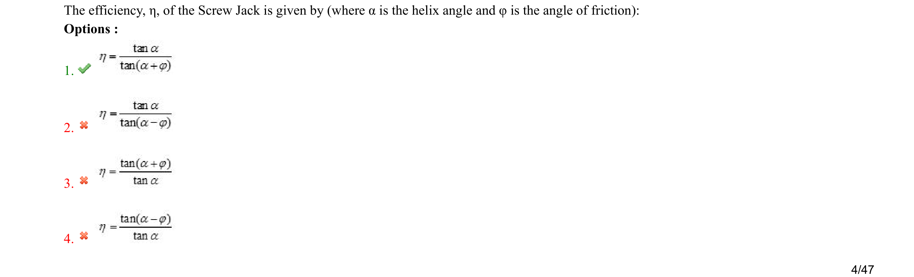

### Options

1. 
2. 
3. 
4. 

### Answer

> **Answer: 1**

### Exam

PCB-2022

---

## Question 470

**Topic:** 11.civil engineering

### Question

When one object presses against another, the stresses developed at the contact surface is referred to as:

### Options

1. bearing stress
2. tensile stress
3. normal stress
4. shear stress

### Answer

> **Answer: 1**

### Exam

PCB-2022

---

## Question 471

**Topic:** 11.civil engineering

### Question

The cylindrical portion of the rivet is called the ______ and the lower portion is known as the ______.

### Options

1. shank; tail
2. head; tail
3. body; base
4. head; base

### Answer

> **Answer: 1**

### Exam

PCB-2022

---

## Question 472

**Topic:** 11.civil engineering

### Question

A riveted joint formed between two plates, when they are brought face to face such that an overlap exists, is called a ______.

### Options

1. lap joint
2. butt joint
3. tee joint
4. edge joint

### Answer

> **Answer: 1**

### Exam

PCB-2022

---

## Question 473

**Topic:** 11.civil engineering

### Question

Which riveted joint has the highest efficiency, which is expressed in percentile of the commercial boiler joint?

### Options

1. Double riveted lap joint
2. Triple riveted lap joint
3. Double riveted butt joint
4. Triple riveted butt joint

### Answer

> **Answer: 4**

### Exam

PCB-2022

---

## Question 474

**Topic:** 11.civil engineering

### Question

The distance between the ______ of the rivet hole and the ______ of the plate is known as the marginal pitch.

### Options

1. centre; nearest edge
2. centre; farthest edge
3. edge; centre
4. edge; nearest edge

### Answer

> **Answer: 1**

### Exam

PCB-2022

---

## Question 475

**Topic:** 11.civil engineering

### Question

4. *

### Options

*(No options)*

### Answer

> **Answer: None**

### Exam

PCB-2022

---

## Question 476

**Topic:** 11.civil engineering

### Question

A plate, 100 mm wide and 10 mm thick, is to be welded to another plate by means of double parallel fillets. The plates are subjected to a static load of 80 kN. The length of weld (neglecting allowance), if the permissible shear stress in the weld does not exceed 55 MPa, is:

### Options

1. 103 cm
2. 103 mm
3. 115.5 mm
4. 115.5 cm

### Answer

> **Answer: 2**

### Exam

PCB-2022

---

## Question 477

**Topic:** 11.civil engineering

### Question

Two plates, 200 mm wide and 10 mm thick, are to be welded by means of transverse welds at the ends. If the plates are subjected to a load of 70 kN, the size of the weld (neglecting allowance), assuming the allowable tensile stress of 70 MPa, is:

### Options

1. 141.42 mm
2. 141.42 cm
3. 153.92 mm
4. 153.92 cm

### Answer

> **Answer: 1**

### Exam

PCB-2022

---

## Question 478

**Topic:** 11.civil engineering

### Question

Uniformly varying load on a beam is also known as:

### Options

1. concentrated load
2. sinusoidal load
3. triangular load
4. unequal load

### Answer

> **Answer: 3**

### Exam

PCB-2022

---

## Question 479

**Topic:** 11.civil engineering

### Question

Which of the following is the overhanging beam?

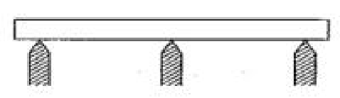

### Options

1. 
2. 
3. 
4. 

### Answer

> **Answer: 2**

### Exam

PCB-2022

---

## Question 480

**Topic:** 11.civil engineering

### Question

In a loaded beam, the point where the bending moment is zero is known as:

### Options

1. the contraflexure point
2. the zero point
3. the bottom point
4. the Unwin point

### Answer

> **Answer: 1**

### Exam

PCB-2022

---

## Question 481

**Topic:** 11.civil engineering

### Question

A cantilever beamAB carries loading as shown in the following figure. Which of the following is the SFD for the
beam?
2 kN
4kN.m
1m		1m

### Options

1. 2kN
2. 
3. 
4. 

### Answer

> **Answer: None**

### Exam

PCB-2022

---

## Question 482

**Topic:** 11.civil engineering

### Question

wkN/unit length

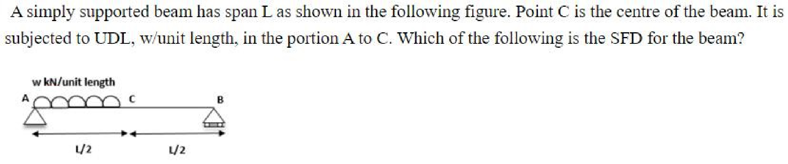

### Options

2. 
3. 
4. 

### Answer

> **Answer: None**

### Exam

PCB-2022

---

## Question 483

**Topic:** 11.civil engineering

### Question

Acantileverbeamis loaded asshown in thefollowingfigure.What is the shapeof thebendingmoment diagramfor
portionAB?
2kN/m
YY
1m		1m

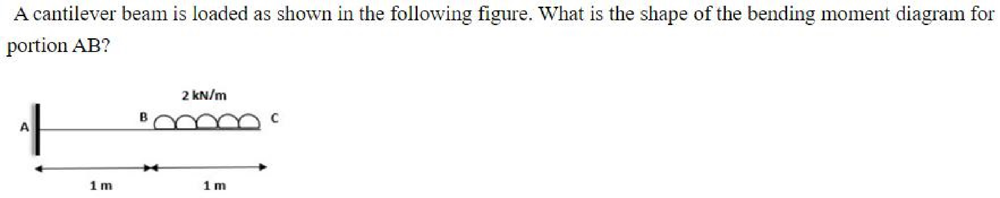

### Options

1. Parabolic
2. Linearly varying with maximum bending moment at B
3. Constant bending moment from A to B
4. Linearly varying with maximum bending moment at A

### Answer

> **Answer: 4**

### Exam

PCB-2022

---

## Question 484

**Topic:** 11.civil engineering

### Question

*(No text)*

### Options

1. L/4
2. L/3
3. L/2
4. 

### Answer

> **Answer: 4**

### Exam

PCB-2022

---

## Question 485

**Topic:** 11.civil engineering

### Question

Which of the following statements is NOT true about pure bending in beams?

### Options

1. Inner edge of cross-section of the beam undergoes compression.
2. Outer edge of cross-section of the beam undergoes tension.
3. Internal stresses are present along the length of the beam.
4. Shear stress is present in the beam.

### Answer

> **Answer: 4**

### Exam

PCB-2022

---

## Question 486

**Topic:** 11.civil engineering

### Question

Which of the following is NOT an assumption used in the Theory of Simple Bending?

### Options

1. The material is homogeneous and isotropic.
2. Transverse planes remain plane after bending.
3. Initially the beam is straight.
4. The radius of curvature is small compared with the dimensions of the cross-section.

### Answer

> **Answer: 4**

### Exam

PCB-2022

---

## Question 487

**Topic:** 11.civil engineering

### Question

The longitudinal stress (o) for the section of beam (N-M) shown in the following figure, subjected to simple bending
having moment M, is given by the formula (where E = Young's modulus of rigidity, I= second moment of area):
N-
8A

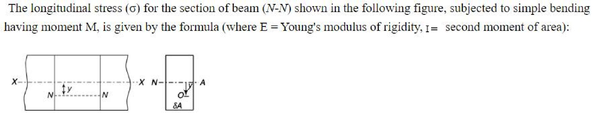

### Options

2. 
3. MI
4. 

### Answer

> **Answer: None**

### Exam

PCB-2022

---

## Question 488

**Topic:** 11.civil engineering

### Question

Z=
2. *
Z-
3. *
4. x

### Options

*(No options)*

### Answer

> **Answer: None**

### Exam

PCB-2022

---

## Question 489

**Topic:** 11.civil engineering

### Question

A 2o0-mm-wide, 300-mm-deep and 4-m-long simply supported beam is shown in the following figure. The bending
moment at the point C which is 60 mm below the top surface and 1.2 m firom the left support is:
-1.2m→		200kN/m
60mm
300mm
200mm

### Options

1. 236 kN.m
2. 336 kN.m
3. 527 kN.m
4. 627 kN.m

### Answer

> **Answer: 2**

### Exam

PCB-2022

---

## Question 490

**Topic:** 11.civil engineering

### Question

A 120-mm-wide and 10-mm-thick steel plate is bent into circular arc of 8-m radius. The maximum value of stress produced is (take Young's Modulus of Rigidity, E, = 200 GPa):

### Options

1. 12.5 Mpa
2. 25 Mpa
3. 125 Mpa
4. 250 MPa

### Answer

> **Answer: 3**

### Exam

PCB-2022

---

## Question 491

**Topic:** 11.civil engineering

### Question

The variation of bending moment due a point load on a simply supported beam is governed by the ______.

### Options

1. Cubic Law
2. Parabolic Law
3. Linear Law
4. Quartic Law

### Answer

> **Answer: 3**

### Exam

PCB-2022

---

## Question 492

**Topic:** 11.civil engineering

### Question

The variation of bending moment between two sections of a beam is equal to:

### Options

1. the area under the shear force diagram
2. the difference of shear force between the two sections
3. the area under the bending moment diagram
4. the difference of bending moment between the two sections

### Answer

> **Answer: 1**

### Exam

PCB-2022

---

## Question 493

**Topic:** 11.civil engineering

### Question

Variation in bending moment in a cantilever beam, carrying a load, the intensity of which varies uniformly from zero at the free end to w per unit run at the fixed end, is governed by the ______.

### Options

1. Cubic Law
2. Parabolic Law
3. Linear Law
4. Quartic Law

### Answer

> **Answer: 1**

### Exam

PCB-2022

---

## Question 494

**Topic:** 11.civil engineering

### Question

Variation in shear force in a cantilever beam, carrying a load, the intensity of which varies uniformly from zero at the free end to w per unit run at the fixed end, is governed by the ______.

### Options

1. Cubic Law
2. Parabolic Law
3. Linear Law
4. Quartic Law

### Answer

> **Answer: 2**

### Exam

PCB-2022

---

## Question 495

**Topic:** 11.civil engineering

### Question

Variation in shear force in a cantilever beam(length = ), carrying a load, the intensity of which varies uniformly
from zero at the fixed end to w per unit run at the free end, is (x is distance from free end):

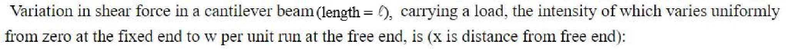

### Options

1. 20

### Answer

> **Answer: None**

### Exam

PCB-2022

---

## Question 496

**Topic:** 11.civil engineering

### Question

2x 3

### Options

*(No options)*

### Answer

> **Answer: None**

### Exam

PCB-2022

---

## Question 497

**Topic:** 11.civil engineering

### Question

A simply supported beam (length = , has a distributed load of intensity varying with zero at each end to w per unit
run atmidspan.Thevariation in bendingmomentwill be (x is distancefrom leftend):
40
2.
3.*		30

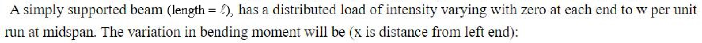

### Options

*(No options)*

### Answer

> **Answer: None**

### Exam

PCB-2022

---

## Question 498

**Topic:** 11.civil engineering

### Question

In an analysis of plane frame structure, members are assumed to be joined together with:

### Options

1. riveted joints
2. welded joints
3. rigid joints
4. pin joints

### Answer

> **Answer: 4**

### Exam

PCB-2022

---

## Question 499

**Topic:** 11.civil engineering

### Question

3.
4. x

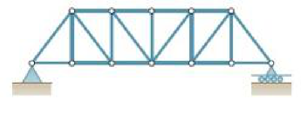

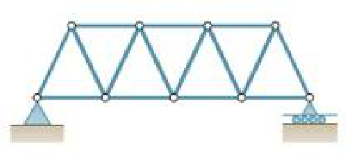

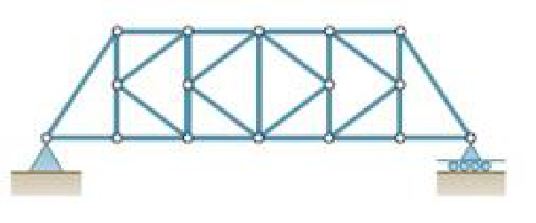

### Options

*(No options)*

### Answer

> **Answer: None**

### Exam

PCB-2022

---

## Question 500

**Topic:** 11.civil engineering

### Question

Which of the following is a deficiency frame?

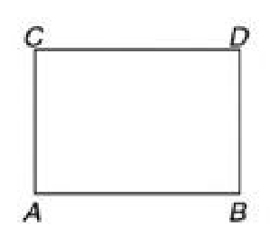

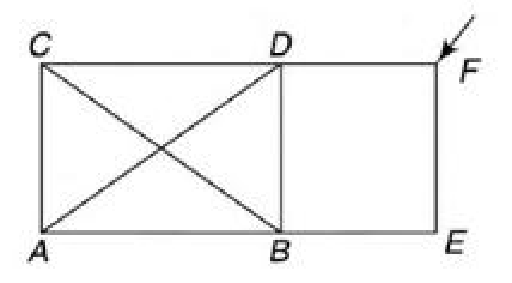

### Options

3. 
4. 

### Answer

> **Answer: None**

### Exam

PCB-2022

---

## Question 501

**Topic:** 11.civil engineering

### Question

The method of joints is preferred in the analysis of plane frames if forces are required to be determined in:

### Options

1. one member only
2. two members only
3. a few members
4. in all the members

### Answer

> **Answer: 4**

### Exam

PCB-2022

---

## Question 502

**Topic:** 11.civil engineering

### Question

The force in member AD of the truss shown in the following figure is (takeD and E as the mid-points of AC and BC,
respectively):
40kN
20kN		20kN
10kN		10kN
30

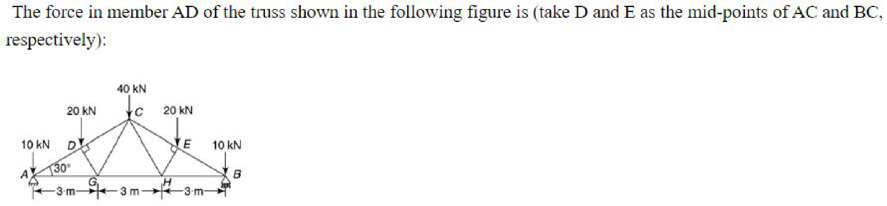

### Options

1. 120 kN
2. –120 kN
3. 80 KN
4. –80 kN

### Answer

> **Answer: 4**

### Exam

PCB-2022

---

## Question 503

**Topic:** 11.civil engineering

### Question

To determine the force in members FH, GH and GI of the truss shown in the following figure, using the method of
sections, the correct way to draw the section will be:
1KN
1kN		1KN
1kN
1kN
8m
5kN.5kN5kN
6panels@5m=30m

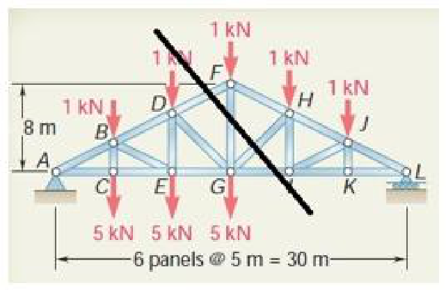

### Options

*(No options)*

### Answer

> **Answer: None**

### Exam

PCB-2022

---

## Question 504

**Topic:** 11.civil engineering

### Question

The variation of shear stress in a circular shaft, subjected to torsion, with radial distance is:

### Options

1. linear
2. parabolic
3. hyperbolic
4. quartic

### Answer

> **Answer: 1**

### Exam

PCB-2022

---

## Question 505

**Topic:** 11.civil engineering

### Question

The relation governing the torsional torque in circular shafts is (where T = Torque, = shear stress, r =radial
distance, (= length of shaft, J = polar moment of inertia, G = modulus of rigidity,  = angle of twist):

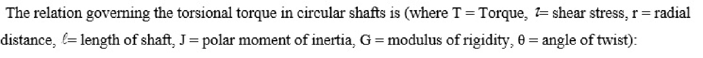

### Options

1. 
2. 
3. 
4. G6

### Answer

> **Answer: None**

### Exam

PCB-2022

---

## Question 506

**Topic:** 11.civil engineering

### Question

2. V
3.
TG
4. *J

### Options

*(No options)*

### Answer

> **Answer: None**

### Exam

PCB-2022

---

## Question 507

**Topic:** 11.civil engineering

### Question

The maximum shear stress of a solid shaft is given by (where T = Torque, d = shaft diameter):

### Options

1. 
2. 
3. 
4. 16T

### Answer

> **Answer: None**

### Exam

PCB-2022

---

## Question 508

**Topic:** 11.civil engineering

### Question

The maximum shear stress in a hollow shaft subjected to a torsional moment ______.

### Options

1. is at the middle of thickness
2. is at the at the inner surface of the shaft
3. is at the at the outer surface of the shaft
4. can be anywhere on the shaft

### Answer

> **Answer: 3**

### Exam

PCB-2022

---

## Question 509

**Topic:** 11.civil engineering

### Question

The ratio of the maximum stress of a hollow shaft to that of a solid shaft, subjected to torsion, if both are of the same material and of the same outer diameters, is (k is the ratio of the inner diameter to the outer diameter of the hollow shaft):

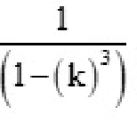

### Options

1. 
2. 
3. 
4. 

### Answer

> **Answer: 1**

### Exam

PCB-2022

---

## Question 510

**Topic:** 11.civil engineering

### Question

The torsional stiffness is given by (l = length of shaft, J= polar moment of inertia, G = modulus of rigidity):

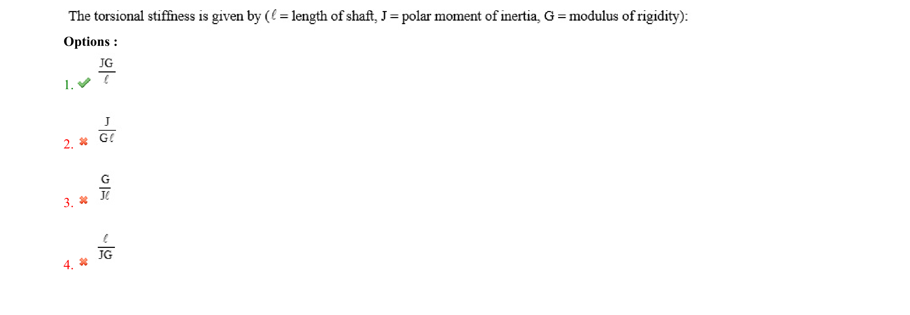

### Options

1. JG
2. 
3. 
4. JG

### Answer

> **Answer: None**

### Exam

PCB-2022

---

## Question 511

**Topic:** 11.civil engineering

### Question

A cylinder-shell may be termed as thin if the ratio of thickness of the wall to the diameter of the shell is less than:

### Options

1. 1 : 5
2. 1 : 10
3. 1 : 15
4. 1 : 20

### Answer

> **Answer: 3**

### Exam

PCB-2022

---

## Question 512

**Topic:** 11.civil engineering

### Question

The circumferential stresses in thin cylinders are also known as:

### Options

1. hoop stresses
2. radial stresses
3. tangential stresses
4. longitudinal stresses

### Answer

> **Answer: 1**

### Exam

PCB-2022

---

## Question 513

**Topic:** 11.civil engineering

### Question

Longitudinal stresses in the body of a thin cylinder (with uniform thickness) having spherical ends are ______ hoop stresses.

### Options

1. half of
2. the same as
3. double of
4. triple of

### Answer

> **Answer: 1**

### Exam

PCB-2022

---

## Question 514

**Topic:** 11.civil engineering

### Question

Hoop strain in the body of a thin cylinder (with uniform thickness ‘t') having spherical ends is (d = internal diameter, p = internal pressure, E =
Young's modulus, v = Poisson's ratio):
pd

### Options

1. 2tE
2. 
3. 
4. 2tE

### Answer

> **Answer: None**

### Exam

PCB-2022

---

## Question 515

**Topic:** 11.civil engineering

### Question

The ratio of hoop stress to hoop strain in the hemispherical portion of a thin cylinder (with uniform thickness ‘t')
is (E = Young's modulus, v = Poisson's ratio):

### Options

1. (1-v)
2. (2-v)
3. 
4. 2E (2-v)

### Answer

> **Answer: None**

### Exam

PCB-2022

---

## Question 516

**Topic:** 11.civil engineering

### Question

Neglecting the effect of internal pressure, the volumetric strain of a thin cylinder is (σ = hoop stress, E = Young’s modulus, ν = Poisson’s ratio):

### Options

1. 
2. 
3. 
4. 

### Answer

> **Answer: 1**

### Exam

PCB-2022

---

## Question 517

**Topic:** 11.civil engineering

### Question

If the load on a column is increased to a value that on its removal the deflection remains and the column doesn’t return to its original position, the load is known as:

### Options

1. critical load
2. ultimate load
3. yield load
4. breaking load

### Answer

> **Answer: 1**

### Exam

PCB-2022

---

## Question 518

**Topic:** 11.civil engineering

### Question

The ratio of the equivalent length of a column fixed at one end with the other free to that of a column with both ends hinged is (consider the lengths of the two columns to be the same):

### Options

1. 1 : 1
2. 2 : 1
3. 3 : 1
4. 1 : 2

### Answer

> **Answer: 2**

### Exam

PCB-2022

---

## Question 519

**Topic:** 11.civil engineering

### Question

Euler’s Crippling Load for a column with both ends fixed is ______ that for a column fixed at one end with the other end hinged.

### Options

1. the same as
2. half of
3. double of
4. triple of

### Answer

> **Answer: 3**

### Exam

PCB-2022

---

## Question 520

**Topic:** 11.civil engineering

### Question

*(No text)*

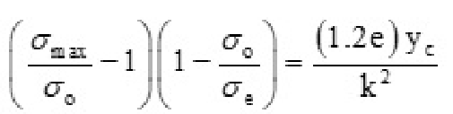

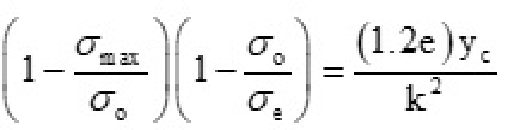

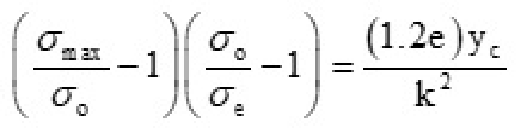

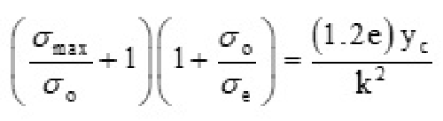

### Options

1. 
2. 
3. 
4. 

### Answer

> **Answer: 1**

### Exam

PCB-2022

---

## Question 521

**Topic:** 11.civil engineering

### Question

In a column, what is the relationship between the slenderness ratio and the critical stress?

### Options

1. Slenderness ratio increases with the increase in critical stress.
2. Slenderness ratio decreases with the increase in critical stress.
3. Slenderness ratio remains constant with the increase in critical stress.
4. Slenderness ratio first increases and after a maximum value, starts to decrease, with the increase in critical stress.

### Answer

> **Answer: 2**

### Exam

PCB-2022

---

## Question 522

**Topic:** 11.civil engineering

### Question

Secant formula is applicable for:

### Options

1. short columns under axial loading
2. long columns under axial loading
3. short columns under eccentric loading
4. long columns under eccentric loading

### Answer

> **Answer: 4**

### Exam

PCB-2022

---

## Question 523

**Topic:** 11.civil engineering

### Question

When centrifugal pump is used to lift water, the direction of flowing water is changed by_______.

### Options

1. 45°
2. 60°
3. 90°
4. 180°

### Answer

> **Answer: 3**

### Exam

PCB-Civil-2022

---

## Question 524

**Topic:** 11.civil engineering

### Question

Which of the following can measure the head loss?

### Options

1. Weir
2. Notch
3. Scrubber
4. Piezometer

### Answer

> **Answer: 4**

### Exam

PCB-Civil-2022

---

## Question 525

**Topic:** 11.civil engineering

### Question

A surge tank is a storage reservoir at the ________ end of a close aqueduct to absorb a sudden ________ of pressure.

### Options

1. downstream, rise
2. upstream, rise
3. upstream, fall
4. downstream, fall

### Answer

> **Answer: 1**

### Exam

PCB-Civil-2022

---

## Question 526

**Topic:** 11.civil engineering

### Question

The valves which are used to remove the sediment in the pipelines are called:

### Options

1. butterfly valves
2. scour valves
3. air valves
4. check valves

### Answer

> **Answer: 2**

### Exam

PCB-Civil-2022

---

## Question 527

**Topic:** 11.civil engineering

### Question

To control the water hammer, which of the following valves will be used?

### Options

1. Air valves
2. Pilot valves
3. Scour valves
4. Blow off valves

### Answer

> **Answer: 1**

### Exam

PCB-Civil-2022

---

## Question 528

**Topic:** 11.civil engineering

### Question

When a retaining wall moves towards the backfill, the pressure exerted on the wall is termed as ________.

### Options

1. passive earth pressure
2. swelling pressure
3. pore pressure
4. active earth pressure

### Answer

> **Answer: 1**

### Exam

PCB-Civil-2022

---

## Question 529

**Topic:** 11.civil engineering

### Question

Which of the following expression is correct to calculate permissible stresses used in working stress method of design?

### Options

1. Permissible Stress = Yield Stress × Factor of Safety
2. Permissible Stress = Yield Stress / Factor of Safety
3. Yield Stress = Permissible Stress / Factor of Safety
4. Permissible Stress = Yield Stress - Factor of Safety

### Answer

> **Answer: 2**

### Exam

PCB-Civil-2022

---

## Question 530

**Topic:** 11.civil engineering

### Question

Which of the following does NOT belong to the limit state of strength?

### Options

1. Fracture due to fatigue
2. Brittle fracture
3. Rupture of the structure
4. Vibrations in structures

### Answer

> **Answer: 4**

### Exam

PCB-Civil-2022

---

## Question 531

**Topic:** 11.civil engineering

### Question

As per IS 800:2007, The thickness of the lacing bar for single lacing should not be less than  of its effective length.

### Options

1. 30
2. 40
3. 50
4. 60

### Answer

> **Answer: None**

### Exam

PCB-Civil-2022

---

## Question 532

**Topic:** 11.civil engineering

### Question

Which ofthe following is NOT a type of bolted joint?

### Options

1. Lap joint
2. Single cover butt joint
3. Double cover lap joint
4. Double cover butt joint

### Answer

> **Answer: 3**

### Exam

PCB-Civil-2022

---

## Question 533

**Topic:** 11.civil engineering

### Question

In lightly stressed structures, where stiffness, rather than strength, controls the design and fatigue or brittle fracture is not a problem, the ________ welds are entirely adequate and generally more economical.

### Options

1. fillet
2. butt
3. plug
4. slot

### Answer

> **Answer: 1**

### Exam

PCB-Civil-2022

---

## Question 534

**Topic:** 11.civil engineering

### Question

The reduction in the weld strength as per long joint is done when the length of the welded joint of a splice or end connections in a compression or tension element exceeds _________ times the throat size of the weld.

### Options

1. 16
2. 150
3. 100
4. 120

### Answer

> **Answer: 2**

### Exam

PCB-Civil-2022

---

## Question 535

**Topic:** 11.civil engineering

### Question

Which of the following causes fatigue in a structure?

1. Stress due to self-weight
2. Residual stress
3. Large number of loading cycles
4. Wide range of stress variation

### Options

1. 1 and 2
2. 3 and 4
3. 2, 3 and 4
4. 1, 2 and 4

### Answer

> **Answer: 2**

### Exam

PCB-Civil-2022

---

## Question 536

**Topic:** 11.civil engineering

### Question

A metal specimen having a diameter of 20 mm is tested in universal testing machine. It was found that the strain in longitudinal, lateral direction was 4.5x10-4 and 1.5x10-4 respectively. What will be its fraction of Poisson's?

### Options

1. 0.33
2. 0.30
3. 0.25
4. 0.5

### Answer

> **Answer: 1**

### Exam

PCB-Civil-2022

---

## Question 537

**Topic:** 11.civil engineering

### Question

Let us consider two bars made of materials ‘X’ and ‘Y’. The area of cross-section and length is the same for both materials. The free elongation produced by material ‘X’ and ‘Y’, individually, when subjected to a rise in temperature ‘T’ is 35mm and 45mm.If both the bars are combined to form a compound bar and are subjected to a rise in temperature T1, the stresses setup within the material ‘X’ and ‘Y’ are:

### Options

1. tensile, compressive
2. tensile, tensile
3. compressive, compressive
4. compressive, tensile

### Answer

> **Answer: 1**

### Exam

PCB-Civil-2022

---

## Question 538

**Topic:** 11.civil engineering

### Question

At a location in a simply supported beam, the variation in the bending moment is given by 50x - 10x2 kN - m. The shear force at x=2 is ________ kN.

### Options

1. 20
2. 30
3. 10
4. 40

### Answer

> **Answer: 3**

### Exam

PCB-Civil-2022

---

## Question 539

**Topic:** 11.civil engineering

### Question

Which of the following statement is incorrect with respect to design considerations for taxiway layout?

### Options

1. As far as possible, the intersection of the taxiway and runway should be avoided.
2. Exit taxiways are always placed at right angles to the runways.
3. The route for the taxiway selected should provide the shortest practicable distance from the apron to the runway end.
4. Taxiways should be arranged so that aircraft taxiing towards the apron do not interfere with the aircraft taxiing for take-off.

### Answer

> **Answer: 2**

### Exam

PCB-Civil-2022

---

## Question 540

**Topic:** 11.civil engineering

### Question

The main function of taxiways is to provide access from the runways to the terminal area and service hangers. Which of the following statements related to the length of a taxiway is/are true or false? 1: Taxiway length depends upon the distance between the apron and entry end or exit end of the runway. 2:To save fuel consumption, the length of the taxiway should be as short as practicable.

### Options

1. 1 is true but 2 is false
2. Both the statements are true
3. 1 is false but 2 is true
4. Both the statements are false

### Answer

> **Answer: 2**

### Exam

PCB-Civil-2022

---

## Question 541

**Topic:** 11.civil engineering

### Question

The function of exit taxiways is to minimise the runway occupancy by the landing aircraft. The location of exit taxiways does NOT depend on _________.

### Options

1. Touchdown speed
2. Mix of aircrafts
3. Size of apron
4. Rate of deceleration of aircrafts

### Answer

> **Answer: 3**

### Exam

PCB-Civil-2022

---

## Question 542

**Topic:** 11.civil engineering

### Question

The aircraft are berthed on the aprons before they are loaded and unloaded. Hence, the loading apron is also known as the____________.

### Options

1. landing apron
2. parking apron
3. service apron
4. hangar

### Answer

> **Answer: 2**

### Exam

PCB-Civil-2022

---

## Question 543

**Topic:** 11.civil engineering

### Question

The runway is usually oriented in the direction of the prevailing winds.
The orientation of a runway is selected after a careful analysis of wind
velocity and direction and duration over the past years.
Match the wind directions used in runway orientation with the
definition.
Wind direction  Definition
A. Headwind

1. It acts in the perpendicular
direction of aircraft
B. Tailwind
2. It acts in the opposite
direction ofthe head of the
aircraft
C. Crosswind  3.It acts in the direction of the
landing operation

### Options

1. A- 1, B -2, C - 3
2. A-2, B -1, C -3
3. A-3, B -2, C -1
4. A-2, B -3, C -1

### Answer

> **Answer: 4**

### Exam

PCB-Civil-2022

---

## Question 544

**Topic:** 11.civil engineering

### Question

The ideal orientation of the runway decided from the study of the wind rose diagram may have to be altered or changed because of the following factors.

1. The orientation of the runway demands excessive grading and earthwork.
2. The location of the runway does not create excessive noise nuisance to the surrounding residential areas and public places of importance. Which of the following statements is/are true or false?

### Options

1. Both the statements are true
2. 1 is false but 2 is true
3. 1 is true but 2 is false
4. Both the statements are false

### Answer

> **Answer: 3**

### Exam

PCB-Civil-2022

---

## Question 545

**Topic:** 11.civil engineering

### Question

Which of the following is an INCORRECT assumption in calculating the basic runway length?

### Options

1. The airport is at sea level.
2. No wind is blowing on the runway.
3. The runway has a slope in the longitudinal direction.
4. The en-route temperature is standard.

### Answer

> **Answer: 3**

### Exam

PCB-Civil-2022

---

## Question 546

**Topic:** 11.civil engineering

### Question

Given the following aircraft class, mix and average gate occupancy time,
the capacity of 10 gates that serve the three classes of aircraft is:
Aircraft class  Mix(%)  Average occupancy
time (min)
15  20
30  40
55  60
Assume that each gate is available for all aircraft.

### Options

1. 18 aircrafts/hour
2. 22 aircrafts /hour
3. 12.5 aircrafts /hour
4. 5.5 aircrafts/hour

### Answer

> **Answer: 3**

### Exam

PCB-Civil-2022

---

## Question 547

**Topic:** 11.civil engineering

### Question

Identify the INCORRECT statement with respect to vertical curves used in highways.

### Options

1. The parabolic curve produces excellent riding qualities and is preferred in highways
2. The circular arc produces good riding qualities and is preferred in highways.
3. Provision of parabolic curves is not recommended in highways.
4. Abrupt change in the rate of grade is not recommended in highways.

### Answer

> **Answer: 3**

### Exam

PCB-Civil-2022

---

## Question 548

**Topic:** 11.civil engineering

### Question

In setting out a vertical curve, the difference in elevation between a point on the tangent and the corresponding point on the curve varies as:

### Options

1. the square of its horizontal distance from the point of tangency
2. 2 times the horizontal distance from the point of tangency
3. 0.5 times the horizontal distance from the point of tangency
4. the square root of its horizontal distance from the point of tangency

### Answer

> **Answer: 1**

### Exam

PCB-Civil-2022

---

## Question 549

**Topic:** 11.civil engineering

### Question

A simple circular curve of radius(r) 150 m is to be set on the ground with a central angle 60°. Calculate its length of long chord.

### Options

1. 100 m
2. 125 m
3. 150 m
4. 175 m

### Answer

> **Answer: 3**

### Exam

PCB-Civil-2022

---

## Question 550

**Topic:** 11.civil engineering

### Question

Identify the INCORRECT statement with respect to electromagnetic radiation used in remote sensing.

### Options

1. It produces a time-varying magnetic field and vice versa.
2. Once electromagnetic radiation is generated, it remains self-propagating.
3. It is capable of travelling across space.
4. Human eyes are sensitive to all the parts of the electromagnetic system.

### Answer

> **Answer: 4**

### Exam

PCB-Civil-2022

---

## Question 551

**Topic:** 11.civil engineering

### Question

Identify the INCORRECT statement with respect to airborne remote sensing system.

### Options

1. Very high spatial resolution images (20 cm or less) can be obtained through airborne remote sensing.
2. Airborne remote sensing is better than satellite remote sensing to map a large area at a less cost.
3. In airborne remote sensing, downward or sideward looking sensors mounted on aircrafts are used to obtain images of the earth's surface.
4. The major disadvantage of airborne remote sensing is the high cost per unit area of ground coverage.

### Answer

> **Answer: 2**

### Exam

PCB-Civil-2022

---

## Question 552

**Topic:** 11.civil engineering

### Question

Which of the following parameters is NOT covered in the design of structures by limit state of serviceability?

### Options

1. Deformation and deflections
2. Vibrations in the structures
3. Corrosion and durability
4. Equilibrium of the structures

### Answer

> **Answer: 4**

### Exam

PCB-Civil-2022

---

## Question 553

**Topic:** 11.civil engineering

### Question

As per IS:456-2000, while doing the design for the limit state of collapse in flexure, the maximum strain in concrete at the outermost compression fibre is taken as ______ in bending.

### Options

1. 0.35
2. 0.035
3. 0.00035
4. 0.0035

### Answer

> **Answer: 4**

### Exam

PCB-Civil-2022

---

## Question 554

**Topic:** 11.civil engineering

### Question

What is the failure pattern of a column with low slenderness ratio, (i.e., relatively short and stocky column) subjected to an axial load which can cause failure?

### Options

1. Fail under ultimate loads, with the material reaching its ultimate strength
2. Fail under relatively low compressive loads and susceptible to buckling failure
3. Fail due to development of considerable secondary moments
4. Fails due to development of both bending and shear stresses

### Answer

> **Answer: 1**

### Exam

PCB-Civil-2022

---

