# APPSC 2022 ae various civil envi Question Bank

## Topic Index

### Strength of Materials

- Q1
- Q2
- Q3
- Q4
- Q5
- Q6
- Q7
- Q8
- Q10
- Q12
- Q13
- Q14
- Q15
- Q16
- Q17
- Q18
- Q19
- Q20
- Q21
- Q24
- Q25
- Q26
- Q27
- Q28
- Q29
- Q30
- Q31
- Q32
- Q33
- Q34
- Q35
- Q36
- Q37
- Q38
- Q39
- Q40
- Q41
- Q42
- Q43
- Q44
- Q45
- Q46
- Q47
- Q48
- Q49
- Q50
- Q51
- Q52
- Q53
- Q54
- Q55
- Q56
- Q57
- Q58
- Q59
- Q60
- Q61
- Q62
- Q63
- Q64
- Q65
- Q66
- Q67
- Q68
- Q69
- Q70
- Q71
- Q72
- Q73
- Q75
- Q76
- Q77
- Q80
- Q81
- Q83
- Q85
- Q86
- Q88
- Q89
- Q90
- Q91
- Q95
- Q96
- Q102
- Q103
- Q107
- Q108
- Q109
- Q111
- Q113
- Q115
- Q117
- Q118
- Q119
- Q120
- Q121
- Q122
- Q123
- Q124
- Q125
- Q126
- Q127
- Q128
- Q129
- Q130
- Q131
- Q132
- Q133
- Q134
- Q135
- Q136
- Q137
- Q138
- Q139
- Q143

### Fluid Mechanics

- Q11
- Q74
- Q78
- Q79
- Q82
- Q84
- Q87
- Q92
- Q93
- Q94
- Q97
- Q98
- Q99
- Q100
- Q101
- Q104
- Q105
- Q106
- Q110
- Q112
- Q114
- Q116
- Q141
- Q142
- Q144
- Q145
- Q146
- Q147
- Q149
- Q150

### Material Science

*(No questions)*

### Theory of Machines

*(No questions)*

### Machine Design

- Q9
- Q22
- Q23
- Q140
- Q148

### Thermodynamics

*(No questions)*

### Heat Transfer

*(No questions)*

### Refrigeration and Air Conditioning

*(No questions)*

### IC Engines

*(No questions)*

### Production Technology

*(No questions)*

---

# Questions

## Question 1

**Topic:** Strength of Materials

### Question

Of the following concepts of classical mechanics, which is NOT an independent one?

### Options

1. Space
2. Time
3. Mass
4. Force

### Answer

> **Answer: 4**

### Exam

PCB-2022

---

## Question 2

**Topic:** Strength of Materials

### Question

If the line of action of all the forces in the system lies on the same plane, then it is called a ______.

### Options

1. coplanar force system
2. non-coplanar force system
3. concurrent force system
4. parallel force system

### Answer

> **Answer: 1**

### Exam

PCB-2022

---

## Question 3

**Topic:** Strength of Materials

### Question

The system of forces represented in the following figure is the

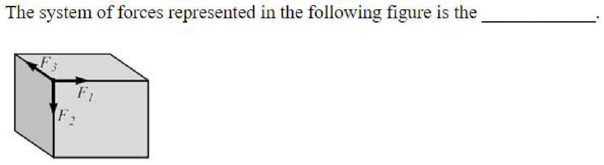

### Options

1. coplanar concurrent force system
2. non-coplanar concurrent force system
3. coplanar non-concurrent force system
4. non-coplanar non-concurrent force system

### Answer

> **Answer: 2**

### Exam

PCB-2022

---

## Question 4

**Topic:** Strength of Materials

### Question

A planet, having mass and radius half of that of earth, will have a value of acceleration due to gravity ______ that on earth (assume that constant of gravitation is the same for both the planets).

### Options

1. half of
2. the same as
3. double
4. four times

### Answer

> **Answer: 3**

### Exam

PCB-2022

---

## Question 5

**Topic:** Strength of Materials

### Question

The resultant of any two ______ forces may be found by the Parallelogram Law.

### Options

1. collinear concurrent
2. non-collinear concurrent
3. collinear non-concurrent
4. non-collinear non-concurrent

### Answer

> **Answer: 2**

### Exam

PCB-2022

---

## Question 6

**Topic:** Strength of Materials

### Question

The system of forces represented in the following figure is the

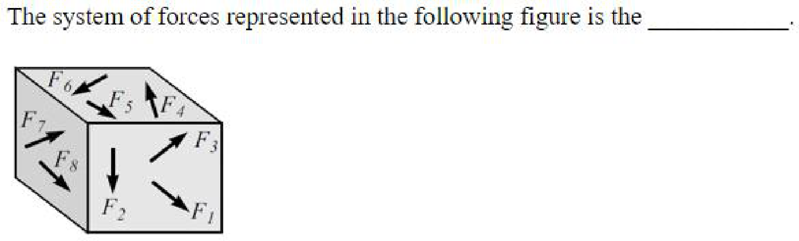

### Options

1. coplanar unlike parallel force system
2. non-coplanar unlike parallel force system
3. coplanar non-concurrent and non-parallel force system
4. non-coplanar non-concurrent and non-parallel force system

### Answer

> **Answer: 4**

### Exam

PCB-2022

---

## Question 7

**Topic:** Strength of Materials

### Question

A block rests on a horizontal frictional surface. Of the conditions given in the options, in which case can the equation F = μsN be applied (where F is the frictional force, μs is the coefficient of static friction and N is the normal reaction)?

### Options

1. The forces applied to the block do not tend to move it along the surface of contact.
2. The applied forces tend to move the block along the surface of contact, but are not large enough to set it in motion.
3. The applied forces are such that the block is just about to slide.
4. The block is sliding under the action of the applied forces.

### Answer

> **Answer: 3**

### Exam

PCB-2022

---

## Question 8

**Topic:** Strength of Materials

### Question

Based on the two statements given below, choose the correct answer. Statement A: A point where the whole weight of the body is assumed to act is called the centre of gravity. Statement B: For a non-homogeneous plate, the coordinates for the centre of gravity and the centroid of the area are the same.

### Options

1. Both statements A and B are correct.
2. Both statements A and B are incorrect.
3. Statement A is correct, but statement B is incorrect.
4. Statement A is incorrect, but statement B is correct.

### Answer

> **Answer: 3**

### Exam

PCB-2022

---

## Question 9

**Topic:** Machine Design

### Question

A shaft runs at 80 rpm and drives another shaft at 150 rpm through belt drive. If the diameter of the driving pully is 600 mm, the diameter of the driven pulley is (neglect the belt thickness):

### Options

1. 320 mm
2. 520 mm
3. 850 mm
4. 1125 mm

### Answer

> **Answer: 1**

### Exam

PCB-2022

---

## Question 10

**Topic:** Strength of Materials

### Question

*(No text)*

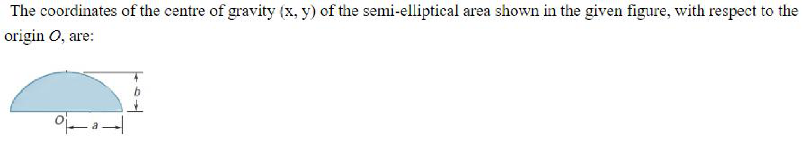

### Options

1. 
2. 
3. 
4. 

### Answer

> **Answer: 2**

### Exam

PCB-2022

---

## Question 11

**Topic:** Fluid Mechanics

### Question

A schematic diagram of a hydraulic braking system is shown in the following figure. If the driver applies a force of
1oo N, the force F available at the brakes is (take specific gravity of the fluid to be 0.8 and units of length as mm):
100N
150
200
100
40

### Options

1. 1.67 kN
2. 2.5 kN
3. 2.75 kN
4. 3.75 kN

### Answer

> **Answer: 4**

### Exam

PCB-2022

---

## Question 12

**Topic:** Strength of Materials

### Question

A hydraulic lift is used to lift a weight, as shown in the following figure. The diameter of the piston (D) on which the
weight is to beplaced is:
Weight
2500kg
25kg
10cm
0.1m
1mm
1 cm

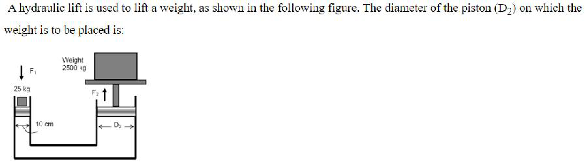

### Options

1. 0.1 m
2. 1 m
3. 1 mm
4. 1 cm

### Answer

> **Answer: 2**

### Exam

PCB-2022

---

## Question 13

**Topic:** Strength of Materials

### Question

The efficiency, η, of the Screw Jack is given by (where α is the helix angle and φ is the angle of friction):

### Options

1. 
2. 
3. 
4. 

### Answer

> **Answer: 1**

### Exam

PCB-2022

---

## Question 14

**Topic:** Strength of Materials

### Question

When one object presses against another, the stresses developed at the contact surface is referred to as:

### Options

1. bearing stress
2. tensile stress
3. normal stress
4. shear stress

### Answer

> **Answer: 1**

### Exam

PCB-2022

---

## Question 15

**Topic:** Strength of Materials

### Question

The Stress (o) - Strain (e) diagram for a Linear-Elastic material is:

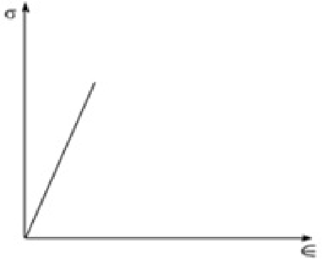

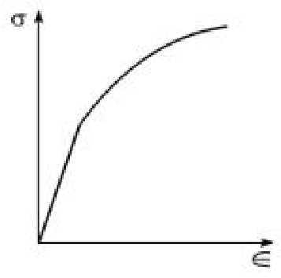

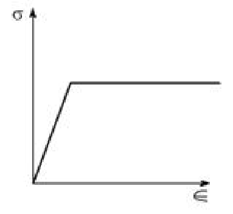

### Options

2. 
3. 
4. 

### Answer

> **Answer: None**

### Exam

PCB-2022

---

## Question 16

**Topic:** Strength of Materials

### Question

The relationship between the Engineering Strain (e) and the True Strain (ε), for materials with no changes in volume during deformation, is (where ln represents natural log):

### Options

1. ε = ln(e + 1)
2. ε = ln(e ̶1)
3. e = ln(ε + 1)
4. e = ln(ε ̶ 1)

### Answer

> **Answer: 1**

### Exam

PCB-2022

---

## Question 17

**Topic:** Strength of Materials

### Question

The relationship between the Engineering Stress (s) and the True Stress (σ), for materials with no changes in volume during deformation, is (where e is the Engineering Strain and ε is the True Strain):

### Options

1. σ = s(e + 1)
2. σ = s(e – 1)
3. s= σ(ε + 1)
4. s= σ(ε – 1)

### Answer

> **Answer: 1**

### Exam

PCB-2022

---

## Question 18

**Topic:** Strength of Materials

### Question

The relationship between Young's modulus of rigidity (E), bulk modulus of elasticity (K) and modulus of rigidity (G) is:
E-		9GK
(3K+G)
E-		(3K+G)
2. *		9GK
3GK
3. *		(3K+2G)
(3K+2G)
4. x		3GK

### Options

*(No options)*

### Answer

> **Answer: None**

### Exam

PCB-2022

---

## Question 19

**Topic:** Strength of Materials

### Question

The relationship between Poisson's ratio (), bulk modulus of elasticity (K) and modulus of rigidity (G) is:

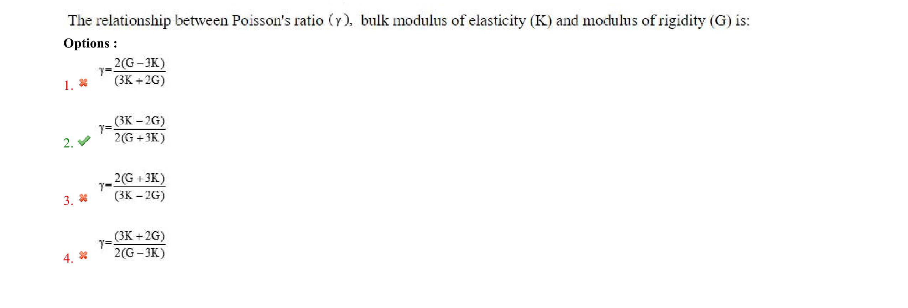

### Options

1. 2(G-3K)
2. (3K + 2G)
3. (3K -2G)
4. (3K+2G) 2(G-3K)

### Answer

> **Answer: None**

### Exam

PCB-2022

---

## Question 20

**Topic:** Strength of Materials

### Question

A rod is 2 m long at a temperature of 10 °C. The temperature of it is raised to 80 °C. If the expansion due to temperature rise is prevented, the stress developed in the rod is (take Young's modulus of rigidity, E, = 1.0 × 105 MN/m2 and coefficient of thermal expansion, α, = 0.000012 per °C):

### Options

1. 64 N/mm2
2. 64 kN/mm2
3. 84 N/mm2
4. 84 kN/mm2

### Answer

> **Answer: 3**

### Exam

PCB-2022

---

## Question 21

**Topic:** Strength of Materials

### Question

The cylindrical portion of the rivet is called the ______ and the lower portion is known as the ______.

### Options

1. shank; tail
2. head; tail
3. body; base
4. head; base

### Answer

> **Answer: 1**

### Exam

PCB-2022

---

## Question 22

**Topic:** Machine Design

### Question

A riveted joint formed between two plates, when they are brought face to face such that an overlap exists, is called a ______.

### Options

1. lap joint
2. butt joint
3. tee joint
4. edge joint

### Answer

> **Answer: 1**

### Exam

PCB-2022

---

## Question 23

**Topic:** Machine Design

### Question

Which riveted joint has the highest efficiency, which is expressed in percentile of the commercial boiler joint?

### Options

1. Double riveted lap joint
2. Triple riveted lap joint
3. Double riveted butt joint
4. Triple riveted butt joint

### Answer

> **Answer: 4**

### Exam

PCB-2022

---

## Question 24

**Topic:** Strength of Materials

### Question

The distance between the ______ of the rivet hole and the ______ of the plate is known as the marginal pitch.

### Options

1. centre; nearest edge
2. centre; farthest edge
3. edge; centre
4. edge; nearest edge

### Answer

> **Answer: 1**

### Exam

PCB-2022

---

## Question 25

**Topic:** Strength of Materials

### Question

4. *

### Options

*(No options)*

### Answer

> **Answer: None**

### Exam

PCB-2022

---

## Question 26

**Topic:** Strength of Materials

### Question

A plate, 100 mm wide and 10 mm thick, is to be welded to another plate by means of double parallel fillets. The plates are subjected to a static load of 80 kN. The length of weld (neglecting allowance), if the permissible shear stress in the weld does not exceed 55 MPa, is:

### Options

1. 103 cm
2. 103 mm
3. 115.5 mm
4. 115.5 cm

### Answer

> **Answer: 2**

### Exam

PCB-2022

---

## Question 27

**Topic:** Strength of Materials

### Question

Two plates, 200 mm wide and 10 mm thick, are to be welded by means of transverse welds at the ends. If the plates are subjected to a load of 70 kN, the size of the weld (neglecting allowance), assuming the allowable tensile stress of 70 MPa, is:

### Options

1. 141.42 mm
2. 141.42 cm
3. 153.92 mm
4. 153.92 cm

### Answer

> **Answer: 1**

### Exam

PCB-2022

---

## Question 28

**Topic:** Strength of Materials

### Question

Uniformly varying load on a beam is also known as:

### Options

1. concentrated load
2. sinusoidal load
3. triangular load
4. unequal load

### Answer

> **Answer: 3**

### Exam

PCB-2022

---

## Question 29

**Topic:** Strength of Materials

### Question

Which of the following is the overhanging beam?

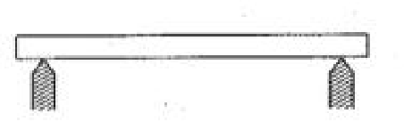

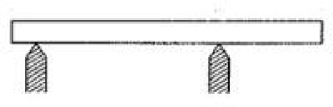

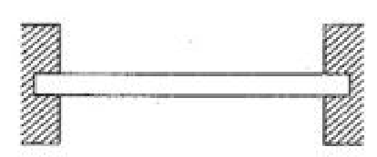

### Options

1. 
2. 
3. 
4. 

### Answer

> **Answer: 2**

### Exam

PCB-2022

---

## Question 30

**Topic:** Strength of Materials

### Question

In a loaded beam, the point where the bending moment is zero is known as:

### Options

1. the contraflexure point
2. the zero point
3. the bottom point
4. the Unwin point

### Answer

> **Answer: 1**

### Exam

PCB-2022

---

## Question 31

**Topic:** Strength of Materials

### Question

A cantilever beamAB carries loading as shown in the following figure. Which of the following is the SFD for the
beam?
2 kN
4kN.m
1m		1m

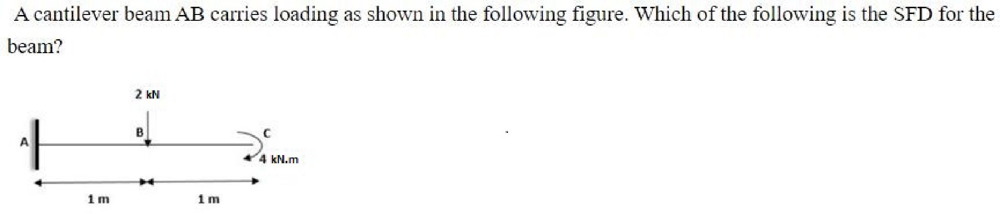

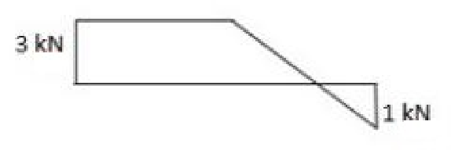

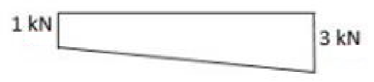

### Options

1. 2kN
2. 
3. 
4. 

### Answer

> **Answer: None**

### Exam

PCB-2022

---

## Question 32

**Topic:** Strength of Materials

### Question

wkN/unit length

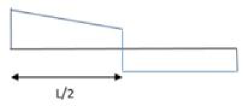

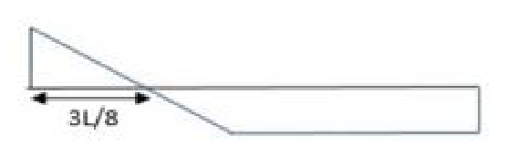

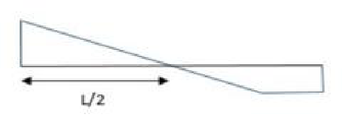

### Options

2. 
3. 
4. 

### Answer

> **Answer: None**

### Exam

PCB-2022

---

## Question 33

**Topic:** Strength of Materials

### Question

Acantileverbeamis loaded asshown in thefollowingfigure.What is the shapeof thebendingmoment diagramfor
portionAB?
2kN/m
YY
1m		1m

### Options

1. Parabolic
2. Linearly varying with maximum bending moment at B
3. Constant bending moment from A to B
4. Linearly varying with maximum bending moment at A

### Answer

> **Answer: 4**

### Exam

PCB-2022

---

## Question 34

**Topic:** Strength of Materials

### Question

*(No text)*

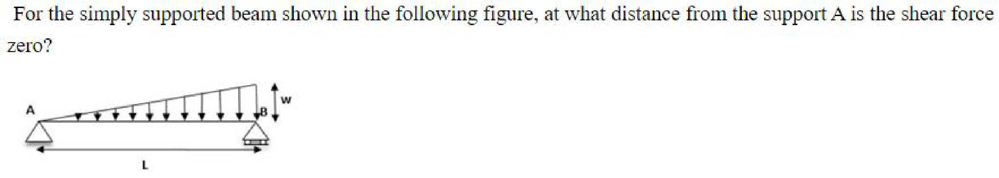

### Options

1. L/4
2. L/3
3. L/2
4. 

### Answer

> **Answer: 4**

### Exam

PCB-2022

---

## Question 35

**Topic:** Strength of Materials

### Question

Which of the following statements is NOT true about pure bending in beams?

### Options

1. Inner edge of cross-section of the beam undergoes compression.
2. Outer edge of cross-section of the beam undergoes tension.
3. Internal stresses are present along the length of the beam.
4. Shear stress is present in the beam.

### Answer

> **Answer: 4**

### Exam

PCB-2022

---

## Question 36

**Topic:** Strength of Materials

### Question

Which of the following is NOT an assumption used in the Theory of Simple Bending?

### Options

1. The material is homogeneous and isotropic.
2. Transverse planes remain plane after bending.
3. Initially the beam is straight.
4. The radius of curvature is small compared with the dimensions of the cross-section.

### Answer

> **Answer: 4**

### Exam

PCB-2022

---

## Question 37

**Topic:** Strength of Materials

### Question

The longitudinal stress (o) for the section of beam (N-M) shown in the following figure, subjected to simple bending
having moment M, is given by the formula (where E = Young's modulus of rigidity, I= second moment of area):
N-
8A

### Options

2. 
3. MI
4. 

### Answer

> **Answer: None**

### Exam

PCB-2022

---

## Question 38

**Topic:** Strength of Materials

### Question

Z=
2. *
Z-
3. *
4. x

### Options

*(No options)*

### Answer

> **Answer: None**

### Exam

PCB-2022

---

## Question 39

**Topic:** Strength of Materials

### Question

A 2o0-mm-wide, 300-mm-deep and 4-m-long simply supported beam is shown in the following figure. The bending
moment at the point C which is 60 mm below the top surface and 1.2 m firom the left support is:
-1.2m→		200kN/m
60mm
300mm
200mm

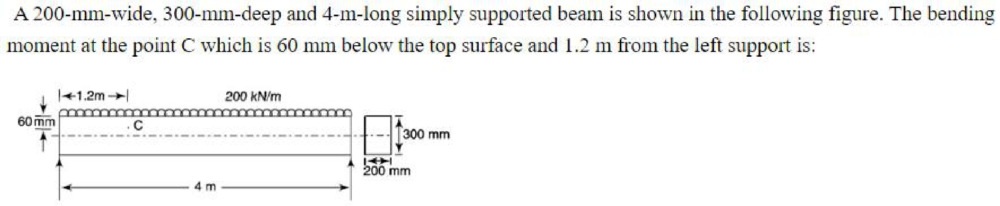

### Options

1. 236 kN.m
2. 336 kN.m
3. 527 kN.m
4. 627 kN.m

### Answer

> **Answer: 2**

### Exam

PCB-2022

---

## Question 40

**Topic:** Strength of Materials

### Question

A 120-mm-wide and 10-mm-thick steel plate is bent into circular arc of 8-m radius. The maximum value of stress produced is (take Young's Modulus of Rigidity, E, = 200 GPa):

### Options

1. 12.5 Mpa
2. 25 Mpa
3. 125 Mpa
4. 250 MPa

### Answer

> **Answer: 3**

### Exam

PCB-2022

---

## Question 41

**Topic:** Strength of Materials

### Question

The variation of bending moment due a point load on a simply supported beam is governed by the ______.

### Options

1. Cubic Law
2. Parabolic Law
3. Linear Law
4. Quartic Law

### Answer

> **Answer: 3**

### Exam

PCB-2022

---

## Question 42

**Topic:** Strength of Materials

### Question

The variation of bending moment between two sections of a beam is equal to:

### Options

1. the area under the shear force diagram
2. the difference of shear force between the two sections
3. the area under the bending moment diagram
4. the difference of bending moment between the two sections

### Answer

> **Answer: 1**

### Exam

PCB-2022

---

## Question 43

**Topic:** Strength of Materials

### Question

Variation in bending moment in a cantilever beam, carrying a load, the intensity of which varies uniformly from zero at the free end to w per unit run at the fixed end, is governed by the ______.

### Options

1. Cubic Law
2. Parabolic Law
3. Linear Law
4. Quartic Law

### Answer

> **Answer: 1**

### Exam

PCB-2022

---

## Question 44

**Topic:** Strength of Materials

### Question

Variation in shear force in a cantilever beam, carrying a load, the intensity of which varies uniformly from zero at the free end to w per unit run at the fixed end, is governed by the ______.

### Options

1. Cubic Law
2. Parabolic Law
3. Linear Law
4. Quartic Law

### Answer

> **Answer: 2**

### Exam

PCB-2022

---

## Question 45

**Topic:** Strength of Materials

### Question

Variation in shear force in a cantilever beam(length = ), carrying a load, the intensity of which varies uniformly
from zero at the fixed end to w per unit run at the free end, is (x is distance from free end):

### Options

1. 20

### Answer

> **Answer: None**

### Exam

PCB-2022

---

## Question 46

**Topic:** Strength of Materials

### Question

2x 3

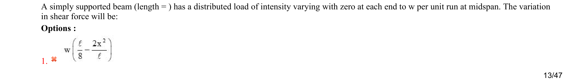

### Options

*(No options)*

### Answer

> **Answer: None**

### Exam

PCB-2022

---

## Question 47

**Topic:** Strength of Materials

### Question

A simply supported beam (length = , has a distributed load of intensity varying with zero at each end to w per unit
run atmidspan.Thevariation in bendingmomentwill be (x is distancefrom leftend):
40
2.
3.*		30

### Options

*(No options)*

### Answer

> **Answer: None**

### Exam

PCB-2022

---

## Question 48

**Topic:** Strength of Materials

### Question

In an analysis of plane frame structure, members are assumed to be joined together with:

### Options

1. riveted joints
2. welded joints
3. rigid joints
4. pin joints

### Answer

> **Answer: 4**

### Exam

PCB-2022

---

## Question 49

**Topic:** Strength of Materials

### Question

3.
4. x

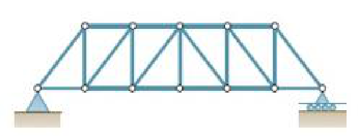

### Options

*(No options)*

### Answer

> **Answer: None**

### Exam

PCB-2022

---

## Question 50

**Topic:** Strength of Materials

### Question

Which of the following is a deficiency frame?

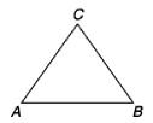

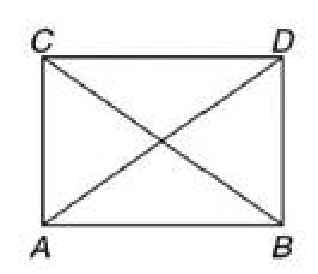

### Options

3. 
4. 

### Answer

> **Answer: None**

### Exam

PCB-2022

---

## Question 51

**Topic:** Strength of Materials

### Question

The method of joints is preferred in the analysis of plane frames if forces are required to be determined in:

### Options

1. one member only
2. two members only
3. a few members
4. in all the members

### Answer

> **Answer: 4**

### Exam

PCB-2022

---

## Question 52

**Topic:** Strength of Materials

### Question

The force in member AD of the truss shown in the following figure is (takeD and E as the mid-points of AC and BC,
respectively):
40kN
20kN		20kN
10kN		10kN
30

### Options

1. 120 kN
2. –120 kN
3. 80 KN
4. –80 kN

### Answer

> **Answer: 4**

### Exam

PCB-2022

---

## Question 53

**Topic:** Strength of Materials

### Question

To determine the force in members FH, GH and GI of the truss shown in the following figure, using the method of
sections, the correct way to draw the section will be:
1KN
1kN		1KN
1kN
1kN
8m
5kN.5kN5kN
6panels@5m=30m

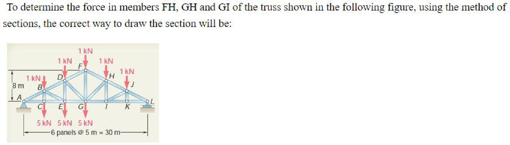

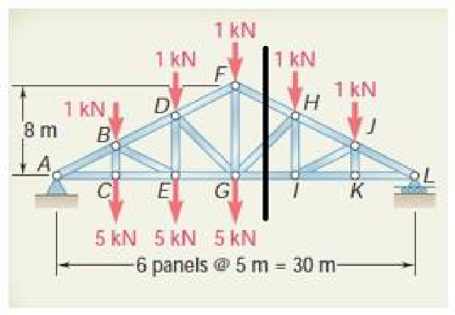

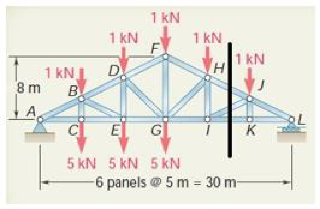

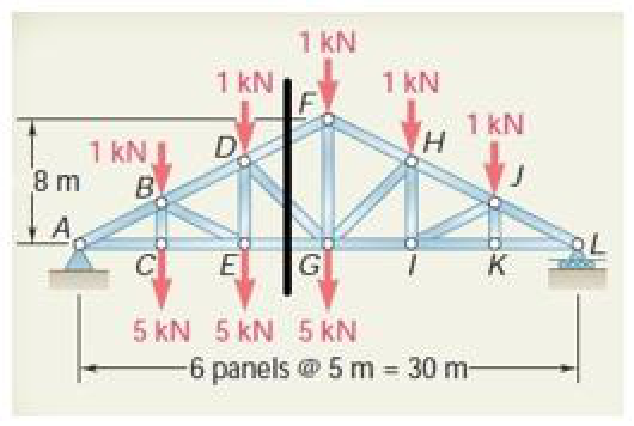

### Options

*(No options)*

### Answer

> **Answer: None**

### Exam

PCB-2022

---

## Question 54

**Topic:** Strength of Materials

### Question

The variation of shear stress in a circular shaft, subjected to torsion, with radial distance is:

### Options

1. linear
2. parabolic
3. hyperbolic
4. quartic

### Answer

> **Answer: 1**

### Exam

PCB-2022

---

## Question 55

**Topic:** Strength of Materials

### Question

The relation governing the torsional torque in circular shafts is (where T = Torque, = shear stress, r =radial
distance, (= length of shaft, J = polar moment of inertia, G = modulus of rigidity,  = angle of twist):

### Options

1. 
2. 
3. 
4. G6

### Answer

> **Answer: None**

### Exam

PCB-2022

---

## Question 56

**Topic:** Strength of Materials

### Question

2. V
3.
TG
4. *J

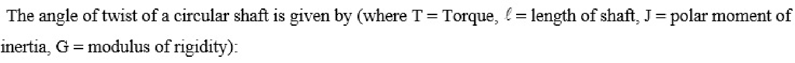

### Options

*(No options)*

### Answer

> **Answer: None**

### Exam

PCB-2022

---

## Question 57

**Topic:** Strength of Materials

### Question

The maximum shear stress of a solid shaft is given by (where T = Torque, d = shaft diameter):

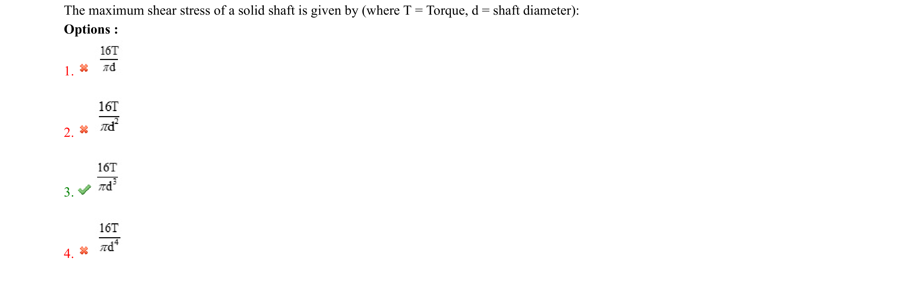

### Options

1. 
2. 
3. 
4. 16T

### Answer

> **Answer: None**

### Exam

PCB-2022

---

## Question 58

**Topic:** Strength of Materials

### Question

The maximum shear stress in a hollow shaft subjected to a torsional moment ______.

### Options

1. is at the middle of thickness
2. is at the at the inner surface of the shaft
3. is at the at the outer surface of the shaft
4. can be anywhere on the shaft

### Answer

> **Answer: 3**

### Exam

PCB-2022

---

## Question 59

**Topic:** Strength of Materials

### Question

The ratio of the maximum stress of a hollow shaft to that of a solid shaft, subjected to torsion, if both are of the same material and of the same outer diameters, is (k is the ratio of the inner diameter to the outer diameter of the hollow shaft):

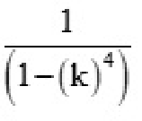

### Options

1. 
2. 
3. 
4. 

### Answer

> **Answer: 1**

### Exam

PCB-2022

---

## Question 60

**Topic:** Strength of Materials

### Question

The torsional stiffness is given by (l = length of shaft, J= polar moment of inertia, G = modulus of rigidity):

### Options

1. JG
2. 
3. 
4. JG

### Answer

> **Answer: None**

### Exam

PCB-2022

---

## Question 61

**Topic:** Strength of Materials

### Question

A cylinder-shell may be termed as thin if the ratio of thickness of the wall to the diameter of the shell is less than:

### Options

1. 1 : 5
2. 1 : 10
3. 1 : 15
4. 1 : 20

### Answer

> **Answer: 3**

### Exam

PCB-2022

---

## Question 62

**Topic:** Strength of Materials

### Question

The circumferential stresses in thin cylinders are also known as:

### Options

1. hoop stresses
2. radial stresses
3. tangential stresses
4. longitudinal stresses

### Answer

> **Answer: 1**

### Exam

PCB-2022

---

## Question 63

**Topic:** Strength of Materials

### Question

Longitudinal stresses in the body of a thin cylinder (with uniform thickness) having spherical ends are ______ hoop stresses.

### Options

1. half of
2. the same as
3. double of
4. triple of

### Answer

> **Answer: 1**

### Exam

PCB-2022

---

## Question 64

**Topic:** Strength of Materials

### Question

Hoop strain in the body of a thin cylinder (with uniform thickness ‘t') having spherical ends is (d = internal diameter, p = internal pressure, E =
Young's modulus, v = Poisson's ratio):
pd

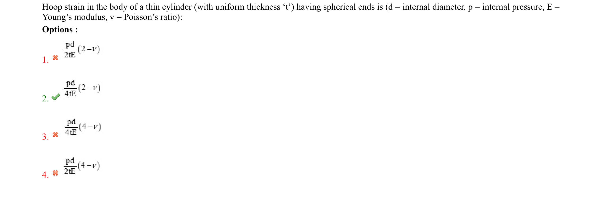

### Options

1. 2tE
2. 
3. 
4. 2tE

### Answer

> **Answer: None**

### Exam

PCB-2022

---

## Question 65

**Topic:** Strength of Materials

### Question

The ratio of hoop stress to hoop strain in the hemispherical portion of a thin cylinder (with uniform thickness ‘t')
is (E = Young's modulus, v = Poisson's ratio):

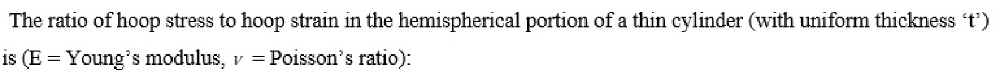

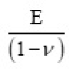

### Options

1. (1-v)
2. (2-v)
3. 
4. 2E (2-v)

### Answer

> **Answer: None**

### Exam

PCB-2022

---

## Question 66

**Topic:** Strength of Materials

### Question

Neglecting the effect of internal pressure, the volumetric strain of a thin cylinder is (σ = hoop stress, E = Young’s modulus, ν = Poisson’s ratio):

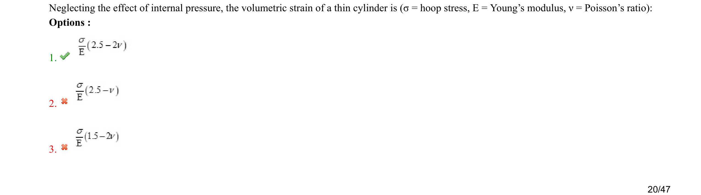

### Options

1. 
2. 
3. 
4. 

### Answer

> **Answer: 1**

### Exam

PCB-2022

---

## Question 67

**Topic:** Strength of Materials

### Question

If the load on a column is increased to a value that on its removal the deflection remains and the column doesn’t return to its original position, the load is known as:

### Options

1. critical load
2. ultimate load
3. yield load
4. breaking load

### Answer

> **Answer: 1**

### Exam

PCB-2022

---

## Question 68

**Topic:** Strength of Materials

### Question

The ratio of the equivalent length of a column fixed at one end with the other free to that of a column with both ends hinged is (consider the lengths of the two columns to be the same):

### Options

1. 1 : 1
2. 2 : 1
3. 3 : 1
4. 1 : 2

### Answer

> **Answer: 2**

### Exam

PCB-2022

---

## Question 69

**Topic:** Strength of Materials

### Question

Euler’s Crippling Load for a column with both ends fixed is ______ that for a column fixed at one end with the other end hinged.

### Options

1. the same as
2. half of
3. double of
4. triple of

### Answer

> **Answer: 3**

### Exam

PCB-2022

---

## Question 70

**Topic:** Strength of Materials

### Question

*(No text)*

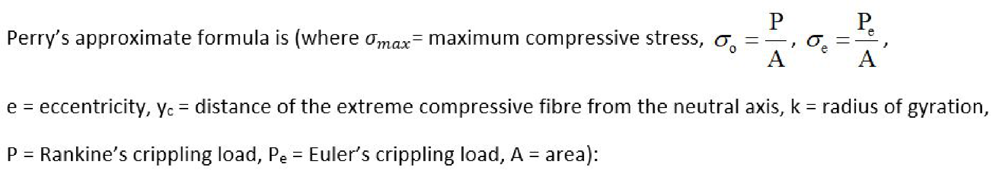

### Options

1. 
2. 
3. 
4. 

### Answer

> **Answer: 1**

### Exam

PCB-2022

---

## Question 71

**Topic:** Strength of Materials

### Question

In a column, what is the relationship between the slenderness ratio and the critical stress?

### Options

1. Slenderness ratio increases with the increase in critical stress.
2. Slenderness ratio decreases with the increase in critical stress.
3. Slenderness ratio remains constant with the increase in critical stress.
4. Slenderness ratio first increases and after a maximum value, starts to decrease, with the increase in critical stress.

### Answer

> **Answer: 2**

### Exam

PCB-2022

---

## Question 72

**Topic:** Strength of Materials

### Question

Secant formula is applicable for:

### Options

1. short columns under axial loading
2. long columns under axial loading
3. short columns under eccentric loading
4. long columns under eccentric loading

### Answer

> **Answer: 4**

### Exam

PCB-2022

---

## Question 73

**Topic:** Strength of Materials

### Question

On application of shear stress, the fluid will:

### Options

1. start to flow
2. not flow
3. flow or not depending on the value of the shear stress
4. flow or not depending on other factors apart from the shear stress

### Answer

> **Answer: 1**

### Exam

PCB-2022

---

## Question 74

**Topic:** Fluid Mechanics

### Question

______ is the ratio of dynamic viscosity to kinematic viscosity.

### Options

1. Density
2. Virtual viscosity
3. Specific weight
4. Specific volume

### Answer

> **Answer: 1**

### Exam

PCB-2022

---

## Question 75

**Topic:** Strength of Materials

### Question

The dimensions of specific weight are same as that of:

### Options

1. pressure
2. force/volume
3. work/volume
4. density

### Answer

> **Answer: 2**

### Exam

PCB-2022

---

## Question 76

**Topic:** Strength of Materials

### Question

Which of the following statements is correct about the density of water?

### Options

1. Density of water increases with temperature.
2. Density of water decreases with temperature.
3. Density of water is maximum at 4 °C.
4. Density of water is maximum at 0 °C.

### Answer

> **Answer: 3**

### Exam

PCB-2022

---

## Question 77

**Topic:** Strength of Materials

### Question

In the graph of shearing stress vs. rate of shearing strain, which of the following lines represent shear
thinning fluid?
Shearingstress,t
Rateof shearing strain,

### Options

1. 1
2. 2
3. 3
4. 4

### Answer

> **Answer: 2**

### Exam

PCB-2022

---

## Question 78

**Topic:** Fluid Mechanics

### Question

If the specific gravity of a fluid is 1.26, its specific weight will be (take density of water = 1000 kg/m3 and acceleration due to gravity = 10 m/s2):

### Options

1. 12.6 N/m3
2. 12.6 kN/m3
3. 1.26 N/m3
4. 1.26 kN/m3

### Answer

> **Answer: 2**

### Exam

PCB-2022

---

## Question 79

**Topic:** Fluid Mechanics

### Question

For liquids or gases at rest, the pressure gradient in the vertical direction at any point in a fluid depends only on the ______ of the fluid at that point.

### Options

1. viscosity
2. specific weight
3. temperature
4. thermal conductivity

### Answer

> **Answer: 2**

### Exam

PCB-2022

---

## Question 80

**Topic:** Strength of Materials

### Question

Which of the following statements is NOT correct about gauge pressure?

### Options

1. It can be more than absolute pressure.
2. For a pressure value more than atmospheric pressure, gauge pressure will be positive.
3. It can have negative values.
4. For a pressure value less than atmospheric pressure, gauge pressure will be negative.

### Answer

> **Answer: 1**

### Exam

PCB-2022

---

## Question 81

**Topic:** Strength of Materials

### Question

is the acceleration due to gravity and R is gas constant):

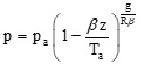

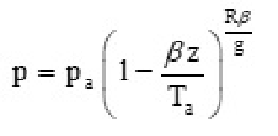

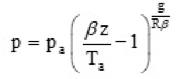

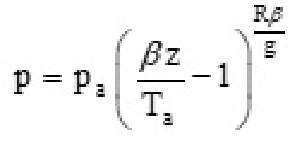

### Options

1. Bz RB
2. 
3. 
4. P=P: Bz

### Answer

> **Answer: None**

### Exam

PCB-2022

---

## Question 82

**Topic:** Fluid Mechanics

### Question

Any two points at ______ elevation in a continuous mass of the same static fluid will be at ______ pressure(s).

### Options

1. the same; the same
2. the same; different
3. different; the same
4. the same; absolute

### Answer

> **Answer: 1**

### Exam

PCB-2022

---

## Question 83

**Topic:** Strength of Materials

### Question

SG=0.8
PA		4m
60kPa
3m
Water
2m
Water

### Options

1. pA = p1
2. pA = p1 - pB
3. pA < p1
4. pA > p1

### Answer

> **Answer: 1**

### Exam

PCB-2022

---

## Question 84

**Topic:** Fluid Mechanics

### Question

Water flows upward in a pipe slanted at 3o, as shown in the given figure. If the mercury manometer reads h = 12 cm,
the pressure difference between points (1) and (2) in the pipe is (take specific weights of water as 9790 N/m3 and of
mercuryas 133100N/m3)
30°
(1)
2m

### Options

1. 2.4 kPa
2. 16.0 kPa
3. 26.1 kPa
4. 34.4 kPa

### Answer

> **Answer: 3**

### Exam

PCB-2022

---

## Question 85

**Topic:** Strength of Materials

### Question

SG=1.2		2m
Density =1500kg/m3

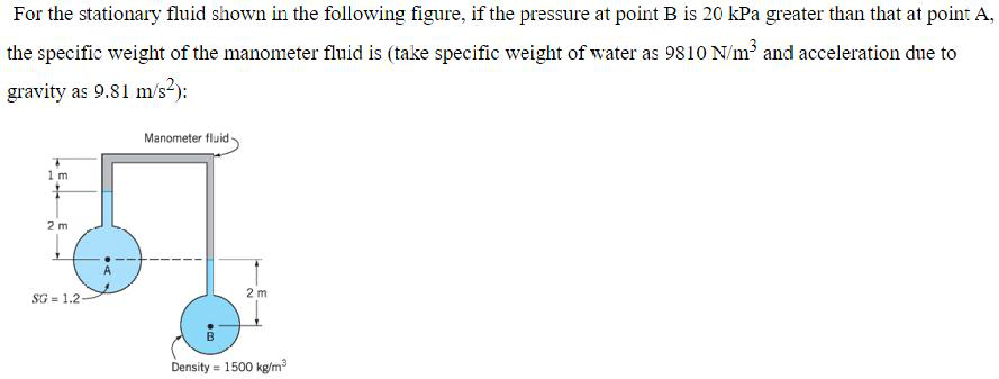

### Options

1. 7.1 kN/m3
2. 7.1 N/m3
3. 16.5 kN/m3
4. 16.5N/m3

### Answer

> **Answer: 1**

### Exam

PCB-2022

---

## Question 86

**Topic:** Strength of Materials

### Question

For the tank shown in the following figure, the resultant force due to the pressure on side wall AB will be:
Freesurface
p=Patm
Specific weight=

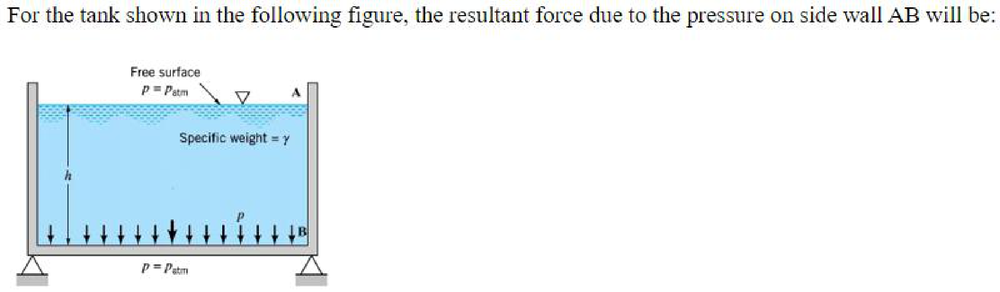

### Options

1. located at the mid-point of the wall
2. located at the upper half of the wall
3. located at the lower half of the wall
4. located at the base of the wall (at point B)

### Answer

> **Answer: 3**

### Exam

PCB-2022

---

## Question 87

**Topic:** Fluid Mechanics

### Question

Based on the two statements given below, choose the correct answer. Statement A: The magnitude of the resultant fluid force is equal to the pressure acting at the centroid of the area multiplied by the total area. Statement B: The resultant fluid force, acting on a fully submerged inclined plane surface, does not pass through the centroid of the area.

### Options

1. Both statements A and B are correct.
2. Both statements A and B are incorrect.
3. Statement A is correct but statement B is incorrect.
4. Statement A is incorrect but statement B is correct.

### Answer

> **Answer: 1**

### Exam

PCB-2022

---

## Question 88

**Topic:** Strength of Materials

### Question

(where Ixx is the area moment of inertia of the plate area about its centroidal x axis, Ixy is the product of inertia of the plane surface,  is the
angle of inclination of the plane surface, hcG is the depth straight down from the surface to the plate centroid, A is the area of plane surface):

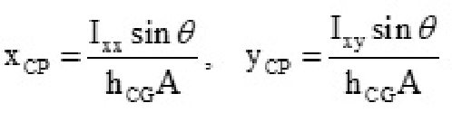

### Options

1. Ixy sin 8 I x sin g
2. hcGA Ycp hcGA
3. 
4. Ixxcos Ixsin hcGA hcGA

### Answer

> **Answer: None**

### Exam

PCB-2022

---

## Question 89

**Topic:** Strength of Materials

### Question

Panel ABC in the slanted side of a water tank (shown in the following figure) is an isosceles triangle with vertex at A
and base BC = 2 m. The water force on the panel is (take specific weight of water as 9790 N/m3):
Water
14m
B,C		3m

### Options

1. 131.0 N
2. 131.0 kN
3. 32.6 kN
4. 32.6 N

### Answer

> **Answer: 2**

### Exam

PCB-2022

---

## Question 90

**Topic:** Strength of Materials

### Question

*(No text)*

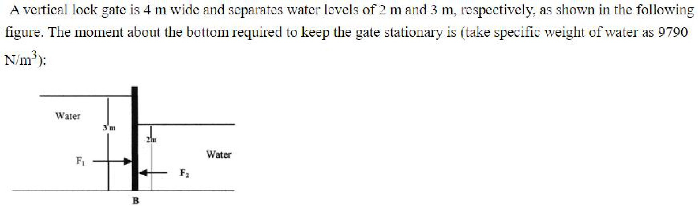

### Options

1. 104 kN.m
2. 114 kN.m
3. 124 kN.m
4. 134 kN.m

### Answer

> **Answer: 3**

### Exam

PCB-2022

---

## Question 91

**Topic:** Strength of Materials

### Question

Flow at varying rates through a long straight pipe of uniform cross-section is a ______.

### Options

1. steady and uniform flow
2. steady and non-uniform flow
3. unsteady and uniform flow
4. unsteady and non-uniform flow

### Answer

> **Answer: 3**

### Exam

PCB-2022

---

## Question 92

**Topic:** Fluid Mechanics

### Question

A ______ is a set of fluid particles that form a line at a given instant.

### Options

1. streamline
2. pathline
3. streakline
4. timeline

### Answer

> **Answer: 4**

### Exam

PCB-2022

---

## Question 93

**Topic:** Fluid Mechanics

### Question

Which of the following statements is NOT correct about flow streamlines?

### Options

1. Fluid particles accelerate normal to streamlines.
2. Fluid particles accelerate along streamlines.
3. The component of weight along a streamline does not depend on the streamline angle.
4. The lines that are tangent to the velocity vectors throughout the flow field are called streamlines.

### Answer

> **Answer: 3**

### Exam

PCB-2022

---

## Question 94

**Topic:** Fluid Mechanics

### Question

The Bernoulli equation can be obtained by integrating F = ma along a ______.

### Options

1. streamline
2. pathline
3. streakline
4. timeline

### Answer

> **Answer: 1**

### Exam

PCB-2022

---

## Question 95

**Topic:** Strength of Materials

### Question

*(No text)*

### Options

1. Flow is steady.
2. Flow is incompressible.
3. Flow is viscous.
4. Flow is along single streamline.

### Answer

> **Answer: 3**

### Exam

PCB-2022

---

## Question 96

**Topic:** Strength of Materials

### Question

The pitot formula, used for velocity measurement using pitot tube, is (where V is the flow velocity, Po is the stagnation pressure, Ps is the static
pressure and p is the density):

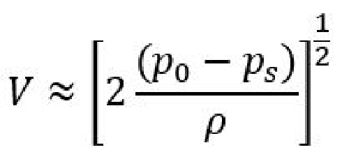

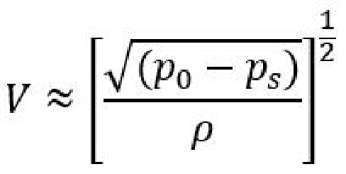

### Options

1. Po
3. 

### Answer

> **Answer: None**

### Exam

PCB-2022

---

## Question 97

**Topic:** Fluid Mechanics

### Question

Which of the following is NOT a constriction meter?

### Options

1. Thin-plate orifice
2. Flow nozzle
3. Venturi tube
4. Rotameter

### Answer

> **Answer: 4**

### Exam

PCB-2022

---

## Question 98

**Topic:** Fluid Mechanics

### Question

Which of the following statements is NOT true about nozzle meter discharge coefficient, Cd (Re is Reynolds number, and β is ratio of nozzle diameter to pipe diameter)?

### Options

1. Cd generally increases with increase in Re at constant β.
2. Cd generally increases with increase in β at constant Re.
3. Cd for nozzle meter is more than that for an orifice meter at the same β and Re.
4. Formation of Vena contracta does not take place.

### Answer

> **Answer: 1**

### Exam

PCB-2022

---

## Question 99

**Topic:** Fluid Mechanics

### Question

If the actual velocity in the contracted section of a jet of liquid flowing from a 50-mm-diameter orifice is 8.91 m/s under a head of 5 m, the value of the coefficient of velocity will be (take acceleration due to gravity as 10 m/s2):

### Options

1. 0.891
2. 0.861
3. 0.901
4. 0.821

### Answer

> **Answer: 1**

### Exam

PCB-2022

---

## Question 100

**Topic:** Fluid Mechanics

### Question

The flow velocity (V) from an orifice, attached to a tank of sufficiently large cross-sectional area, is (where ac is the area of vena contracta, a is
the tank area, h is the height of the fluid in the tank and g is the acceleration due to gravity):
2gh ac
2gh
2gh
3. *

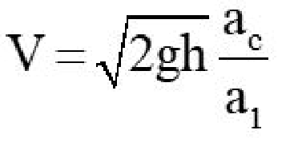

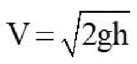

### Options

*(No options)*

### Answer

> **Answer: None**

### Exam

PCB-2022

---

## Question 101

**Topic:** Fluid Mechanics

### Question

The actual discharge (Q) through an orifice, attached to a tank, is given by (where V is the flow velocity from the orifice, ac is the area of
contraction, a is the orifice area, h is the height of the fluid in the tank, Cc is the coefficient of contraction, Cv is the coefficient of velocity and g
is the acceleration due to gravity):
Q=(axV)

### Options

1. 
2. 
3. Q=(C,×a,.)x(C,/2gh)
4. Q=a/2gh

### Answer

> **Answer: None**

### Exam

PCB-2022

---

## Question 102

**Topic:** Strength of Materials

### Question

JIIUILL		II.LL IVI
In reference to the following figure, the coefficient of velocity is given by:

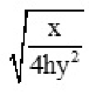

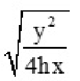

### Options

1. 4hy
2. 4hx?
3. 4hy2
4. × 4hx

### Answer

> **Answer: None**

### Exam

PCB-2022

---

## Question 103

**Topic:** Strength of Materials

### Question

*(No text)*

### Options

1. 
2. 
3. 
4. 

### Answer

> **Answer: 1**

### Exam

PCB-2022

---

## Question 104

**Topic:** Fluid Mechanics

### Question

Water discharges at the rate of 98 litres per second through a vertical sharp-edged orifice of area 0.01 m2 placed under a constant head of 10 m. A point on the jet measured from the vena contracta of the jet has coordinates 3.85 m horizontal and 0.4 m vertical. The value of coefficient of contraction is (take acceleration due to gravity as 10 m/s2):

### Options

1. 0.63
2. 0.73
3. 0.78
4. 0.96

### Answer

> **Answer: 2**

### Exam

PCB-2022

---

## Question 105

**Topic:** Fluid Mechanics

### Question

In reference to the following figure, the time to completely empty the vertical cylindrical tank is (where A is the cross-
sectional area of the tank, a is the area of orifice and Cd is the coefficient of discharge):
dh
H2
rifice

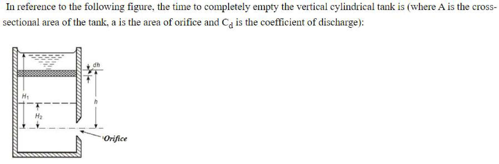

### Options

1. Cgav/2g
2. CA./2g
3. Cgay2g
4. CA/2gh

### Answer

> **Answer: None**

### Exam

PCB-2022

---

## Question 106

**Topic:** Fluid Mechanics

### Question

dh
H2
Orifice
Ho

### Options

1. Ho= R,H
2. (R,-Ro)
3. R,H
4. R,H2

### Answer

> **Answer: None**

### Exam

PCB-2022

---

## Question 107

**Topic:** Strength of Materials

### Question

*(No text)*

### Options

1. 
2. 
3. 
4. 

### Answer

> **Answer: 1**

### Exam

PCB-2022

---

## Question 108

**Topic:** Strength of Materials

### Question

In a Borda's mouthpiece as shown in the following figure, 4o mm diameter discharges under a constant head of 1.5 m.
If the coefficient of velocity for the entrance section of the mouthpiece is 0.95, the coefficient of contraction, when the
mouthpiece is running firee, is:
Area

### Options

1. 0.554
2. 0.59
3. 0.63
4. 0.68

### Answer

> **Answer: 1**

### Exam

PCB-2022

---

## Question 109

**Topic:** Strength of Materials

### Question

sill

### Options

1. Q=C/2gl[(H+h, -h
2. 
3. 
4. 

### Answer

> **Answer: None**

### Exam

PCB-2022

---

## Question 110

**Topic:** Fluid Mechanics

### Question

Francis formula for the discharge over a rectangular weir neglecting the approach velocity is (where H and L are the height and width of the
weir, respectively, and n is the number of end contractions for the weir):

### Options

1. Q = 1. 84(L - 0. 1(nH)H
2. Q = 2.84(L - 0.1(nH))H
3. Q = 1. 84(L - 0.1(nH)H %
4. Q = 2.84(L - 0.1(nH)H

### Answer

> **Answer: None**

### Exam

PCB-2022

---

## Question 111

**Topic:** Strength of Materials

### Question

For flow over the triangular notch shown in the following figure, constant for the notch is given by (where Ca is the
coefficient of discharge, and g is the acceleration due to gravity):
Watersurface

### Options

1. 
2. 15 sin
3. 
4. 15 tan

### Answer

> **Answer: None**

### Exam

PCB-2022

---

## Question 112

**Topic:** Fluid Mechanics

### Question

Which of the following statements is NOT true about a triangular weir?

### Options

1. The nappe emerging from a triangular weir or notch has the same shape for nearly all different heads.
2. For measuring low discharges, a triangular weir or notch is more useful as compared to a rectangular weir.
3. In most of the cases of flow over a triangular weir or notch, the velocity of approach may be neglected without introducing an appreciable error.
4. Ventilation of a triangular weir is must.

### Answer

> **Answer: 4**

### Exam

PCB-2022

---

## Question 113

**Topic:** Strength of Materials

### Question

*(No text)*

### Options

1. 14°
2. 22°
3. 30°
4. 38°

### Answer

> **Answer: 1**

### Exam

PCB-2022

---

## Question 114

**Topic:** Fluid Mechanics

### Question

The Darcy friction factor (f) for laminar flow in circular pipes is given by (Red is pipe diameter-based Reynolds number):

### Options

1. 8log
2. 6.9
3. Re.

### Answer

> **Answer: None**

### Exam

PCB-2022

---

## Question 115

**Topic:** Strength of Materials

### Question

Darcy-Weisbach equation used for computing the loss of head due to friction (h) in pipes is given by (where V is the velocity of flow, L and D
are the length and diameter of the pipe, respectively, f is the friction factor and g is the acceleration due to gravity):

### Options

1. LV2
2. 2gD
3. 2gD
4. h. /2gD 2gD fLV

### Answer

> **Answer: None**

### Exam

PCB-2022

---

## Question 116

**Topic:** Fluid Mechanics

### Question

Which of the following losses occurring in pipe flow does NOT belong to the category of minor loss?

### Options

1. Loss in sudden expansion
2. Loss in bends
3. Loss in flow through valves, open or partially closed
4. Frictional loss in pipes

### Answer

> **Answer: 4**

### Exam

PCB-2022

---

## Question 117

**Topic:** Strength of Materials

### Question

and d is the pipe diameter):

### Options

1. Kd
2. K)2
3. eq
4. 

### Answer

> **Answer: None**

### Exam

PCB-2022

---

## Question 118

**Topic:** Strength of Materials

### Question

What is the correct relationship of loss coefficients (K) for 90° bends with pipe bend radius (R) to pipe diameter (d) ratio?

### Options

1. K increases with increase in R/d
2. K decreases with increase in R/d
3. K first decreases till a certain value and then increases with increase in R/d
4. K first increases till a certain value and then decreases with increase in R/d

### Answer

> **Answer: 3**

### Exam

PCB-2022

---

## Question 119

**Topic:** Strength of Materials

### Question

The loss coefficient, KsE, of flow entering from a pipe of smaller diameter (d) to a pipe of larger diameter (D), known as sudden expansion, is:
12
d2
2.
3.*

### Options

*(No options)*

### Answer

> **Answer: None**

### Exam

PCB-2022

---

## Question 120

**Topic:** Strength of Materials

### Question

K = 0.42
4. *

### Options

*(No options)*

### Answer

> **Answer: None**

### Exam

PCB-2022

---

## Question 121

**Topic:** Strength of Materials

### Question

For gradual conical expansion from a pipe of diameter di to a pipe of diameter d2, the loss coefficient K is (where Cp is the pressure-recovery
coefficient):
K=1
2. *
d?
3.

### Options

*(No options)*

### Answer

> **Answer: None**

### Exam

PCB-2022

---

## Question 122

**Topic:** Strength of Materials

### Question

The pipe-head loss is equal to the change in the ______.

### Options

1. height of the hydraulic grade line
2. pressure head only
3. gravity head only
4. velocity head only

### Answer

> **Answer: 1**

### Exam

PCB-2022

---

## Question 123

**Topic:** Strength of Materials

### Question

In frictionless flow, with no work or heat transfer, the energy grade line:

### Options

1. linearly increases
2. linearly decreases
3. has constant height
4. first increases then decreases

### Answer

> **Answer: 3**

### Exam

PCB-2022

---

## Question 124

**Topic:** Strength of Materials

### Question

The height to which a liquid would rise in a piezometer tube attached to the flow is the same as the ______.

### Options

1. height of the hydraulic grade line
2. height of the energy grade line
3. gravity head only
4. velocity head only

### Answer

> **Answer: 1**

### Exam

PCB-2022

---

## Question 125

**Topic:** Strength of Materials

### Question

In an open-channel flow, the hydraulic grade line is:

### Options

1. below the free surface of the water
2. identical to the free surface of the water
3. above the free surface of the water
4. can be above or below the free surface of the water

### Answer

> **Answer: 2**

### Exam

PCB-2022

---

## Question 126

**Topic:** Strength of Materials

### Question

The relationship between hydraulic grade line (HGL) and the energy grade line (EGL) is:

### Options

1. HGL = EGL – velocity head
2. HGL = EGL – potential head
3. HGL = EGL – pressure head
4. HGL = EGL – (pressure head + potential head)

### Answer

> **Answer: 1**

### Exam

PCB-2022

---

## Question 127

**Topic:** Strength of Materials

### Question

The head given by a pitot stagnation-velocity tube corresponds to the ______.

### Options

1. hydraulic grade line
2. energy grade line
3. gravity head only
4. velocity head only

### Answer

> **Answer: 2**

### Exam

PCB-2022

---

## Question 128

**Topic:** Strength of Materials

### Question

*(No text)*

### Options

1. of gradually increasing height and straight
2. of gradually decreasing height and straight
3. of gradually increasing height and gradually increasing height
4. straight and straight

### Answer

> **Answer: 1**

### Exam

PCB-2022

---

## Question 129

**Topic:** Strength of Materials

### Question

The power available at the outlet of a pipe is (where Q is the discharge through the pipe, V is the velocity of flow, L and D are the length and the
diameter of the pipe, respectively, w is the specific weight, f is the friction factor and g is the acceleration due to gravity):
πD2		fL V2
2gD
πD2		fL V?
2gD
2.
fL V?
4L		2gD
πD3		fL V?
2L		2gD

### Options

*(No options)*

### Answer

> **Answer: None**

### Exam

PCB-2022

---

## Question 130

**Topic:** Strength of Materials

### Question

The water from a reservoir at a high altitude is conveyed by a pipeline. The efficiency of power transmission in this case is given by (where Q is
the volume flow rate, R is the hydraulic resistance of the pipeline and H is the potential head of water in the reservoir):

### Options

1. RQ?
2. 
3. Tp H?
4. H? RQ

### Answer

> **Answer: None**

### Exam

PCB-2022

---

## Question 131

**Topic:** Strength of Materials

### Question

The efficiency of power transmission through a pipe, at the condition of maximum power delivered, is (where H is the total head supplied at the
entrance to the pipe and hf is the loss of head due to friction):

### Options

1. 1/2
2. 1/4
3. 1/3
4. 2/3

### Answer

> **Answer: None**

### Exam

PCB-2022

---

## Question 132

**Topic:** Strength of Materials

### Question

Corresponding to the maximum power transmitted through a pipeline, the efficiency of power transmission is:

### Options

1. 50.0%
2. 56.7%
3. 66.7%
4. 76.7%

### Answer

> **Answer: 3**

### Exam

PCB-2022

---

## Question 133

**Topic:** Strength of Materials

### Question

The relation between force F and jet velocity V, for a high-velocity jet impinging on a stationary flat vertical plate (neglecting friction), is:

### Options

1. × Foc V1/2
2. Foc V3/2
3. V FoV?
4. F oc V3

### Answer

> **Answer: None**

### Exam

PCB-2022

---

## Question 134

**Topic:** Strength of Materials

### Question

Which of the following statements is true about force F due to a high-velocity jet impingement on a stationary curved
plate (neglecting fiiction)as shown in the given figure?

### Options

1. Force in X-direction is dependent on V1cosβ1
2. Force in X-direction is dependent on V2sinβ2
3. Force in Y-direction is dependent on V1cosβ1
4. Force in Y-direction is dependent on V2cosβ2

### Answer

> **Answer: 1**

### Exam

PCB-2022

---

## Question 135

**Topic:** Strength of Materials

### Question

The force, F, generated when a jet strikes at the middle of one of the flat plates mounted on a wheel is (where V is the jet velocity and u is the tangential velocity of the wheel at the middle of the plate, D is the diameter of the wheel at the middle of the plate and A is the area of the plate):

### Options

1. F = ρ A V (V-u)
2. F = ρ A V2
3. F = ρ A V u
4. F = ρ A u2

### Answer

> **Answer: 1**

### Exam

PCB-2022

---

## Question 136

**Topic:** Strength of Materials

### Question

A number of flat plates are mounted on a wheel and the jet strikes at the middle of the plate. The efficiency of this wheel is (where V is the jet
velocity and u is the tangential velocity of the wheel at the middle of the plate):

### Options

1. 2V(V-u)
2. 2V(V-)
3. 2u(V-u)
4. 2u(V-u) V?

### Answer

> **Answer: None**

### Exam

PCB-2022

---

## Question 137

**Topic:** Strength of Materials

### Question

A number of flat plates are mounted on a wheel and the jet strikes at the middle of the plate. The efficiency of this wheel is maximum when
(where V is the jet velocity and u is the tangential velocity of the wheel at the middle of the plate):

### Options

1. u=
2. 
3. 
4. u’=2V(V-u)

### Answer

> **Answer: None**

### Exam

PCB-2022

---

## Question 138

**Topic:** Strength of Materials

### Question

*(No text)*

### Options

1. V
2. 
3. 
4. 

### Answer

> **Answer: None**

### Exam

PCB-2022

---

## Question 139

**Topic:** Strength of Materials

### Question

Based on the two statements given below, choose the correct answer. Statement A: Reaction turbines are low-head, high-flow devices. Statement B: In a reaction turbine, flow enters at the larger-diameter section and discharges through the eye.

### Options

1. Both statements A and B are correct.
2. Statement A is correct, but statement B is incorrect.
3. Statement A is incorrect, but statement B is correct.
4. Both statements A and B are incorrect.

### Answer

> **Answer: 1**

### Exam

PCB-2022

---

## Question 140

**Topic:** Machine Design

### Question

Head coefficient CH of a turbine is (where H = head, D = impeller diameter, g = acceleration due to gravity, n = shaft speed):

### Options

1. 
2. 
3. 
4. 

### Answer

> **Answer: 1**

### Exam

PCB-2022

---

## Question 141

**Topic:** Fluid Mechanics

### Question

Power coefficient Cp of a turbine is (where bhp = available power, D = impeller diameter, p = fluid density, n = shaft speed):
Pn'D3
bhp

### Options

1. 
2. pmD
3. bhp
4. bhp

### Answer

> **Answer: None**

### Exam

PCB-2022

---

## Question 142

**Topic:** Fluid Mechanics

### Question

The power specific speed Nsp for a turbine is (where bhp = available power, H = head, p = fluid density, g = acceleration due to gravity, n =
shaft speed):

### Options

1. n(bhp)/2
2. n(bhp)/2
3. p"(gH)
4. n(bhp)3/2

### Answer

> **Answer: None**

### Exam

PCB-2022

---

## Question 143

**Topic:** Strength of Materials

### Question

velocity,H=head,g=acceleration due to gravity).

### Options

1. 0.27
2. 0.37
3. 0.47
4. 0.57

### Answer

> **Answer: 3**

### Exam

PCB-2022

---

## Question 144

**Topic:** Fluid Mechanics

### Question

For a centrifugal pump, the ratio of the power available at the impeller to the power available at the shaft of the pump is known as:

### Options

1. overall efficiency
2. volumetric efficiency
3. hydraulic efficiency
4. mechanical efficiency

### Answer

> **Answer: 4**

### Exam

PCB-2022

---

## Question 145

**Topic:** Fluid Mechanics

### Question

For a centrifugal pump, the ratio of the actual flow rate to the theoretical flow rate is known as:

### Options

1. overall efficiency
2. volumetric efficiency
3. hydraulic efficiency
4. mechanical efficiency

### Answer

> **Answer: 2**

### Exam

PCB-2022

---

## Question 146

**Topic:** Fluid Mechanics

### Question

For a centrifugal pump, for the blade exit angle less than 90°, the pump head ______.

### Options

1. decreases with increasing discharge
2. remains constant with increasing discharge
3. increases with increasing discharge
4. first increases and then decreases with increasing discharge

### Answer

> **Answer: 1**

### Exam

PCB-2022

---

## Question 147

**Topic:** Fluid Mechanics

### Question

The efficiency of a typical centrifugal pump is maximum at:

### Options

1. zero discharge
2. 40% of maximum discharge
3. 60% of maximum discharge
4. maximum discharge

### Answer

> **Answer: 3**

### Exam

PCB-2022

---

## Question 148

**Topic:** Machine Design

### Question

Capacity coefficient CQ of a pump is (where Q = discharge, D = impeller diameter, n = shaft speed):

### Options

1. 
2. 
3. V nD
4. ×

### Answer

> **Answer: None**

### Exam

PCB-2022

---

## Question 149

**Topic:** Fluid Mechanics

### Question

The head required at the centrifugal pump inlet to keep the liquid from cavitating or boiling is known as:

### Options

1. minimum head
2. threshold head
3. ultimate head
4. net positive-suction head

### Answer

> **Answer: 4**

### Exam

PCB-2022

---

## Question 150

**Topic:** Fluid Mechanics

### Question

For a fluid flowing through a centrifugal pump having density p, discharge Q, circumferential speed ui, tip speed u2, and absolute
circumferential velocity components of the flow Vt1 and Vt2, the power delivered to the fluid is given by:

### Options

1. PQ(u, Vi-u, Va)
2. PQ(uzVe-u,Vl)
3. PQ(u Va-u Vi)
4. PQ(u, Vi-u Ve)

### Answer

> **Answer: None**

### Exam

PCB-2022
